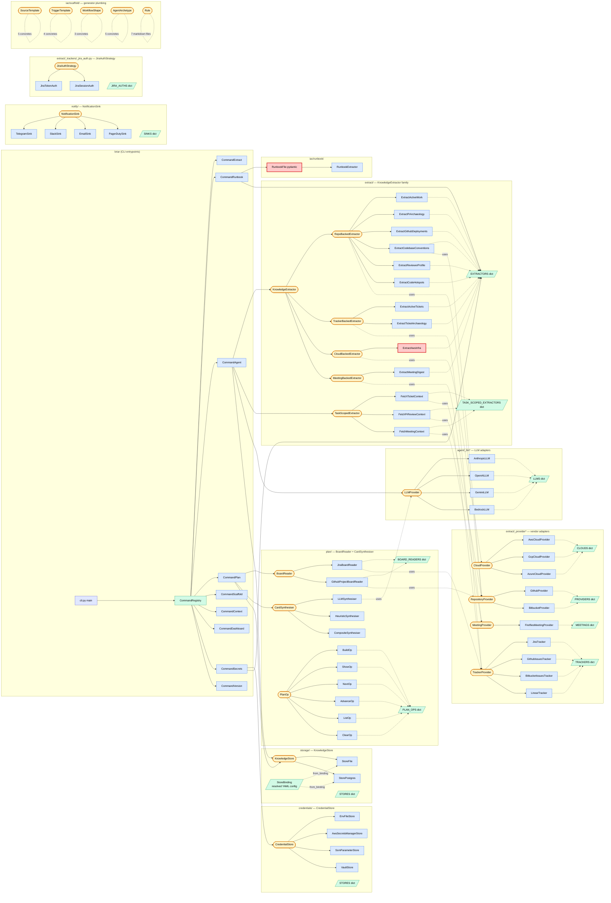
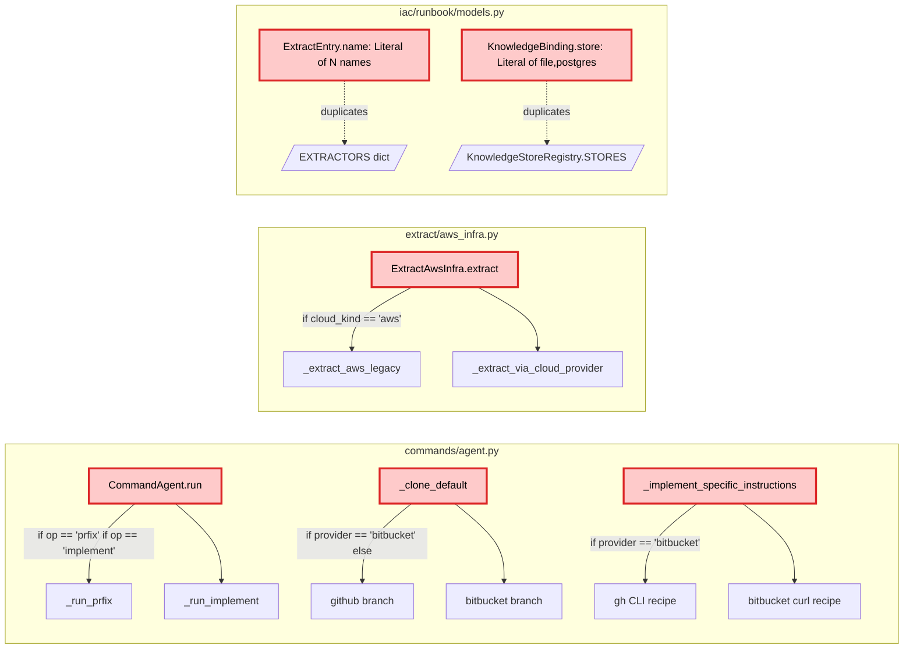

# Architecture — class + function map, with SOLID findings

Reference diagram + the design-pattern violations found during the
2026-05-22 audit. **All seven violations were resolved by the follow-up
commits listed at the bottom of this file** — the "Violations found"
section below is retained as historical record so the audit-and-fix
trail stays in one place.

For the test infrastructure that pins these invariants going forward,
see the "Testing infrastructure" section near the end.

---

## Module + abstraction map

Thirteen Strategy + Registry families, plus one-off helpers. Adapter
files live under `_<plural>/` subpackages; registries are dicts in
the package `__init__.py`.



Red-bordered nodes are the SOLID violation hotspots (annotated below).

---

## Violations found

### Diagram zoom — the if-chain hotspots



### Findings table

| # | File:Line | Pattern | Why it's wrong | Fix |
|---|---|---|---|---|
| 1 | `commands/agent.py:112,114` | `if op == "prfix": ... if op == "implement": ...` | OCP — adding a new op requires editing the dispatch site, not just adding a class | `AgentOp` ABC + `AGENT_OPS` registry, mirroring every other plugin family |
| 2 | `commands/agent.py:302` | `if provider == "bitbucket": ... else (github)` | OCP — adding GitLab/Gitea cloner means a third `elif`, not a third class | `RepoCloner` ABC + `GithubRepoCloner`, `BitbucketRepoCloner` registered in `REPO_CLONERS` |
| 3 | `commands/agent.py:382` | Same `if provider == "bitbucket"` for instruction template | Same — provider-specific PR-creation recipe is data per-vendor, not branching | Method on `RepoCloner` (`pr_creation_recipe(owner, repo, branch, company)`) |
| 4 | `extract/aws_infra.py:62` | `if cloud_kind == "aws": ... else (cloud provider)` | The whole point of `CloudProvider` was to unify the AWS path with the generic path. The `if` re-introduces the coupling | Collapse to one path. `AwsCloudProvider` already exists; the legacy section-shape is the only blocker. Either accept the shape change or move the legacy rendering into `AwsCloudProvider` itself |
| 5 | `iac/runbook/models.py:24` | `ExtractEntry.name: Literal["pr-archaeology", ..., "code-hotspots"]` (9 names) | OCP — adding a new extractor requires editing the Literal even though the runtime registry already has the answer (`EXTRACTORS.keys()`). I edited this 3× this session | `name: str` + `@field_validator("name")` that checks against `EXTRACTORS.keys()` at validation time |
| 6 | `iac/runbook/models.py:53` | `KnowledgeBinding.store: Literal["file", "postgres"]` | Same shape — `KnowledgeStoreRegistry.STORES.keys()` is the source of truth | Same fix |
| 7 | `commands/secrets.py:22` | Hand-maintained `_EXTRACTOR_REQUIREMENTS: Dict[(extractor_name, provider_kind), List[CredEnv]]` | Each new (extractor, provider) pair requires editing the table. Should live on the extractor/provider as a `required_credentials()` method | DEFERRED — bigger refactor. Files a follow-up. |

The Literal[...] forms in `iac/models.py` (workflow-graph node `kind:
agent|human_checkpoint|branch|...`) are NOT violations — those are
tagged-union discriminators where the closed set is intentional (the
orchestrator switches on them). Keep.

### Why the if-chains specifically are the worst smell here

Every plugin family in the codebase uses Strategy + Registry. The
if-chains are inconsistent with that — they look like ad-hoc branching
when the surrounding architecture made the registry pattern the
default. A reviewer scanning `commands/agent.py:run` against
`commands/__init__.py:CommandRegistry.build` sees two different
philosophies and reasonably wonders which one wins. Convergence is
the cheaper outcome.

### Out-of-scope finds (not violations, noted for future)

- **`extract/_trackers/jira.py:_adf_walk`** has `if kind == "text"` — this is
  a single-decision branch inside a format walker, not a dispatcher. Not a
  violation.
- **Agent runner's `dry_run`** flag is a boolean parameter — could be a separate
  `DryRunRunner` class, but the if-check is one place and the runner is otherwise
  fine. Not worth the refactor.
- **`commands/agent.py::_pr_specific_instructions`** has a long format string. Long
  but readable. Not a SOLID issue.

---

## Follow-up commits

- **B (this branch):** fix violation 1 — `AgentOp` ABC + `AGENT_OPS` registry
- **C:** fix violations 2 + 3 — `RepoCloner` ABC for clone + PR-creation
- **D:** fix violation 4 — collapse `aws_infra` if-chain
- **E:** fix violations 5 + 6 — runbook Literal[] → field_validator against registries

Each commit stays independently revertable.

---

## Later additions (post-original-audit)

These ABCs landed after the original audit table above. They follow
the same Strategy + Registry shape as every other plugin family.

| ABC | Concretes | Purpose |
|---|---|---|
| `StoreBinding` (frozen dataclass) + `KnowledgeStore.from_binding` | `StoreFile`, `StorePostgres` | Per-company DSN resolution. Closed an OCP violation in `KnowledgeStoreRegistry.build()` (the old `if store_cls is StorePostgres: dsn = ENV ...` if-chain). See commit `c8e58d1`. |
| `JiraAuthStrategy` | `JiraTokenAuth`, `JiraSessionAuth` | Splits Jira's authentication concern out of `JiraTracker`. Lets one tracker support API-token AND browser-session-cookie auth without a 3-branch if-by-mode inside the tracker. See commit `d896d56`. |
| `GitIdentity` (Pydantic model) | n/a — pure config | Per-company commit author for `briar agent` flows. Read from YAML `companies.<name>.git_identity.{name,email}`. CLI flags still win per-field. See commit `ba91dde`. |
| `ErrorPolicy` + `ErrorDecision` (two ABCs) + `RetryingExecutor` | `ExceptionTypePolicy`, `HttpStatusPolicy` (leaf policies); `RetryAfter`, `Abort`, `Escalate` (decision types) | Pluggable error-response strategy for any external-API call. Anthropic 429 → `RetryAfter(3600s)`, 401 → `Abort`. Two ABCs eliminate if-by-type cascades in both directions (which error matched + what action to take). Adding "X provider rate limit → wait Y" = one tuple entry, not a code branch. Wired into `AnthropicLLM.complete`; same pattern available for GitHub/Bitbucket/Jira call sites. See commit `d001026`. |
| `CredentialAcquirer` (ABC) + `DestinationPolicy` enum + 9 concrete acquirers + new `briar auth` command | `GithubPatAcquirer`, `GithubDeviceAcquirer`, `BitbucketAppPasswordAcquirer`, `AwsStaticAcquirer`, `AwsSsoAcquirer`, `JiraTokenAcquirer`, `JiraSessionAcquirer`, `LinearApiKeyAcquirer`, `InfisicalAcquirer` | Interactive *write* side of credential management. Symmetric to `CredentialStore` (read side) and `CredentialBootstrap` (bulk-hydrate side). `DestinationPolicy` (EXTERNAL vs BOOTSTRAP_LOCAL) tells the CLI whether `--store` applies (vendor flows) or is forced to envfile (store-bootstrap flows). Closes the "how does the operator log in?" gap. See commits `984641d` + `fae64ae`. |
| `PromptIO` (Protocol) | `TerminalPromptIO` (real: `input` + `termios`-based MAX_CANON-safe secret reader, `getpass` only as Windows / no-TTY fallback, `webbrowser`), `MockPromptIO` (tests) | Testable interactive I/O surface. Every acquirer's prompt/info/open_url/poll funnels through here — no direct stdin/stdout calls. Lets `MockPromptIO` drive every login flow in unit tests with scripted answers. The custom secret reader replaces `getpass.getpass` because canonical-mode `/dev/tty` reads cap a single line at `MAX_CANON` (≈1024 bytes on Darwin), which silently dropped Enter after long pastes like Atlassian's 1.1KB `tenant.session.token`. See commits `984641d`, `0db4440`. |
| `InfisicalStore` (`CredentialStore` impl) | n/a — single concrete | Per-name read/write/delete/list against the Infisical Secrets API. Counterpart to `InfisicalBootstrap` (bulk-hydrate at startup). Same machine-identity credentials, opposite direction. Makes Infisical a first-class `--store` destination. See commit `fae64ae`. |
| `EnvFileStore` path-resolution chain | `_secrets_path()` | Three-step resolution: `$BRIAR_SECRETS_FILE` → `/etc/briar/secrets.env` (if exists) → `$XDG_CONFIG_HOME/briar/secrets.env`. Plus auto-create-parent-dir + raise-on-real-failure (replaces silent-fallback-to-os.environ that masked file-write failures). Same backend, two deploy shapes (droplet + laptop). See commit `89089b3`. |
| `MeetingProvider` + `MeetingBackedExtractor` + `TaskScopedMeetingExtractor` | `FirefliesMeetingProvider`; `ExtractMeetingDigest` (scheduled, last-N-days summaries + action items); `FetchMeetingContext` (JIT — fetch one meeting by id OR keyword-search top-K relevant transcripts) | Third source family alongside `RepositoryProvider` and `TrackerProvider`. Meetings are transcript-centric, time-windowed, identifier-less — different verbs from PRs / tickets, so a separate ABC keeps each contract honest (LSP). `engineer` and `pr-fixer` archetypes both consume `meeting-context` + `meeting-digest`, so decisions captured in standups land in `implement` / `prfix` flows automatically. Adding Otter / Granola / Read.ai = one module + one tuple entry. |
| `BoardReader` + `CardSynthesiser` + `PlanOp` (three ABCs) + `Selector` / `KnowledgeWriter` (concrete) + `ImplementationPlan` / `PlanCard` / `PlanContext` / `SelectorDecision` (dataclasses) | `JiraBoardReader`, `GithubProjectBoardReader`; `LLMSynthesiser`, `HeuristicSynthesiser`, `CompositeSynthesiser`; `BuildOp` / `ShowOp` / `StatusOp` / `NextOp` / `AdvanceOp` / `ListOp` / `ClearOp` / `RunOp` | Powers the `briar plan` command. `BoardReader` parses tracker board URLs (Jira boards, GitHub Projects v2) and returns raw `PlanCard`s; the composite synthesiser fills in scope / out-of-scope / risks / inferred deps at build time (LLM judgement first, deterministic heuristic second). At run time the `Selector` reads `PlanContext` (past completed/failed cards from the journal, current in-progress card, every pending card, the live `knowledge:<company>.<plan>` blob) and returns a `SelectorDecision` with a closed-enum action (`pick`/`replan`/`complete`/`blocked`). After a successful card, `KnowledgeWriter` merges new learnings into the same knowledge blob; the next selector call sees the richer state. The dependency-graph picker (`topological_sort` + `apply_cascade` + `next_pending`) and the `--cascade` flag are removed in this version. Plans persist as `plan:<name>` blobs through the existing `KnowledgeStore` (file or postgres). Adding Linear/Trello = one `_boards/*.py` + one registry entry. |

The pattern recurs: when you spot 2+ ways to do the same job (two DSN
sources, two auth modes), split into a Strategy + Registry rather
than growing an if-chain.

## Post-§17 additions (2026-05-25, refactor branch)

These are non-Strategy/Registry additions from the austere refactor pass.
See [`ARCHITECTURE_MAP.md`](ARCHITECTURE_MAP.md) §17–§21 for the
reasoning and [`REFACTORING.md`](REFACTORING.md) for the runbook.

The principle: **enums for closed domain enumerations; registries for
open plug-in spaces.** The codebase already had 25+ Strategy + Registry
families (the table below). The closed enumerations (LLM stop reasons,
CLI exit codes, plan card lifecycle states) now get the symmetric
treatment.

| Symbol | Kind | Replaces / why |
|---|---|---|
| `StopReason` (`agent/_enums.py`) | `class X(str, Enum)` | Canonical reasons an LLM turn ended (`END_TURN`, `TOOL_USE`, `DRY_RUN`, `MAX_ITERATIONS`, `UNEXPECTED`). 10+ magic-string sites across `runner.py` + 4 LLM-provider adapters that each translated their vendor's stop reason into the canonical set. Wire-compatible: `StopReason.END_TURN == "end_turn"` is `True`. |
| `ExitCode` (`commands/_enums.py`) | `IntEnum` | CLI process exit codes (`OK`, `GENERAL_ERROR`, `USAGE_ERROR`, `STORE_OPEN_FAILED`, `CLONE_FAILED`, `GIT_CONFIG_FAILED`, `AGENT_ERROR`). Was 15+ bare integer literals in `commands/agent.py` + `commands/plan.py` whose meaning was inferred from inline comments. `return ExitCode.CLONE_FAILED` is identical to `return 4` at the OS level. |
| `PlanCardStatus` (`plan/_enums.py`) | `class X(str, Enum)` | Lifecycle states (`PENDING`, `IN_PROGRESS`, `DONE`, `BLOCKED`) for `PlanCard`. Was a `status: str` field annotated only by a comment at `plan/_models.py:39`. `PlanCardStatus("In_Progress")` now raises `ValueError` loud at the wire boundary instead of silently bucketing to a status that never matches. |
| `AgentRunConfig` (`agent/runner.py`) | Frozen `@dataclass` value object | Replaces 13 keyword-only constructor parameters on `AgentRunner.__init__`. New shape: `AgentRunner(AgentRunConfig(...), *, llm=None, llm_kind="anthropic")`. Internal reads migrated from `self._company` → `self._cfg.company`. |

### Correctness fixes shipped alongside (T0 in §17)

Three silent-failure paths surfaced:

| Fix | Before | After |
|---|---|---|
| `MeetingProvider.get_meeting` | Default impl returned an empty `MeetingDetail`; a provider forgetting to override silently emitted blank meetings | Now `@abstractmethod` — providers must implement or the class won't construct |
| `meeting_context._render_detail` UTF-8 truncation | `errors="ignore"` silently dropped multi-byte chars at the cut boundary (CJK / emoji disappeared) | `errors="replace"` inserts U+FFFD + log line on truncation |
| `ExtractMeetingDigest.is_available` | `except Exception` hid bugs like `AttributeError` from typos as "extractor unavailable" | Narrowed to `except CliError` (legitimate "missing creds" signal); other exceptions propagate |
| `_implement_specific_instructions` | Silent fallback to GitHub recipe on unknown `--provider` | Propagates the `RuntimeError` from `_resolve_cloner` — typos fail loud |

### What was NOT enumed

Per the rubric: if you can imagine a plug-in PR adding a new value, it's a registry, not an enum. The 9+ plug-in registries below remain string-keyed; `build_registry`'s dup-check enforces validity. Don't promote any of them to an enum.

## Plug-in family inventory (current)

For at-a-glance discovery — every place a new behaviour-by-data can
be added without changing existing classes:

| Family | Registry location | Concretes today | Adding one |
|---|---|---|---|
| `Command` | `commands/__init__.py:CommandRegistry.COMMANDS` | extract, runbook, scaffold, context, dashboard, agent, **plan**, auth, secrets, version | one class + list entry |
| `KnowledgeExtractor` | `extract/__init__.py:EXTRACTORS` | pr-archaeology, active-work, github-deployments, codebase-conventions, reviewer-profile, code-hotspots, active-tickets, ticket-archaeology, aws-infra, **meeting-digest** | one module + registry tuple |
| `TaskScopedExtractor` | `extract/__init__.py:TASK_SCOPED_EXTRACTORS` | ticket-context, pr-review-context, **meeting-context** | one module + registry tuple |
| `RepositoryProvider` | `extract/_providers/` | github, bitbucket | one adapter |
| `TrackerProvider` | `extract/_trackers/` | jira, github-issues, bitbucket-issues, linear | one adapter |
| `MeetingProvider` | `extract/_meetings/` | **fireflies** | one adapter |
| `JiraAuthStrategy` | `extract/_trackers/_jira_auth.py` | token, session | one strategy class |
| `CloudProvider` | `extract/_clouds/` | aws, gcp, azure | one adapter |
| `LLMProvider` | `agent/_llms/` | anthropic, openai, gemini, bedrock | one adapter; `default_error_policies()` declares retry shape |
| `NotificationSink` | `notify/` | telegram, slack, email, pagerduty | one adapter |
| `MessageWriter` | `messaging/` | jira-comment, jira-transition, slack-channel, telegram-chat, github-pr-comment, bitbucket-pr-comment | one writer |
| `KnowledgeStore` | `storage/` | file, postgres | one backend |
| `CredentialStore` | `credentials/` | envfile, aws-secretsmanager, ssm, vault, **infisical** | one backend |
| `CredentialBootstrap` | `credentials/_bootstraps/` | infisical | one bootstrap |
| **`CredentialAcquirer`** | `auth/_acquirers/` | 9 (see "Later additions" table above) | one acquirer |
| `ErrorPolicy` | per-provider `default_error_policies()` | anthropic: 6 policies covering 429/connect/503/529/401/403 | one tuple entry per (error class, decision) |
| `AgentArchetype` | `iac/scaffold/archetypes/` | engineer, pr-fixer, pr-ci-fixer, pr-conflict-resolver, triager | one archetype |
| `WorkflowShape` | `iac/scaffold/workflows/` | plan-approve-act, one-shot, triage | one shape |
| `SourceTemplate` | `iac/scaffold/sources/` | github, bitbucket, jira, aws, sentry | one template |
| `TriggerTemplate` | `iac/scaffold/triggers/` | github_webhook, bitbucket_webhook, schedule_cron, manual | one template |
| `Rule` | `iac/scaffold/rules/` | 7 markdown rule snippets | one .md file |
| **`BoardReader`** | `plan/_boards/` | jira, github-project | one module + registry tuple |
| **`CardSynthesiser`** | `plan/_synthesize.py` | heuristic, llm, composite | one class (e.g. for a new provider's structured-output mode) |
| **`PlanOp`** | `commands/plan.py:PLAN_OPS` | build, show, next, advance, list, clear | one subclass + registry tuple |
| **`AgentOp`** | `commands/agent.py:AGENT_OPS` | prfix, implement | one subclass + registry tuple |
| **`RepoCloner`** | `commands/agent.py:REPO_CLONERS` | github, bitbucket | one subclass + registry tuple |

---

## Testing infrastructure

Two concentric test suites against the same source tree. Both run
under `pytest` cleanly; the older one also works under stdlib
`unittest discover`.

- **Existing unittest suite** (~355 tests in `tests/test_*.py` at
  repo root) — subsystem-focused: extract registry, scaffold composer,
  journal lifecycle, scheduler DSL, dashboard collectors. Predates the
  pytest infrastructure; collected by both runners.
- **New pytest suite** (~469 tests under `tests/unit/` and
  `tests/integration/`) — leaf-module property tests, CLI dispatch
  via the `cli` fixture, every external-IO adapter against mocked
  `urllib.request.urlopen` / `smtplib.SMTP`, parametrized
  registry-shape contract across all 10 plugin registries.

Total: **824 tests pass + 1 documented `xfail` in ~10 seconds.**

### Pytest config (`pyproject.toml [tool.pytest.ini_options]`)

- `--strict-markers --strict-config`
- `xfail_strict = true` — an `xfail` that passes is an error
- `filterwarnings = ["error", ...]` — `DeprecationWarning` surfaces as a test failure
- `timeout = 30` — kills hung tests via `pytest-timeout`
- Eight named markers: `unit`, `integration`, `slow`, `needs_pg`, `needs_aws_creds`, `registry`, `boundary`, `property`

### Shared fixtures (`tests/conftest.py`)

| Fixture | Scope | What it does |
|---|---|---|
| `env_sandbox` | function, **autouse** | Scrubs every credential-shaped env var prefix before each test. Kills the order-coupling bugs `pytest-randomly` would surface. |
| `cli` | function | Invokes `briar.cli.main([...argv])` and returns `(code, out, err)`. Patches `configure_logging` to no-op so `caplog` survives. |
| `fake_subprocess` | function | Replaces `subprocess.run`; records argv lists, asserts `shell=False`. |
| `file_store` / `pg_store` / `store` | function (`store` parametrized) | `KnowledgeStore` instances against tmp dirs / `BRIAR_TEST_PG_DSN`. |
| `tmp_root` | function | `tmp_path` with the dir shape commands expect (`knowledge/`, `journal/`, `examples/`, `worktree/`, `runbooks/`). |
| `caplog_briar` | function | `caplog` scoped to the `briar.*` logger tree at DEBUG. |

### Property tests (`hypothesis`)

Located in `tests/unit/test_pagination.py`, `tests/unit/test_log_context.py`,
`tests/unit/test_formatting.py`. Markers: `pytest.mark.property`.

- `Payload.items_of` is a total function over any JSON-ish payload (recursive `st.recursive`).
- `log_context` push/pop balances under any depth + exception (`st.lists(st.text())`).
- JSON and YAML formatters roundtrip on any list of dicts.

Hypothesis caught one real library quirk: YAML's NEL (`\x85`) and LS
(`
`) character normalisation breaks roundtrips. Worked around
by restricting text strategies to printable ASCII.

### Mutation testing (`tools/mutation_test.py`)

Standalone script — applies 7 representative mutations to the leaf
modules (operator flips, type narrowings, broad-except changes), runs
the focused suite, reports killed vs. survived.

```
[KILLED  ] error_policy:wait>0 → wait>=0 (would call sleep(0))
[KILLED  ] error_policy:max_attempts<1 → <=1 (rejects 1 as well)
[KILLED  ] pagination:type(page) is list → is tuple
[KILLED  ] decorators:except Exception → except ValueError
[KILLED  ] errors:HTML detection 9 chars → 8 chars
[KILLED  ] env_vars:str.upper → str.lower in for_company
[KILLED  ] log_context:always-empty filter (return True early)
Mutation score: 7/7 killed (100%)
```

Tried `mutmut` 3.x first — has packaging issues with the
hatch + uv editable-install layout; the hand-rolled script does
the same job with fewer moving parts.

### CI (`.github/workflows/tests.yml`)

| Lane | Triggers | What runs |
|---|---|---|
| `unit` | every push + PR | `pytest -n auto` on py3.10 / 3.11 / 3.12 |
| `property` | every push + PR | `pytest -m property` (longer hypothesis budget) |
| `mutation` | `main` + manual dispatch only | `tools/mutation_test.py` — not PR-gating |

### Registry-shape contract

`tests/integration/test_registry_contract.py` runs one contract
parametrized over all 10 plug-in registries (`EXTRACTORS`, `STORES`,
`ACQUIRERS`, `WRITERS`, `SINKS`, `BOARD_READERS`, `FORMATTERS`,
`JOURNAL_SINKS`, `ARCHETYPES`, `BOOTSTRAPS`). Asserts:

- No duplicate names within a registry.
- Every name nonempty.
- Each entry's class `name`/`kind` ClassVar matches its registry key.
- Factory `make(kind)` returns an instance whose ClassVar matches.

This contract replaced 6 hand-rolled per-registry test classes —
one harness, ~98 generated test cases.

### Documented behaviours (intentional `xfail` and asserted current state)

The suite uses `xfail(strict=True)` and "documented behavior" tests to
pin behaviours that *will* change but haven't yet — so a future fix
must also update the assertion, preventing silent drift.

| Site | What's documented |
|---|---|
| `tests/unit/commands/test_journal.py` | Global `--format` collides with `briar journal export --format`; argparse always overwrites the global with the subparser default. Pinned `xfail strict=True`. |
| `tests/unit/test_decorators.py::test_mutable_default_shared_documented_behavior` | `swallow_errors(default=[])` returns the same list object every call (aliasing). A move to `default.copy()` requires flipping this assertion. |
| `tests/unit/test_env_vars.py::test_empty_company_yields_double_underscore_documented` | `CredEnv.AWS_KEY_ID.for_company("")` produces `AWS__ACCESS_KEY_ID` (double underscore). |
