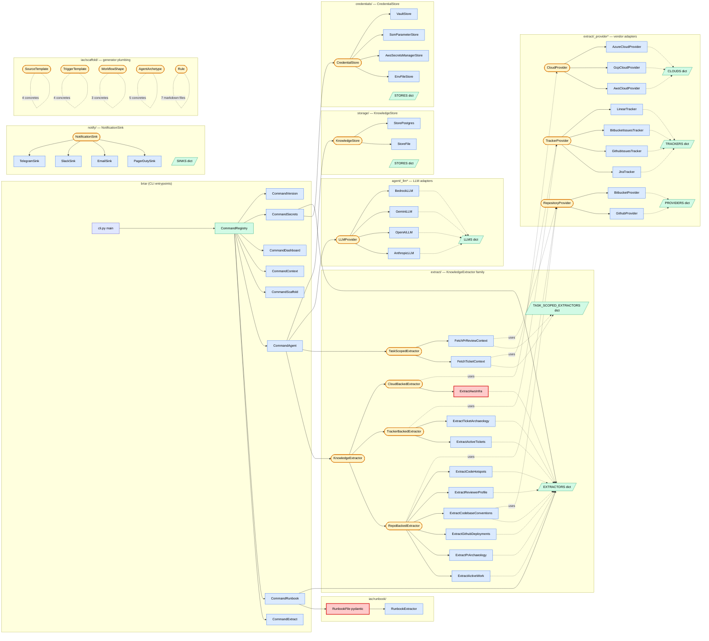
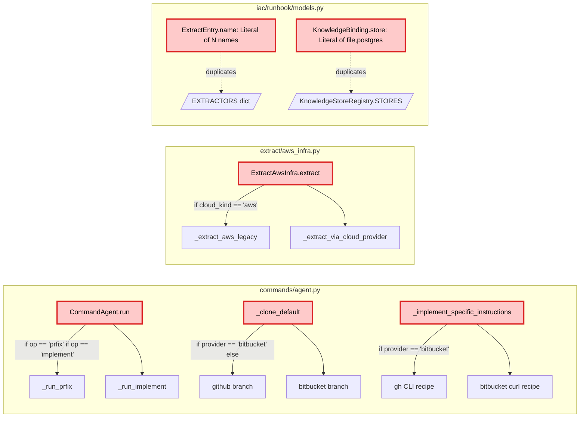

# Architecture — class + function map, with SOLID findings

Reference diagram + the design-pattern violations found during the
2026-05-22 audit. Follow-up commits fix violations 1–6.

---

## Module + abstraction map

Twelve Strategy + Registry families, plus one-off helpers. Adapter
files live under `_<plural>/` subpackages; registries are dicts in
the package `__init__.py`.

Red-bordered nodes are the SOLID violation hotspots (annotated below).

---

## Violations found

### Diagram zoom — the if-chain hotspots

### Findings table

| # | File:Line | Pattern | Why it's wrong | Fix |
|---|---|---|---|---|
| 1 | `commands/agent.py:112,114` | `if op == "prfix": ... if op == "implement": ...` | OCP — adding a new op requires editing the dispatch site, not just adding a class | `AgentOp` ABC + `AGENT_OPS` registry, mirroring every other plugin family |
| 2 | `commands/agent.py:302` | `if provider == "bitbucket": ... else (github)` | OCP — adding GitLab/Gitea cloner means a third `elif`, not a third class | `RepoCloner` ABC + `GithubRepoCloner`, `BitbucketRepoCloner` registered in `REPO_CLONERS` |
| 3 | `commands/agent.py:382` | Same `if provider == "bitbucket"` for instruction template | Same — provider-specific PR-creation recipe is data per-vendor, not branching | Method on `RepoCloner` (`pr_creation_recipe(owner, repo, branch, company)`) |
| 4 | `extract/aws_infra.py:62` | `if cloud_kind == "aws": ... else (cloud provider)` | The whole point of `CloudProvider` was to unify the AWS path with the generic path. The `if` re-introduces the coupling | Collapse to one path. `AwsCloudProvider` already exists; the legacy section-shape is the only blocker. Either accept the shape change or move the legacy rendering into `AwsCloudProvider` itself |
| 5 | `iac/runbook/models.py:24` | `ExtractEntry.name: Literal["pr-archaeology", ..., "code-hotspots"]` (9 names) | OCP — adding a new extractor requires editing the Literal even though the runtime registry already has the answer (`EXTRACTORS.keys()`). I edited this 3× this session | `name: str` + `@field_validator("name")` that checks against `EXTRACTORS.keys()` at validation time |
| 6 | `iac/runbook/models.py:53` | `KnowledgeBinding.store: Literal["file", "postgres"]` | Same shape — `KnowledgeStoreRegistry.STORES.keys()` is the source of truth | Same fix |
| 7 | `commands/secrets.py:22` | Hand-maintained `_EXTRACTOR_REQUIREMENTS: Dict[(extractor_name, provider_kind), List[CredEnv]]` | Each new (extractor, provider) pair requires editing the table. Should live on the extractor/provider as a `required_credentials()` method | DEFERRED — bigger refactor. Files a follow-up. |

The Literal[...] forms in `iac/models.py` (workflow-graph node `kind:
agent|human_checkpoint|branch|...`) are NOT violations — those are
tagged-union discriminators where the closed set is intentional (the
orchestrator switches on them). Keep.

### Why the if-chains specifically are the worst smell here

Every plugin family in the codebase uses Strategy + Registry. The
if-chains are inconsistent with that — they look like ad-hoc branching
when the surrounding architecture made the registry pattern the
default. A reviewer scanning `commands/agent.py:run` against
`commands/__init__.py:CommandRegistry.build` sees two different
philosophies and reasonably wonders which one wins. Convergence is
the cheaper outcome.

### Out-of-scope finds (not violations, noted for future)

- **`extract/_trackers/jira.py:_adf_walk`** has `if kind == "text"` — this is
  a single-decision branch inside a format walker, not a dispatcher. Not a
  violation.
- **Agent runner's `dry_run`** flag is a boolean parameter — could be a separate
  `DryRunRunner` class, but the if-check is one place and the runner is otherwise
  fine. Not worth the refactor.
- **`commands/agent.py::_pr_specific_instructions`** has a long format string. Long
  but readable. Not a SOLID issue.

---

## Follow-up commits

- **B (this branch):** fix violation 1 — `AgentOp` ABC + `AGENT_OPS` registry
- **C:** fix violations 2 + 3 — `RepoCloner` ABC for clone + PR-creation
- **D:** fix violation 4 — collapse `aws_infra` if-chain
- **E:** fix violations 5 + 6 — runbook Literal[] → field_validator against registries

Each commit stays independently revertable.
