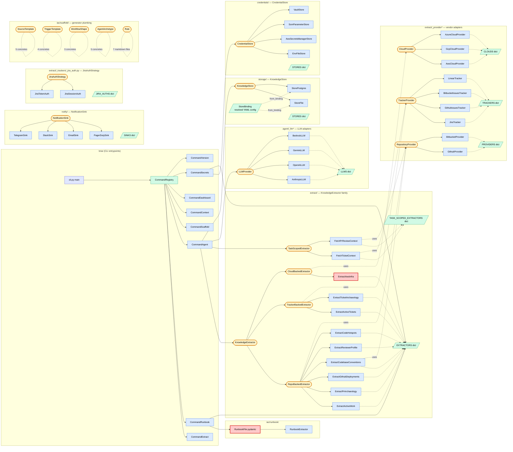
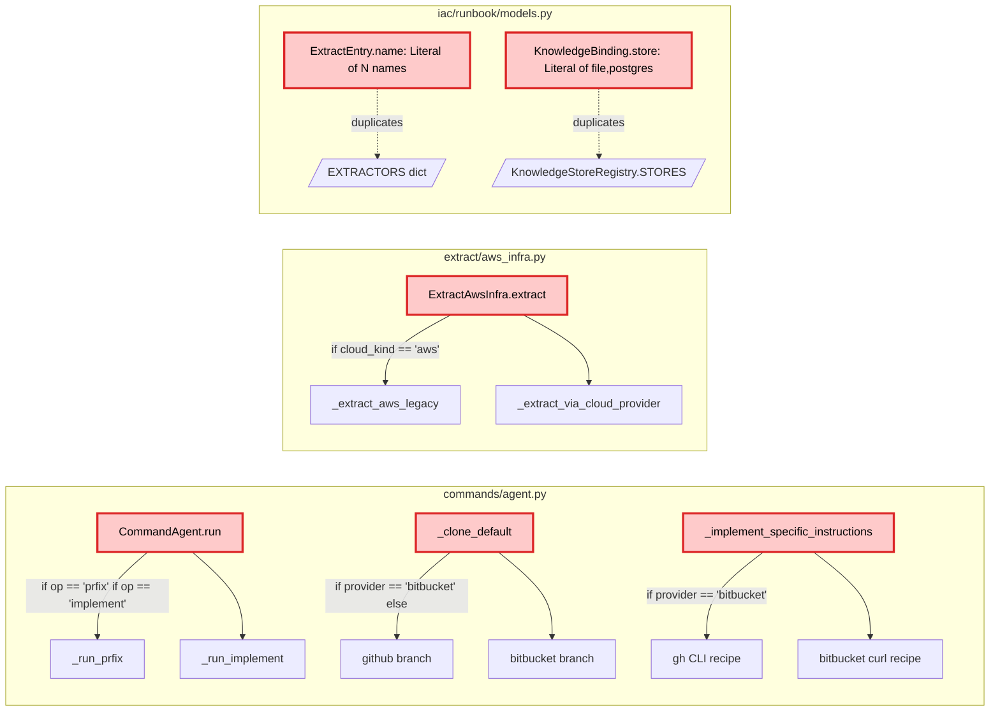

# Architecture — class + function map, with SOLID findings

Reference diagram + the design-pattern violations found during the
2026-05-22 audit. Follow-up commits fix violations 1–6.

---

## Module + abstraction map

Twelve Strategy + Registry families, plus one-off helpers. Adapter
files live under `_<plural>/` subpackages; registries are dicts in
the package `__init__.py`.

Red-bordered nodes are the SOLID violation hotspots (annotated below).

---

## Violations found

### Diagram zoom — the if-chain hotspots

### Findings table

| # | File:Line | Pattern | Why it's wrong | Fix |
|---|---|---|---|---|
| 1 | `commands/agent.py:112,114` | `if op == "prfix": ... if op == "implement": ...` | OCP — adding a new op requires editing the dispatch site, not just adding a class | `AgentOp` ABC + `AGENT_OPS` registry, mirroring every other plugin family |
| 2 | `commands/agent.py:302` | `if provider == "bitbucket": ... else (github)` | OCP — adding GitLab/Gitea cloner means a third `elif`, not a third class | `RepoCloner` ABC + `GithubRepoCloner`, `BitbucketRepoCloner` registered in `REPO_CLONERS` |
| 3 | `commands/agent.py:382` | Same `if provider == "bitbucket"` for instruction template | Same — provider-specific PR-creation recipe is data per-vendor, not branching | Method on `RepoCloner` (`pr_creation_recipe(owner, repo, branch, company)`) |
| 4 | `extract/aws_infra.py:62` | `if cloud_kind == "aws": ... else (cloud provider)` | The whole point of `CloudProvider` was to unify the AWS path with the generic path. The `if` re-introduces the coupling | Collapse to one path. `AwsCloudProvider` already exists; the legacy section-shape is the only blocker. Either accept the shape change or move the legacy rendering into `AwsCloudProvider` itself |
| 5 | `iac/runbook/models.py:24` | `ExtractEntry.name: Literal["pr-archaeology", ..., "code-hotspots"]` (9 names) | OCP — adding a new extractor requires editing the Literal even though the runtime registry already has the answer (`EXTRACTORS.keys()`). I edited this 3× this session | `name: str` + `@field_validator("name")` that checks against `EXTRACTORS.keys()` at validation time |
| 6 | `iac/runbook/models.py:53` | `KnowledgeBinding.store: Literal["file", "postgres"]` | Same shape — `KnowledgeStoreRegistry.STORES.keys()` is the source of truth | Same fix |
| 7 | `commands/secrets.py:22` | Hand-maintained `_EXTRACTOR_REQUIREMENTS: Dict[(extractor_name, provider_kind), List[CredEnv]]` | Each new (extractor, provider) pair requires editing the table. Should live on the extractor/provider as a `required_credentials()` method | DEFERRED — bigger refactor. Files a follow-up. |

The Literal[...] forms in `iac/models.py` (workflow-graph node `kind:
agent|human_checkpoint|branch|...`) are NOT violations — those are
tagged-union discriminators where the closed set is intentional (the
orchestrator switches on them). Keep.

### Why the if-chains specifically are the worst smell here

Every plugin family in the codebase uses Strategy + Registry. The
if-chains are inconsistent with that — they look like ad-hoc branching
when the surrounding architecture made the registry pattern the
default. A reviewer scanning `commands/agent.py:run` against
`commands/__init__.py:CommandRegistry.build` sees two different
philosophies and reasonably wonders which one wins. Convergence is
the cheaper outcome.

### Out-of-scope finds (not violations, noted for future)

- **`extract/_trackers/jira.py:_adf_walk`** has `if kind == "text"` — this is
  a single-decision branch inside a format walker, not a dispatcher. Not a
  violation.
- **Agent runner's `dry_run`** flag is a boolean parameter — could be a separate
  `DryRunRunner` class, but the if-check is one place and the runner is otherwise
  fine. Not worth the refactor.
- **`commands/agent.py::_pr_specific_instructions`** has a long format string. Long
  but readable. Not a SOLID issue.

---

## Follow-up commits

- **B (this branch):** fix violation 1 — `AgentOp` ABC + `AGENT_OPS` registry
- **C:** fix violations 2 + 3 — `RepoCloner` ABC for clone + PR-creation
- **D:** fix violation 4 — collapse `aws_infra` if-chain
- **E:** fix violations 5 + 6 — runbook Literal[] → field_validator against registries

Each commit stays independently revertable.

---

## Later additions (post-original-audit)

These ABCs landed after the original audit table above. They follow
the same Strategy + Registry shape as every other plugin family.

| ABC | Concretes | Purpose |
|---|---|---|
| `StoreBinding` (frozen dataclass) + `KnowledgeStore.from_binding` | `StoreFile`, `StorePostgres` | Per-company DSN resolution. Closed an OCP violation in `KnowledgeStoreRegistry.build()` (the old `if store_cls is StorePostgres: dsn = ENV ...` if-chain). See commit `c8e58d1`. |
| `JiraAuthStrategy` | `JiraTokenAuth`, `JiraSessionAuth` | Splits Jira's authentication concern out of `JiraTracker`. Lets one tracker support API-token AND browser-session-cookie auth without a 3-branch if-by-mode inside the tracker. See commit `d896d56`. |
| `GitIdentity` (Pydantic model) | n/a — pure config | Per-company commit author for `briar agent` flows. Read from YAML `companies.<name>.git_identity.{name,email}`. CLI flags still win per-field. See commit `ba91dde`. |
| `ErrorPolicy` + `ErrorDecision` (two ABCs) + `RetryingExecutor` | `ExceptionTypePolicy`, `HttpStatusPolicy` (leaf policies); `RetryAfter`, `Abort`, `Escalate` (decision types) | Pluggable error-response strategy for any external-API call. Anthropic 429 → `RetryAfter(3600s)`, 401 → `Abort`. Two ABCs eliminate if-by-type cascades in both directions (which error matched + what action to take). Adding "X provider rate limit → wait Y" = one tuple entry, not a code branch. Wired into `AnthropicLLM.complete`; same pattern available for GitHub/Bitbucket/Jira call sites. See commit `d001026`. |
| `CredentialAcquirer` (ABC) + `DestinationPolicy` enum + 9 concrete acquirers + new `briar auth` command | `GithubPatAcquirer`, `GithubDeviceAcquirer`, `BitbucketAppPasswordAcquirer`, `AwsStaticAcquirer`, `AwsSsoAcquirer`, `JiraTokenAcquirer`, `JiraSessionAcquirer`, `LinearApiKeyAcquirer`, `InfisicalAcquirer` | Interactive *write* side of credential management. Symmetric to `CredentialStore` (read side) and `CredentialBootstrap` (bulk-hydrate side). `DestinationPolicy` (EXTERNAL vs BOOTSTRAP_LOCAL) tells the CLI whether `--store` applies (vendor flows) or is forced to envfile (store-bootstrap flows). Closes the "how does the operator log in?" gap. See commits `984641d` + `fae64ae`. |
| `PromptIO` (Protocol) | `TerminalPromptIO` (real: input/getpass/webbrowser), `MockPromptIO` (tests) | Testable interactive I/O surface. Every acquirer's prompt/info/open_url/poll funnels through here — no direct stdin/stdout calls. Lets `MockPromptIO` drive every login flow in unit tests with scripted answers. See commit `984641d`. |
| `InfisicalStore` (`CredentialStore` impl) | n/a — single concrete | Per-name read/write/delete/list against the Infisical Secrets API. Counterpart to `InfisicalBootstrap` (bulk-hydrate at startup). Same machine-identity credentials, opposite direction. Makes Infisical a first-class `--store` destination. See commit `fae64ae`. |
| `EnvFileStore` path-resolution chain | `_secrets_path()` | Three-step resolution: `$BRIAR_SECRETS_FILE` → `/etc/briar/secrets.env` (if exists) → `$XDG_CONFIG_HOME/briar/secrets.env`. Plus auto-create-parent-dir + raise-on-real-failure (replaces silent-fallback-to-os.environ that masked file-write failures). Same backend, two deploy shapes (droplet + laptop). See commit `89089b3`. |

The pattern recurs: when you spot 2+ ways to do the same job (two DSN
sources, two auth modes), split into a Strategy + Registry rather
than growing an if-chain.

## Plug-in family inventory (current)

For at-a-glance discovery — every place a new behaviour-by-data can
be added without changing existing classes:

| Family | Registry location | Concretes today | Adding one |
|---|---|---|---|
| `Command` | `commands/__init__.py:CommandRegistry.COMMANDS` | extract, runbook, scaffold, context, dashboard, agent, **auth**, secrets, version | one class + list entry |
| `KnowledgeExtractor` | `extract/__init__.py:EXTRACTORS` | pr-archaeology, active-work, github-deployments, codebase-conventions, reviewer-profile, code-hotspots, active-tickets, ticket-archaeology, aws-infra | one module + registry tuple |
| `RepositoryProvider` | `extract/_providers/` | github, bitbucket | one adapter |
| `TrackerProvider` | `extract/_trackers/` | jira, github-issues, bitbucket-issues, linear | one adapter |
| `JiraAuthStrategy` | `extract/_trackers/_jira_auth.py` | token, session | one strategy class |
| `CloudProvider` | `extract/_clouds/` | aws, gcp, azure | one adapter |
| `LLMProvider` | `agent/_llms/` | anthropic, openai, gemini, bedrock | one adapter; `default_error_policies()` declares retry shape |
| `NotificationSink` | `notify/` | telegram, slack, email, pagerduty | one adapter |
| `MessageWriter` | `messaging/` | jira-comment, jira-transition, slack-channel, telegram-chat, github-pr-comment, bitbucket-pr-comment | one writer |
| `KnowledgeStore` | `storage/` | file, postgres | one backend |
| `CredentialStore` | `credentials/` | envfile, aws-secretsmanager, ssm, vault, **infisical** | one backend |
| `CredentialBootstrap` | `credentials/_bootstraps/` | infisical | one bootstrap |
| **`CredentialAcquirer`** | `auth/_acquirers/` | 9 (see "Later additions" table above) | one acquirer |
| `ErrorPolicy` | per-provider `default_error_policies()` | anthropic: 6 policies covering 429/connect/503/529/401/403 | one tuple entry per (error class, decision) |
| `AgentArchetype` | `iac/scaffold/archetypes/` | engineer, pr-fixer, pr-ci-fixer, pr-conflict-resolver, triager | one archetype |
| `WorkflowShape` | `iac/scaffold/workflows/` | plan-approve-act, one-shot, triage | one shape |
| `SourceTemplate` | `iac/scaffold/sources/` | github, bitbucket, jira, aws, sentry | one template |
| `TriggerTemplate` | `iac/scaffold/triggers/` | github_webhook, bitbucket_webhook, schedule_cron, manual | one template |
| `Rule` | `iac/scaffold/rules/` | 7 markdown rule snippets | one .md file |
