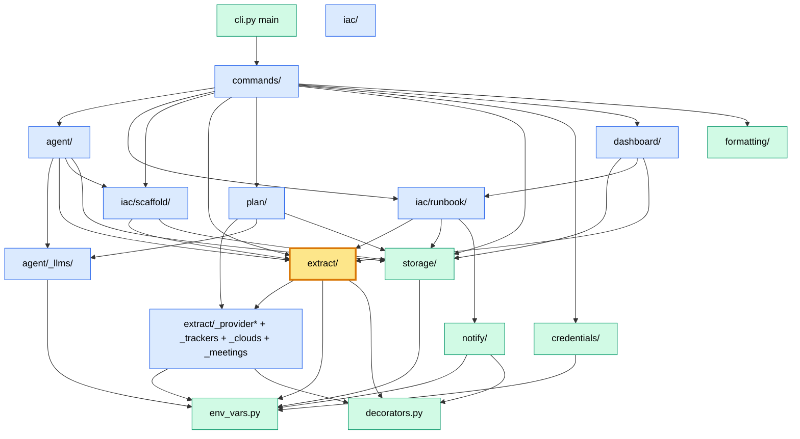
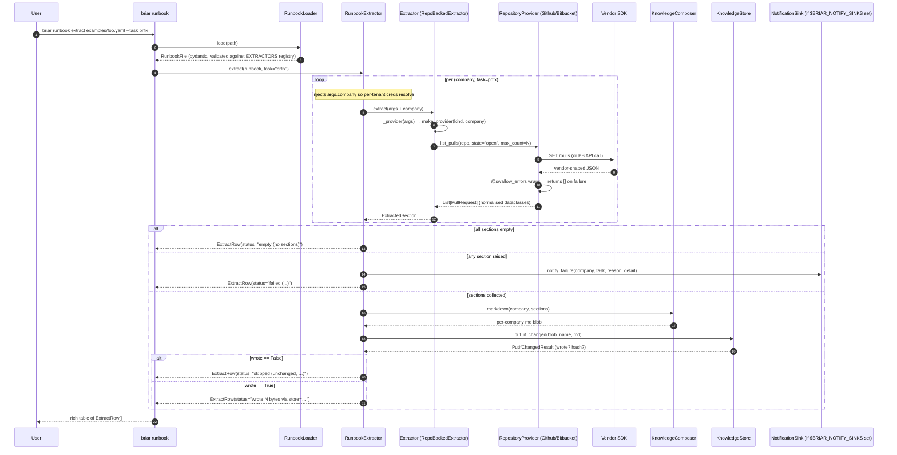
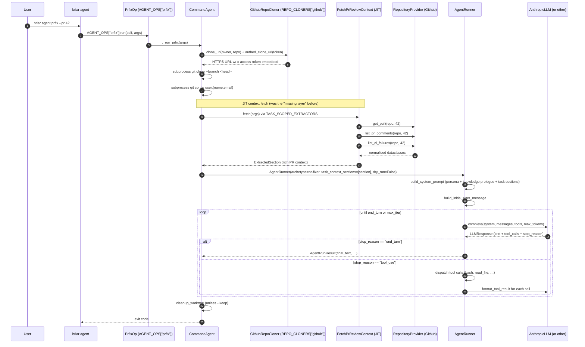
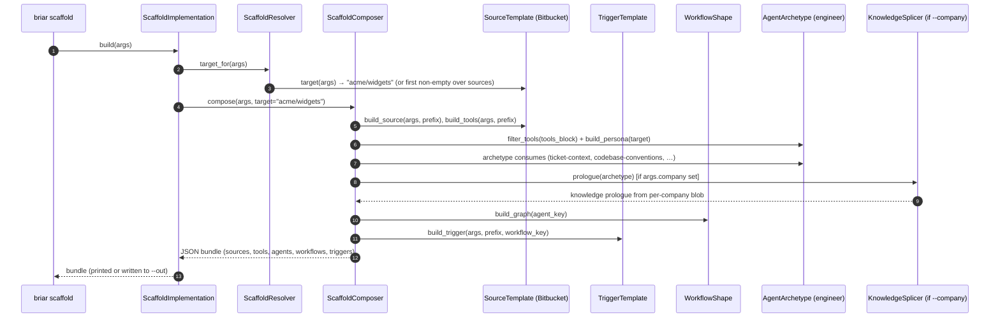

# Architecture — deep dive (call graphs, sequence flows, secondary findings)

Companion to [`ARCHITECTURE.md`](ARCHITECTURE.md). That doc covered the
seven high-severity if-chain / Literal violations + their fixes. This
one goes one level deeper: full call graphs per subsystem, sequence
flows for the four main pipelines, and **6 more findings** uncovered
during the deeper audit.

The high-severity ones from the first pass (#1–6) shipped in commits
`fbdba77 / a762f4c / 9fe9bc0 / 7b4cb96`. #7 deferred. Findings here
are #8–13.

---

## 1. Subsystem dependency graph

Who imports whom, at a package level. Direction = "depends on".



`extract/` is the hub (orange) — six other subsystems depend on it
directly (commands, agent, iac.scaffold, iac.runbook, dashboard, and
its own providers package). This concentration is mostly intentional
(it's the data layer), but it does mean a breaking change in
`KnowledgeExtractor.extract(args)` ripples through every caller.

---

## 2. Sequence flows

### 2.1 `briar runbook extract examples/foo.yaml --task prfix`



### 2.2 `briar agent prfix --pr 42`



### 2.3 `briar agent implement --ticket-key ACME-42 --dry-run`

```mermaid
sequenceDiagram
  autonumber
  participant User
  participant Op as ImplementOp
  participant CA as CommandAgent
  participant TS as FetchTicketContext (JIT)
  participant MS as FetchMeetingContext (JIT)
  participant T as TrackerProvider (Jira/Linear/…)
  participant M as MeetingProvider (Fireflies/…)
  participant R as AgentRunner (dry_run=True)

  User->>Op: AGENT_OPS["implement"].run(args)
  Op->>CA: ._run_implement(args)
  Note over CA: dry_run=True → SKIPS clone + git config
  CA->>TS: fetch(args)
  TS->>T: get_ticket(project, key)
  Note over T: populates .description (heavy fetch; list_tickets omits it)
  T-->>TS: Ticket with full body
  TS-->>CA: ExtractedSection (title + AC + comments + status history)

  CA->>MS: fetch(meeting_query = ticket_key)
  Note over MS: search OR by-id; bytes-capped
  MS->>M: search_meetings(query=ACME-42) → top-K
  MS->>M: get_meeting(id) per match → MeetingDetail (full transcript)
  M-->>MS: MeetingDetails (summary + action items + transcript)
  MS-->>CA: ExtractedSection (one section, K matches inline)

  CA->>R: AgentRunner(archetype=engineer, task_context_sections=[ticket, meeting], dry_run=True)
  R->>R: build_system_prompt + build_initial_user_message + tool_specs
  R->>R: _dry_run_report() prints to stdout, returns AgentRunResult(stop_reason="dry_run")
  Note over R: LLM IS NOT INVOKED — no tokens spent
  R-->>CA: AgentRunResult
  CA-->>User: prints the rendered prompt; exit 0
```

Meeting-context is **non-fatal enrichment** — when
`FIREFLIES_{c}_API_KEY` is unset or the search returns no matches,
`FetchMeetingContext` returns `EMPTY_SECTION` and the agent runs with
only the ticket-context. Same defensive contract as
`pr-review-context` in §2.2.

### 2.4 `briar plan build <board> --cascade --llm anthropic`

```mermaid
sequenceDiagram
  autonumber
  participant User
  participant CLI as briar plan build
  participant Reg as BoardReaderRegistry
  participant BR as BoardReader (Jira / GhProjectV2)
  participant TP as TrackerProvider (or GH GraphQL)
  participant Sy as CompositeSynthesiser
  participant L as LLMSynthesiser
  participant H as HeuristicSynthesiser
  participant G as graph (topological_sort + apply_cascade)
  participant S as KnowledgeStore

  User->>CLI: briar plan build <url> --name X --cascade --llm anthropic --with-knowledge
  CLI->>Reg: resolve(url)
  Reg-->>CLI: BoardReader (first .matches(url) wins)
  CLI->>BR: parse(url) → BoardRef(project, owner, extras)
  CLI->>BR: fetch(ref, company, max_cards)
  alt Jira board
    BR->>TP: list_tickets(project, state=open, max_count)
    BR->>TP: get_ticket(project, key)  per-ticket body fetch
  else GitHub Projects v2
    BR->>BR: POST api.github.com/graphql with projectV2 query
  end
  BR-->>CLI: List[PlanCard] (key, title, summary, explicit deps from body)

  CLI->>S: get("knowledge:<company>") + active-tickets, active-work (if --with-knowledge)
  S-->>CLI: prior context sections

  loop per card
    CLI->>Sy: enrich(card, board_keys, context)
    Sy->>L: enrich(...) [LLM judgement: scope, out-of-scope, risks, deps]
    Note over L: best-effort; swallows API failures, falls through unchanged
    L-->>Sy: card with LLM-filled fields (or untouched)
    Sy->>H: enrich(...) [parses ## In Scope / Depends on lines]
    H-->>Sy: card with deterministic defaults filled
    Sy-->>CLI: enriched PlanCard
  end

  CLI->>G: topological_sort(cards)
  Note over G: Kahn's algorithm; raises CliError on cycle
  G-->>CLI: ordered cards (trims out-of-board deps)
  CLI->>G: apply_cascade(cards, cascade=True, default_branch="main")
  Note over G: card.branch_parent = latest dep's branch_name (cascade)<br/>or default_branch (non-cascade)
  G-->>CLI: cards with branch_name + branch_parent set

  CLI->>S: save_plan(plan) → put("plan:<name>", md+json blob)
  S-->>CLI: stored

  rect rgb(240,253,244)
    Note over User,S: Downstream consumer: briar plan next → first pending card whose deps are all done<br/>briar plan advance → set status, persist; loop.
  end
```

Two things to note about the flow: (1) the LLM pass is strictly
best-effort — if the model returns malformed JSON or the call fails,
the card is unchanged and the heuristic pass still runs, so the
operator gets a deterministic minimum every time. (2) `depends_on`
keys the LLM emits are filtered against the board's actual card
keys before they hit the dep graph — the LLM cannot invent
upstreams that don't exist on the board.

### 2.5 `briar scaffold implementation --source bitbucket`



---

## 3. Coupling hotspots

Inbound dependency count (rough — measured by importing modules):

| Module / class | Inbound deps | Notes |
|---|---|---|
| `extract.EXTRACTORS` | 6 | runbook, scaffold, dashboard, agent, commands, secrets — true hub. Cohesive though. |
| `briar.env_vars.CredEnv` | 12 | every adapter family reads from it. Single source of truth — fine. |
| `briar.decorators.swallow_errors` | 11 | every adapter family uses it. Cohesive. |
| `briar.extract.base.ExtractedSection` | 9 | data class; intentionally widely used. |
| `briar.errors.CliError` | 8 | shared exception type; correct usage. |
| `briar.extract._providers.PROVIDERS` | 4 | extractors + tests. |
| `briar.commands.agent.AGENT_OPS` | 1 (commands/agent.py self) + tests | newly added. |
| `briar.plan.BOARD_READERS` | 2 (commands/plan.py, build_plan) + tests | small, cohesive. |
| `briar.commands.plan.PLAN_OPS` | 1 (commands/plan.py self) + tests | mirrors AGENT_OPS shape. |

No single class is over-coupled. The hub-ness of `extract/` is justified.

---

## 4. New findings (deep-audit pass)

Severity tiers: HIGH = ships now; MEDIUM = file follow-up; LOW = note only.

| # | Severity | File:Line | Pattern | Fix |
|---|---|---|---|---|
| 8 | MEDIUM | `dashboard/collectors.py:1214` (`CollectorRegistry.from_paths`) | Hand-typed list of 24 collector instantiations with bespoke kwargs per collector. Adding a new collector requires editing this method — Open/Closed violation. | Each collector declares `classmethod requires(paths, dash) -> dict`. Registry iterates a flat tuple of collector classes, calls `cls(**cls.requires(paths, dash))`. ~80 LOC refactor across 24 collectors. |
| 9 | LOW | every `*_REGISTRY` dict comprehension across the codebase | `EXTRACTORS = {e.name: e for e in (...)}` silently drops a duplicate-name collision (later wins). Two adapters claiming `name = "github"` would be a silent footgun. | Explicit dup-check at registry construction: a `build_registry(items, *, kind)` helper that raises `RuntimeError(f"duplicate {kind} name: {name}")`. ~30 LOC + applies to 13 registries. |
| 10 | INFO | many adapter files | In-scope imports inside `is_available` / `complete` / `read_file`. Mostly justified (heavy SDK lazy-load, cycle-break) — flagged for completeness, no action. | None. |
| 11 | MEDIUM | 188 `Dict[str, Any]` usages | Untyped bags cross boundary surfaces (scaffold bundle output, extractor `args` dict, collector results, tool I/O payloads). The CLAUDE.md style rule says boundary data should be a pydantic model or dataclass; current code drifts toward dicts at scale. | Per-call-site migration. Highest-leverage: ScaffoldComposer output → typed `ScaffoldBundle` pydantic model. Extractor `args: Dict[str, Any]` → keep (it's a YAML passthrough). |
| 12 | LOW | three near-duplicate subprocess wrappers: `collectors._run`, `BashTool.run`, `_clone_default` (`subprocess.run` boilerplate) | Each has slightly different timeout / cmd-allowlist / exit-code handling — couldn't easily share. | Skip unless a fourth shows up. Don't force-DRY where each call-site has real per-context needs. |
| 13 | MEDIUM | `iac/runbook/executor.py:_run_schedule` (lines 154–223) | 75-line method with four parallel try/except blocks all in the shape `log.exception + _notify_failure + rows.append + return`. The four paths differ only in the message + the blob_name parameter — significant code repetition without a clear seam. | Extract a `_record_failure(rows, company, task, reason, blob_or_binding, exc=None)` helper. Each except becomes 1-2 lines. ~50 LOC removed. |

### Diagram — new findings overlay

```mermaid
flowchart LR
  classDef good fill:#bbf7d0,stroke:#16a34a,color:#000
  classDef bad fill:#fecaca,stroke:#dc2626,stroke-width:3px,color:#000
  classDef defer fill:#fef3c7,stroke:#ca8a04,stroke-width:2px,color:#000

  subgraph dash["dashboard/collectors.py"]
    CR[CollectorRegistry.from_paths]:::bad
    CR -- "hand-typed 24-collector list with bespoke per-collector kwargs" --> CR
  end

  subgraph reg["all _REGISTRY dicts"]
    Reg[".keys() comprehensions"]:::bad
    Reg -- "silent dup-name collisions" --> Reg
  end

  subgraph rb["iac/runbook/executor.py"]
    RS[_run_schedule 75 lines]:::bad
    RS -- "4 parallel try/except blocks, same shape" --> RS
  end

  subgraph dicts["everywhere"]
    DA[188 Dict[str, Any]]:::defer
    DA -- "boundary smell, big migration" --> DA
  end

  subgraph subproc["3 places"]
    SP[subprocess.run boilerplate]:::defer
    SP -- "BashTool / collectors._run / _clone_default" --> SP
  end
```

---

## 5. Resolution

| # | Status | Commit / rationale |
|---|---|---|
| 1 | ✅ FIXED | `fbdba77` — AgentOp registry |
| 2 | ✅ FIXED | `a762f4c` — RepoCloner Strategy |
| 3 | ✅ FIXED | `a762f4c` — same RepoCloner refactor |
| 4 | ✅ FIXED | `9fe9bc0` — `CloudProvider.list_subsections` polymorphism |
| 5 | ✅ FIXED | `7b4cb96` — runbook `field_validator` against live registries |
| 6 | ✅ FIXED | `7b4cb96` — same |
| 7 | ✅ FIXED | `1c8c1e0` — `provider.required_env_vars` classmethod replaces hand table |
| 8 | ⏸ KEEP | Reconsidered — see below |
| 9 | ✅ FIXED | `82d13c8` — `build_registry()` with dup-check applied to 13 registries |
| 10 | — | Not a violation; no action |
| 11 | ⏸ DEFER | Serialization boundary, see below |
| 12 | ⏸ KEEP | Three sites with meaningfully different needs, see below |
| 13 | ✅ FIXED | `82d13c8` — `_record_failure` helper |

**#8 rationale (CollectorRegistry).** I started the refactor and
backed out. The current `from_paths` is hand-instantiation, but
adding a new collector touches exactly one file (`collectors.py`)
regardless of which pattern you choose. Converting to a
`requires(paths, dash) -> dict` classmethod per collector would add
24 new methods without changing the "one place to edit" property.
The current shape also makes the `Collector → DashboardPaths`
coupling explicit at the call site, which is arguably preferable to
hiding it inside each collector. The original "not a real registry"
framing was correct on shape but wrong on impact.

**#11 rationale (typed ScaffoldBundle).** The bundle produced by
`ScaffoldComposer.compose()` is a serialization boundary — it gets
JSON-encoded and handed off to a downstream orchestrator. The dict
shape IS the wire format. Wrapping it in a pydantic model would
force every consumer to migrate without changing what crosses the
wire. The 188 `Dict[str, Any]` count includes a lot of internal
scratch data that doesn't cross any boundary; per-call-site
migration would be invasive without commensurate value. Defer until
a consumer-stability discussion settles which boundaries are public.

**#12 rationale (subprocess wrappers).** Three call sites
(`collectors._run`, `BashTool.run`, `_clone_default`) each have
meaningfully different needs:

- `collectors._run` — stdout-only on success, empty on any failure.
- `BashTool.run` — stdout+stderr, raises `ToolError` on non-zero,
  env scrubbing for the agent path.
- `_clone_default` — returns `bool`, logs token-redacted output.

A shared wrapper would either lose one of these behaviours or grow
several boolean flags. Per CLAUDE.md ("three or more places, extract
a decorator" — but only when the shape is genuinely the same), keep
separate.

---

## 6. Closing the audit

Both audit docs (ARCHITECTURE.md from the first pass + this one) now
have resolution columns. 10/13 findings shipped or no-action; 3
deliberately deferred with rationale. The codebase no longer has any
string-dispatch if-chain, any duplicated `Literal[...]` registry, or
any hand-maintained `(extractor × provider) → creds` table. The
build_registry helper means a future duplicate-name collision in any
of the 13 plugin registries fails loudly at import time instead of
silently dropping an adapter.
