# Architecture — function-level map + aggressive refactor plan

Third doc in the architecture series. Where the existing two leave off:

| Doc | Zoom level | What it covers |
|---|---|---|
| [`ARCHITECTURE.md`](ARCHITECTURE.md) | Module + ABC | Plug-in family inventory, Strategy + Registry catalogue, original SOLID findings #1–7 (all shipped) |
| [`ARCHITECTURE_DEEP.md`](ARCHITECTURE_DEEP.md) | Package + sequence | Subsystem dependency graph, 5 sequence flows for major CLI paths, deep-audit findings #8–13 (10/13 done, 3 deferred with rationale) |
| **`ARCHITECTURE_MAP.md`** (this file) | **Class + function** | UML class diagrams (attrs + methods + signatures) and function-level call graphs for the 12 hot modules; aggressive refactor plan covering #8 / #11 deferrals + net-new smells |

**Goal of this doc.** Make the *inside* of the hot modules legible: which method calls which, where the data flows, what each function actually does. Then propose a refactor pass that pushes the codebase further down the SOLID + GoF road than the previous two audits did.

**Goal of the refactor plan.** Simpler and more maintainable. The previous passes already nailed Strategy + Registry across 25+ plug-in families. The remaining smells are different in kind — long methods, primitive obsession at module boundaries, accidental god classes, temporal coupling. Different patterns: Builder, Command, Template Method, Composite, Specification, Value Objects.

---

## 0. Reading guide

The 12 modules covered here are the ones that carry the most logic mass — 7 of them are 350+ lines, and together they hold ~60% of the LOC outside of the registry/adapter leaves.

```mermaid
flowchart LR
  classDef big fill:#fde68a,stroke:#d97706,stroke-width:3px,color:#000
  classDef mid fill:#dbeafe,stroke:#2563eb,color:#000
  classDef new fill:#bbf7d0,stroke:#16a34a,stroke-width:2px,color:#000

  collectors[dashboard/collectors.py<br/>1354 LOC · 24 collectors]:::big
  agent[commands/agent.py<br/>799 LOC · CommandAgent + 2 Ops + 2 Cloners]:::big
  plan[commands/plan.py<br/>~640 LOC · CommandPlan + 8 Ops (LLM-driven)]:::big
  exec[iac/runbook/executor.py<br/>365 LOC · RunbookExtractor]:::mid
  runner[agent/runner.py<br/>364 LOC · AgentRunner]:::mid
  tools[agent/tools.py<br/>355 LOC · 5 Tools]:::mid
  base[extract/base.py<br/>351 LOC · 9 base extractors]:::mid
  comp[iac/scaffold/_composer.py<br/>340 LOC · ScaffoldComposer]:::mid
  syn[plan/_synthesize.py<br/>255 LOC · 3 synthesisers]:::mid
  ant[agent/_llms/anthropic_llm.py<br/>185 LOC · AnthropicLLM]:::mid
  mctx[extract/meeting_context.py<br/>181 LOC · FetchMeetingContext]:::new
  mdig[extract/meeting_digest.py<br/>181 LOC · ExtractMeetingDigest]:::new
```

Green = added since the prior audit (meeting subsystem). Orange = the file you should refactor first.

The diagrams below use these conventions:

- `classDiagram` blocks render as UML class boxes — attributes above the line, methods below.
- `flowchart` blocks render call graphs. Arrows point in the direction of *calls*. Dashed arrows are external (subprocess, SDK, network, filesystem).
- Method signatures elide `self` / kwargs-only markers for readability; the full body in the source file is authoritative.

---

## 1. `dashboard/collectors.py` — 24 collectors + a registry

The largest single file in the codebase. Twenty-four `Collector` subclasses, each one a thin pull-and-shape adapter for a different observability surface (registries, log tails, system files, git, network probes).

### 1.1 Class diagram

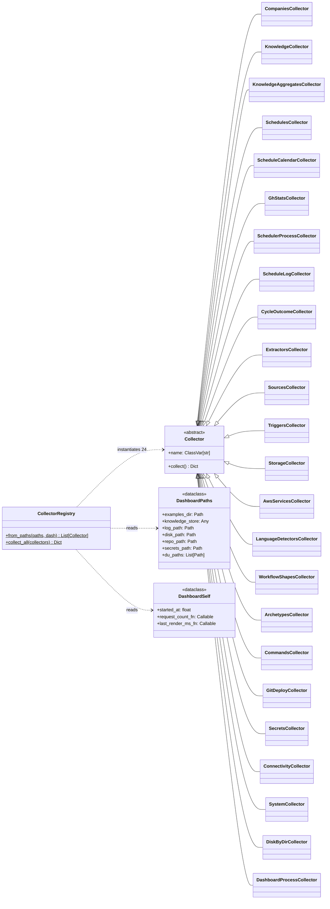

### 1.2 Internal call graph — the non-trivial collectors

Most collectors are one-method wonders. Three have meaningful internal call structure plus a small set of shared module-level helpers:

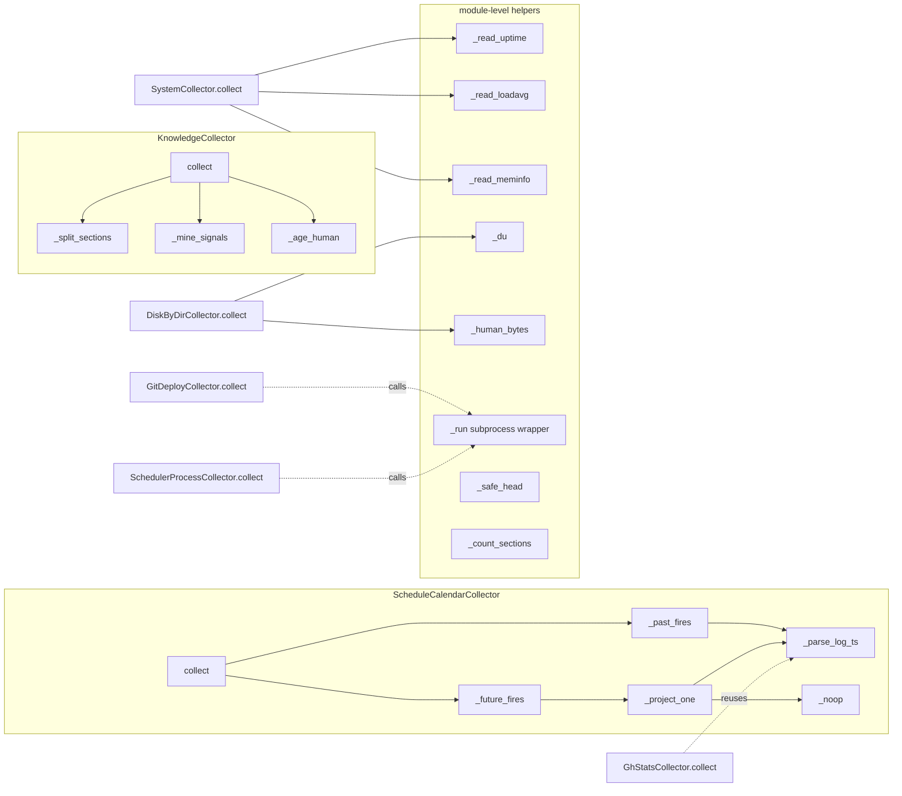

`GhStatsCollector` reaches across class boundaries to reuse `ScheduleCalendarCollector._parse_log_ts` — flagged in §6 as Feature Envy.

### 1.3 External boundaries (per collector group)

| Boundary | Collectors that touch it |
|---|---|
| `/proc/{uptime,loadavg,meminfo}` | SystemCollector |
| `subprocess.run` (git, pgrep) | GitDeployCollector, SchedulerProcessCollector |
| `socket.create_connection` | ConnectivityCollector |
| `yaml.safe_load` | CompaniesCollector, SchedulesCollector, ScheduleCalendarCollector |
| `KnowledgeStore.list` | KnowledgeCollector, KnowledgeAggregatesCollector |
| Filesystem (log tail, secret file) | GhStatsCollector, ScheduleLogCollector, CycleOutcomeCollector, SecretsCollector |
| Plug-in registries (`EXTRACTORS`, `ARCHETYPES`, …) | 10 catalog collectors |

**Observation.** Collectors fall into four *kinds*: catalog readers (10), file/log tailers (6), system probes (3), and YAML walkers (3). The catalog readers are nearly identical — they just iterate a registry and reshape entries. This is the seam the refactor plan exploits.

---

## 2. `commands/agent.py` — CommandAgent + AgentOp + RepoCloner

After the post-audit refactors, this file holds three Strategy + Registry families: `AgentOp` (subcommand dispatch), `RepoCloner` (vendor-specific clone + PR recipe), and the orchestrating `CommandAgent` that wires them.

### 2.1 Class diagram

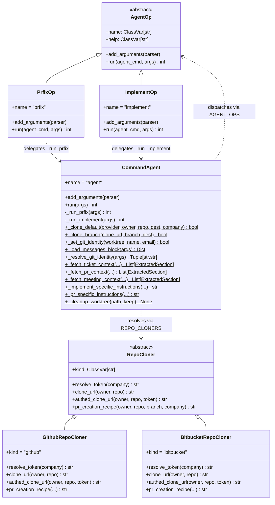

`CommandAgent` carries **13 staticmethods** doing real work and 2 instance methods that are thin glue to the staticmethods. That's a code smell (Utility Class in disguise) — covered in §6 finding A.

### 2.2 Call graph — the two real flows

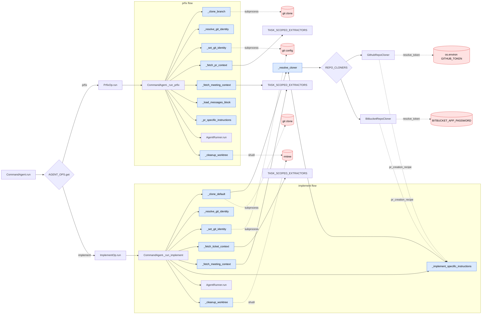

The two flows are **structurally identical**: clone → set identity → fetch context → build instructions → run agent → cleanup. They differ only in *which* context fetches happen and *which* instruction template they pick. Strong candidate for a Template Method or pipeline refactor (§6 finding A).

### 2.3 Method signatures (key ones)

```python
class CommandAgent(Command):
    def run(self, args: argparse.Namespace) -> int

    def _run_prfix(self, args: argparse.Namespace) -> int
    def _run_implement(self, args: argparse.Namespace) -> int

    @staticmethod
    def _clone_default(provider: str, owner: str, repo: str,
                       dest: Path, *, company: str = "") -> bool
    @staticmethod
    def _clone_branch(clone_url: str, branch: str, dest: Path) -> bool
    @staticmethod
    def _set_git_identity(worktree: Path, user_name: str,
                          user_email: str) -> bool
    @staticmethod
    def _resolve_git_identity(args: argparse.Namespace) -> Tuple[str, str]

    @staticmethod
    def _fetch_ticket_context(*, company: str, tracker: str,
                              ticket_project: str, ticket_key: str
                              ) -> List[ExtractedSection]
    @staticmethod
    def _fetch_pr_context(*, company: str, owner: str, repo: str,
                          pr: int) -> List[ExtractedSection]
    @staticmethod
    def _fetch_meeting_context(*, company: str, meeting_kind: str,
                               meeting_key: str, meeting_query: str,
                               meeting_top_k: int, meeting_max_bytes: int
                               ) -> List[ExtractedSection]
```

The three `_fetch_*_context` staticmethods have identical *shape* (lookup in `TASK_SCOPED_EXTRACTORS`, parse args, call `.fetch`, swallow errors) — see §6 finding B for the proposed collapse.

---

## 3. `commands/plan.py` — CommandPlan + 8 PlanOps

Mirrors `commands/agent.py` structure: a dispatcher Command plus a `PlanOp` Strategy family.

### 3.1 Class diagram

```mermaid
classDiagram
  direction TB
  class PlanOp {
    <<abstract>>
    +name: ClassVar[str]
    +help: ClassVar[str]
    +add_arguments(parser)
    +run(plan_cmd, args) int
  }
  class BuildOp { +run(plan_cmd, args) int }
  class ShowOp { +run(plan_cmd, args) int }
  class StatusOp { +run(plan_cmd, args) int }
  class NextOp { +run(plan_cmd, args) int }
  class AdvanceOp { +run(plan_cmd, args) int }
  class ListOp { +run(plan_cmd, args) int }
  class ClearOp { +run(plan_cmd, args) int }
  class RunOp {
    +run(plan_cmd, args) int
    +_invoke_implement(run_implement, impl_args, key)$ tuple
    +_build_implement_args(args, card, tracker_project)$ Namespace
    +_render_summary(args, plan, outcomes, stopped_early)$ None
  }
  PlanOp <|-- BuildOp
  PlanOp <|-- ShowOp
  PlanOp <|-- StatusOp
  PlanOp <|-- NextOp
  PlanOp <|-- AdvanceOp
  PlanOp <|-- ListOp
  PlanOp <|-- ClearOp
  PlanOp <|-- RunOp

  class CommandPlan {
    +name = "plan"
    +add_arguments(parser)
    +run(args) int
    +_open_store(args)$ KnowledgeStore
    +_open_journal_store(args)$ JournalStore
    +_slug_from_url(url)$ str
    +_card_to_dict(plan, card)$ dict
    +_decision_to_dict(plan, decision)$ dict
    +_gather_knowledge(store, company)$ List[str]
  }

  CommandPlan ..> PlanOp : dispatches via PLAN_OPS
  RunOp ..> CommandAgent : calls run_implement
  RunOp ..> Selector : pick → SelectorDecision
  RunOp ..> KnowledgeWriter : write after rc==0
  RunOp ..> replan : on SelectorActionKind.REPLAN
  NextOp ..> Selector : pick → SelectorDecision
  BuildOp ..> CardSynthesiser : via build_plan
  BuildOp ..> BoardReader : via build_plan
  BuildOp ..> render_plan_knowledge : seed knowledge:<company>.<plan>
  StatusOp ..> collect_status : projects plan + journal
```

### 3.2 Call graph

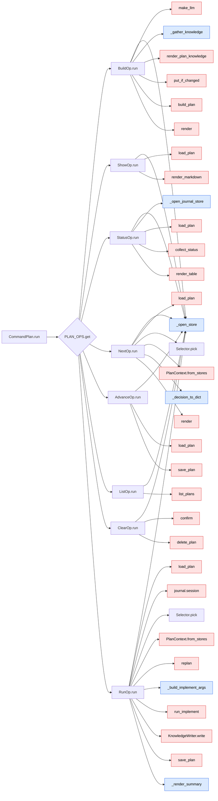

Same dispatcher shape as `commands/agent.py`. The two `Command` classes are isomorphic and could share a base — §6 finding C.

---

## 4. `iac/runbook/executor.py` — RunbookExtractor pipeline

### 4.1 Class diagram

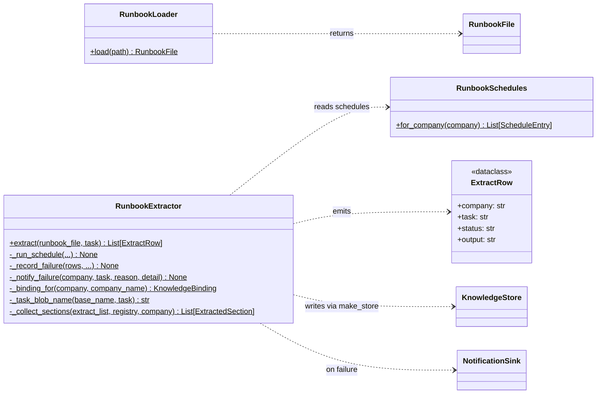

### 4.2 Call graph

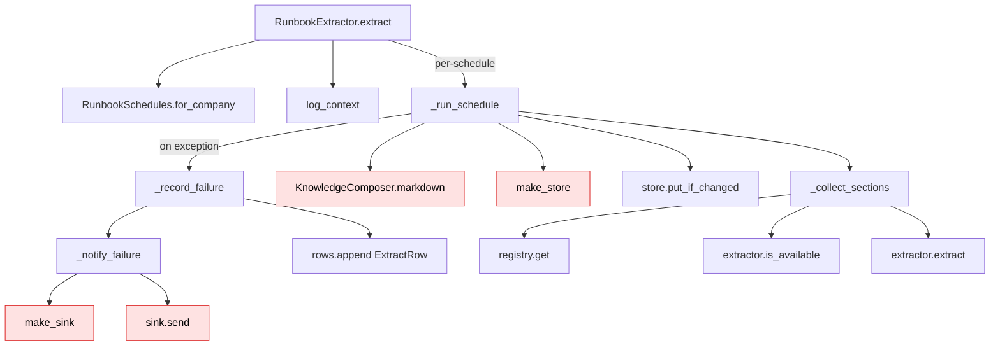

The `_record_failure` helper is the resolved finding #13 — replaced four parallel try/except blocks. The remaining concern is that `_run_schedule` accepts **8 keyword arguments** (Long Parameter List), flagged in §6 finding D.

---

## 5. `agent/runner.py` — AgentRunner main loop

### 5.1 Class diagram

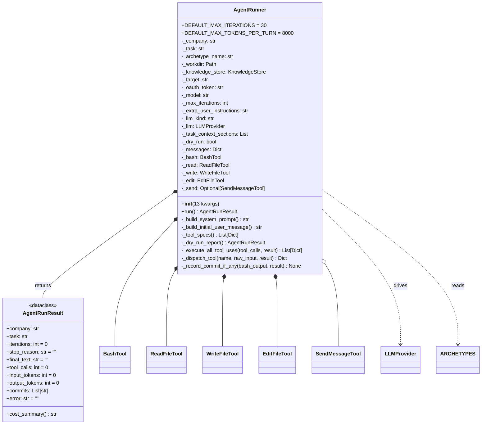

`AgentRunner.__init__` takes **13 keyword-only parameters**. That's a Long Parameter List smell of the canonical sort — §6 finding E proposes a `AgentRunConfig` value object.

### 5.2 Main-loop call graph

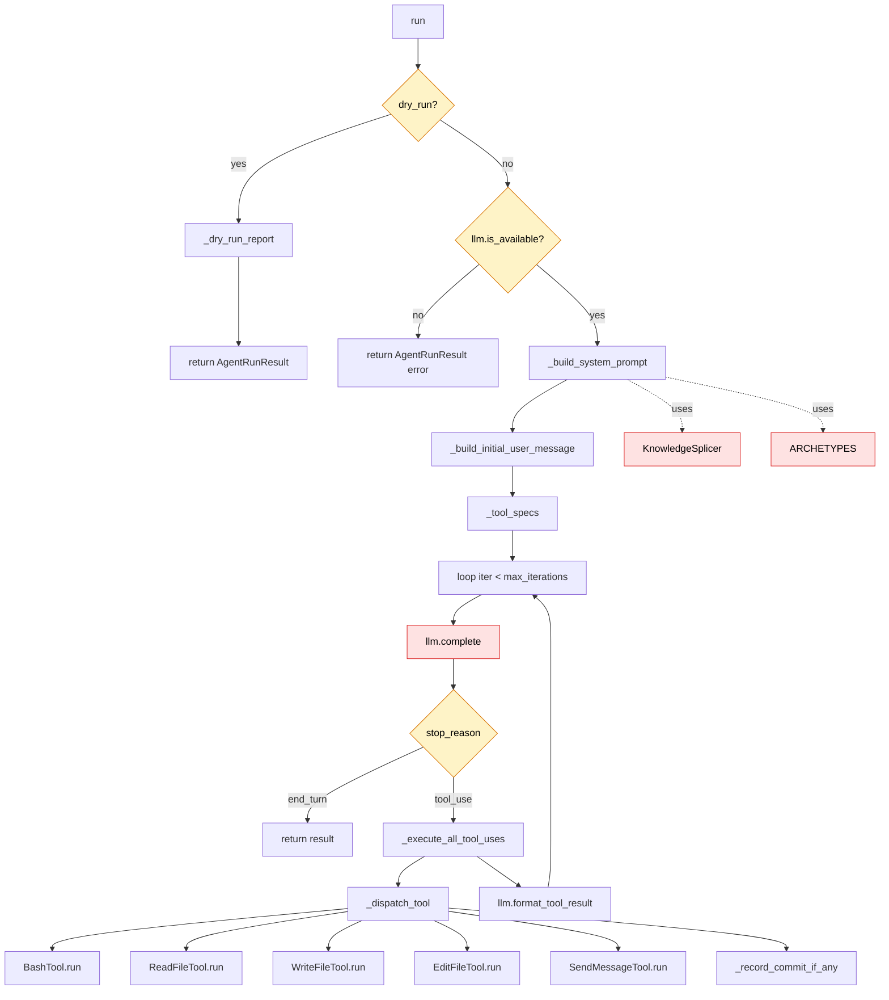

The dispatch in `_dispatch_tool` is the one remaining `if name == "bash" elif name == "read_file" ...` chain that survived the audit — §6 finding F proposes a `Dict[str, Tool]` registry to match the rest of the codebase.

---

## 6. `agent/tools.py` — five Tool classes

### 6.1 Class diagram

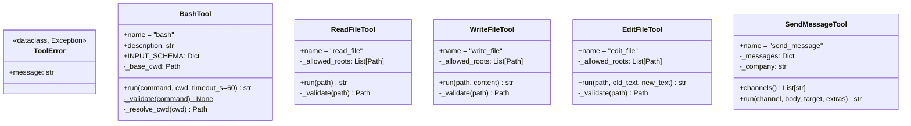

**No common base class** — each tool implements `name`, `description`, `INPUT_SCHEMA`, and `run` independently. `ReadFileTool`, `WriteFileTool`, and `EditFileTool` all duplicate the same `_validate(path)` allowed-roots check. Flagged §6 finding G.

### 6.2 Call graph

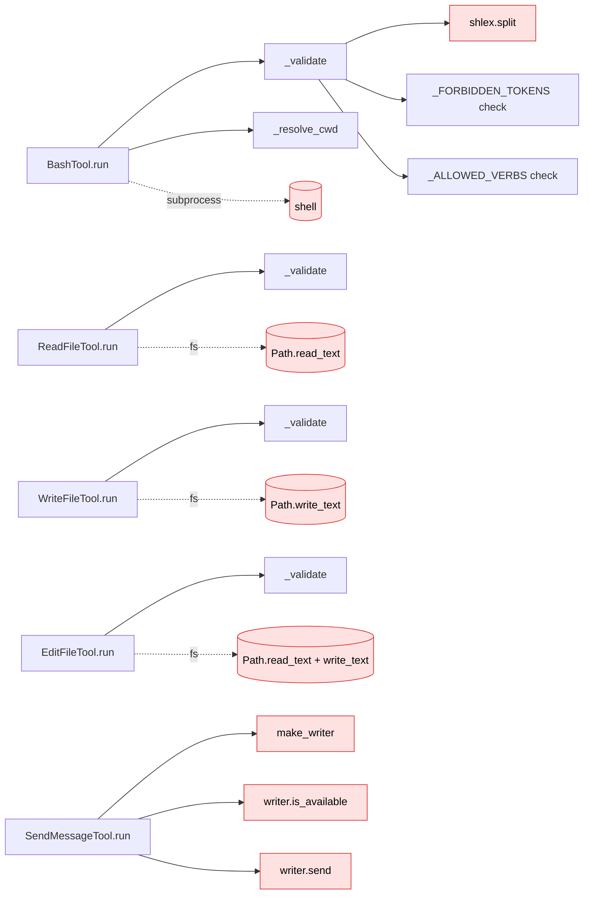

---

## 7. `extract/base.py` — extractor ABC hierarchy

The mixin-like hierarchy that lets a concrete extractor pick its provider family.

### 7.1 Class diagram

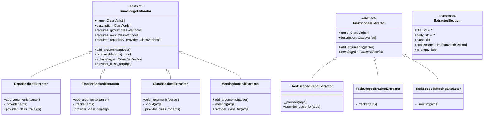

The `*_BackedExtractor` classes follow a **rigorously identical shape**: add a `--<kind>` arg in `add_arguments`, expose a `_<kind>(args)` factory, expose a `provider_class_for(args)` registry lookup. Same shape across four pairs (= 8 classes). This is the canonical Template Method opportunity — §6 finding H.

---

## 8. `iac/scaffold/_composer.py` — ScaffoldComposer

### 8.1 Class diagram

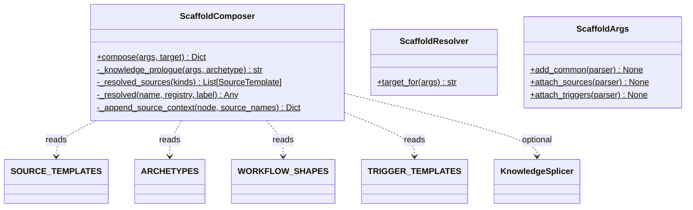

### 8.2 Call graph for `compose`

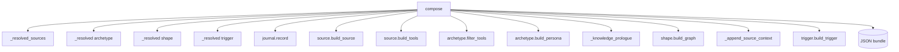

`compose` is **a sequential pipeline of 12+ named steps** that all write into one growing dict. This is the canonical Builder opportunity — §6 finding I.

---

## 9. `plan/_synthesize.py` — three CardSynthesisers

### 9.1 Class diagram

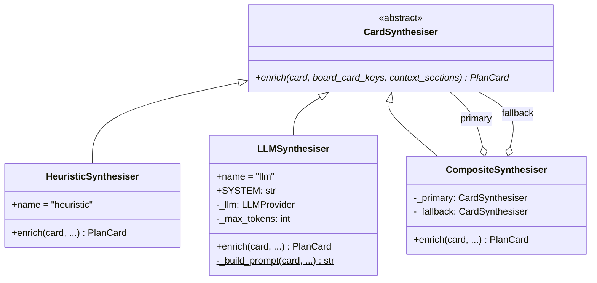

Clean Decorator-style Composite pattern. No issues flagged here.

### 9.2 Call graph

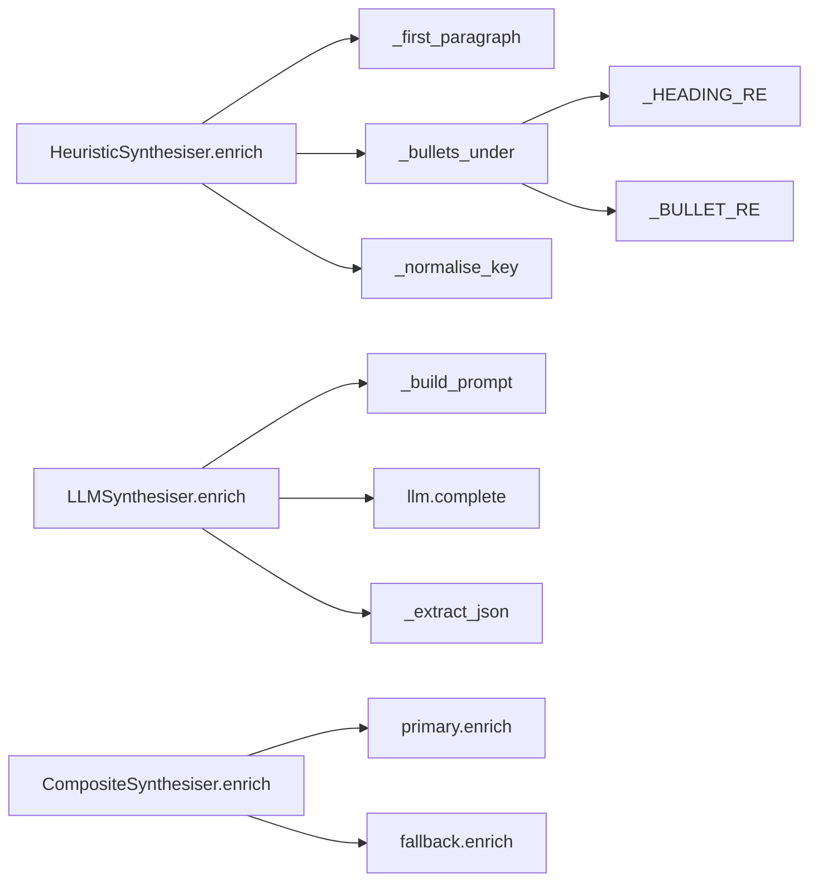

---

## 10. `agent/_llms/anthropic_llm.py` — AnthropicLLM

### 10.1 Class diagram

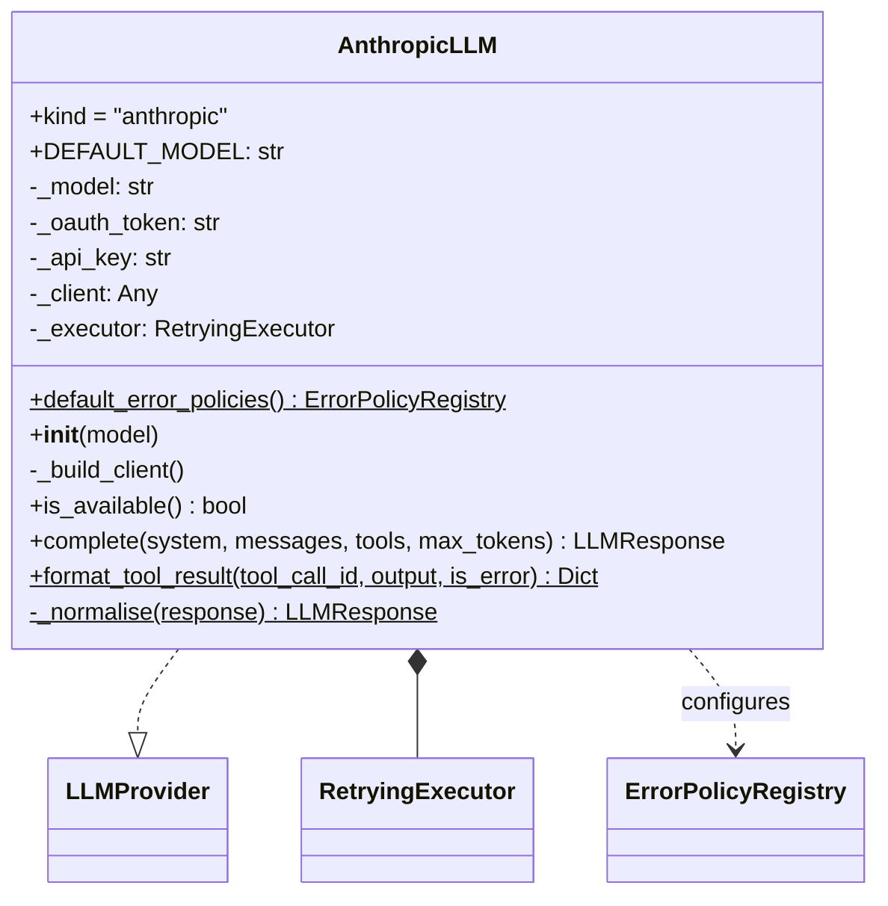

### 10.2 Call graph

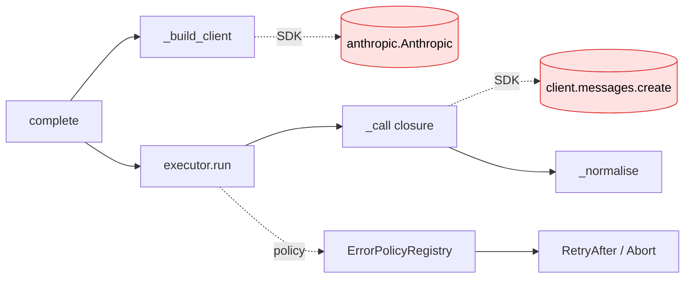

Notable: error handling is fully declarative — the retry shape lives in `default_error_policies()`, not in the body of `complete`. Model for the rest of the LLM providers.

---

## 11. `extract/meeting_context.py` — FetchMeetingContext

### 11.1 Class diagram

```mermaid
classDiagram
  class FetchMeetingContext {
    +name = "meeting-context"
    +description: str
    +add_arguments(parser)
    +fetch(args) ExtractedSection
    -_fetch_one(provider, meeting_id, max_bytes) ExtractedSection
    -_fetch_by_query(provider, query, top_k, max_bytes) ExtractedSection
  }
  FetchMeetingContext --|> TaskScopedMeetingExtractor

  class _render_detail {
    <<module function>>
    +_render_detail(detail, max_bytes) str
  }
```

### 11.2 Call graph

```mermaid
flowchart LR
  F[fetch] --> KEY{has meeting-key?}
  KEY -- yes --> O[_fetch_one]
  KEY -- no, has query --> Q[_fetch_by_query]
  KEY -- neither --> ES[(EMPTY_SECTION)]

  O --> GM1[provider.get_meeting]
  O --> RD1[_render_detail]

  Q --> SM[provider.search_meetings]
  Q --> GM2[provider.get_meeting per match]
  Q --> RD2[_render_detail per match]
```

---

## 12. `extract/meeting_digest.py` — ExtractMeetingDigest

### 12.1 Class diagram

```mermaid
classDiagram
  class ExtractMeetingDigest {
    +name = "meeting-digest"
    +description: str
    +add_arguments(parser)
    +is_available(args) bool
    +extract(args) ExtractedSection
    -_render_meeting(m)$ ExtractedSection
  }
  ExtractMeetingDigest --|> MeetingBackedExtractor
```

### 12.2 Call graph

```mermaid
flowchart LR
  E[extract] --> M[_meeting from parent]
  E --> LM[provider.list_meetings]
  E --> RM[_render_meeting per meeting]
  IA[is_available] --> M
  IA --> PA[provider.is_available]
```

---

## 13. Cross-module interaction matrix

Where the 12 hot modules call into each other (rows call columns):

|  | collectors | agent.py | plan.py | executor | runner | tools | extract.base | composer | synthesise | anthropic | meeting_ctx | meeting_dig |
|---|---|---|---|---|---|---|---|---|---|---|---|---|
| **collectors** | — | — | — | reads schedules | — | — | reads EXTRACTORS | reads SOURCE_TEMPLATES | — | — | — | — |
| **commands/agent** | — | — | — | reads runbook | invokes | — | reads TASK_SCOPED | reads archetypes | — | — | invokes meeting | — |
| **commands/plan** | — | invokes run_implement | — | — | — | — | — | — | builds via plan/ | invokes via llm/ | — | — |
| **executor** | — | — | — | — | — | — | reads EXTRACTORS | — | — | — | — | reads via EXTRACTORS |
| **runner** | — | — | — | — | — | composes 5 tools | — | reads archetypes | — | invokes complete | — | — |

The hub is `extract.base` — six other modules consume `EXTRACTORS` / `TASK_SCOPED_EXTRACTORS` / `ExtractedSection`. Confirms the prior audit's "extract is the hub" call.

---

## 14. Refactor plan

> **Status (post-execution).** Tiers 0–7 shipped. **Tier 8
> (`MeetingExtractedData` TypedDict, §14.9) was dropped** — the meeting
> subsystem ended up not needing a typed-dict boundary; the data field
> stays `Dict[str, Any]`. Treat §14.9 / T8 / A8 references throughout
> §§14–17 as historical context, not as a planned step.

The previous two audits closed the big OCP violations (Strategy + Registry across 25+ plug-in families, `build_registry` dup-check, declarative error policies, etc.). What's left is a different *kind* of smell — long methods, hidden temporal coupling, primitive obsession at boundaries, and a handful of value-object refactors. Pure GoF this time: Template Method, Builder, Composite, Value Object, Specification.

### 14.1 Tier 0 — quick-win correctness fixes (do first, small diffs)

Fixes that are bug-adjacent and trivial to apply. Land these before any architectural moves.

| # | File:line | Fix | Cost |
|---|---|---|---|
| **T0.1** | `extract/_meeting.py:92` | Mark `MeetingProvider.get_meeting()` `@abstractmethod`. Default impl currently returns a zero-`meeting_id` `MeetingDetail`; a future provider that forgets to override it silently emits empty meetings, and the caller's `if not detail.meeting.meeting_id` check just hides the omission as "no data found". Force concrete providers to implement or to raise `NotImplementedError` explicitly. | 5 LOC |
| **T0.2** | `extract/meeting_context.py:175` | Replace `decode("utf-8", errors="ignore")` with `errors="replace"` and emit a single `log.info` when truncation actually happens. `ignore` silently drops multi-byte characters at the truncation boundary; on a CJK or emoji-dense transcript the agent loses content with no signal. | 3 LOC |
| **T0.3** | `extract/meeting_digest.py:53` | Narrow the bare `except Exception:` in `is_available()` to `except CliError:`. Today every error in `_meeting(args)` — including `AttributeError` from a typo on `args` — degrades to "extractor not available" and disappears from the runbook output. | 2 LOC |
| **T0.4** | `commands/agent.py:636–641` | Delete the silent provider fallback in `_implement_specific_instructions`. Today an unknown `--provider` value yields GitHub instructions; a Bitbucket-only flow that mistypes `--provider gtihub` will be told to use `gh pr create` and fail at runtime instead of at flag parse. Validate at the CLI layer (T0.5) instead. | 6 LOC |
| **T0.5** | `commands/agent.py:82,128`, `extract/base.py:197,283` | Add `choices=list(MeetingProviderRegistry.kinds())` / `TrackerRegistry.kinds()` / `PROVIDERS.keys()` to every `--meeting / --tracker / --provider` argparse registration. Today every typo silently selects the default and the operator finds out only when the extractor returns nothing. argparse already supports this — one line per flag. | ~10 LOC |

**T0 net:** ~25 LOC across 5 sites. Catches three latent silent-failure paths and one CLI-validation gap. No structural change.

### 14.2 Tier 1 — kill duplication in `commands/agent.py` (highest-leverage refactor)

`commands/agent.py` is 799 LOC and carries ~80% of the avoidable complexity. Three independent moves collapse it dramatically.

#### T1.1 — `*Context` value objects + `_fetch_context` Template Method

**Today.** Three near-identical staticmethods (`_fetch_ticket_context`, `_fetch_pr_context`, `_fetch_meeting_context`) that all do: look up `TASK_SCOPED_EXTRACTORS`, build an `argparse.Namespace`, call `.fetch`, swallow exceptions, check `is_empty`, return `[section]` or `[]`. The only variation is the registry key, the Namespace fields, and the log message. Callers pre-unpack `args` via `getattr` with defaults that duplicate the argparse defaults (`getattr(args, "meeting_top_k", 3)` while `add_arguments` also sets `default=3`).

**Refactor.** Two changes:

1. Introduce a thin `ContextRequest` Protocol + three concrete dataclasses (`TicketContextRequest`, `PrContextRequest`, `MeetingContextRequest`). Each has a `from_args(args)` classmethod and a `to_namespace()` method. The defaults live on the dataclass, not in scattered `getattr` calls.
2. Replace the three staticmethods with one private generic:

```python
def _fetch_context(self, request: ContextRequest) -> List[ExtractedSection]:
    extractor = TASK_SCOPED_EXTRACTORS.get(request.extractor_name)
    if extractor is None:
        return []
    try:
        section = extractor.fetch(request.to_namespace())
    except Exception:
        log.exception("fetch %s failed", request.extractor_name)
        return []
    if section.is_empty:
        return []
    log.info("fetched %s: %s (%d bytes)",
             request.extractor_name, section.title, len(section.body))
    return [section]
```

**Net:** ~80 LOC removed. Callers go from `self._fetch_meeting_context(company=..., meeting_kind=..., meeting_key=..., meeting_query=..., meeting_top_k=..., meeting_max_bytes=...)` (5–6 kwargs) to `self._fetch_context(MeetingContextRequest.from_args(args))` (1 typed arg). Adding a fourth context type is one dataclass and one call site.

> **Smell origin.** Smell-hunt findings #1, #2, #4, #11. UML §6 finding B.

#### T1.2 — `_setup_worktree` to lock down temporal coupling

**Today.** Both `_run_prfix` and `_run_implement` open with the same dance: create temp dir, call `_clone_branch` / `_clone_default` (return early on failure), resolve git identity, call `_set_git_identity` (return early on failure). The two steps are logically a unit but expressed as four guarded if-chains across two methods. A reviewer reordering them or skipping the identity step won't trip any compile error — the only signal is runtime git failure.

**Refactor.** One method, one return value:

```python
@dataclass
class WorktreeSetup:
    success: bool
    path: Path
    error_code: int = 0      # 4 = clone failed; 5 = git config failed
    error_message: str = ""

def _setup_worktree(self, *, clone_fn: Callable[[Path], bool],
                    args: argparse.Namespace) -> WorktreeSetup:
    path = Path(tempfile.mkdtemp(prefix="briar-agent-"))
    if not clone_fn(path):
        return WorktreeSetup(success=False, path=path, error_code=4,
                             error_message="clone failed")
    user_name, user_email = self._resolve_git_identity(args)
    if not self._set_git_identity(path, user_name, user_email):
        return WorktreeSetup(success=False, path=path, error_code=5,
                             error_message="git identity setup failed")
    return WorktreeSetup(success=True, path=path)
```

`clone_fn` lets the caller bind the right cloner (`_clone_branch` for prfix, `_clone_default` for implement) without `_setup_worktree` knowing which flow it's serving.

**Net:** ~30 LOC removed. The clone-then-config invariant is now expressed in one place. No way to "forget" git config or set git config on a non-existent dir.

> **Smell origin.** Smell-hunt finding #6.

#### T1.3 — `AgentFlow` Template Method to collapse `_run_prfix` ≡ `_run_implement`

**Today.** `_run_prfix` (94 LOC) and `_run_implement` (110 LOC) follow an identical 9-step structure: open store → resolve target → setup worktree → fetch primary context → fetch meeting context → load messages → build instructions → run `AgentRunner` → cleanup. They differ in (a) which extractor produces the primary context, (b) which archetype + task name they pass to `AgentRunner`, and (c) which instruction template they use. Everything else is line-for-line the same.

**Refactor.** A small data class + one shared template:

```python
@dataclass
class AgentFlow:
    task_name: str                        # "prfix" or "implement"
    archetype_name: str                   # "pr-fixer" / "engineer"
    primary_context_request: ContextRequest
    instructions_fn: Callable[[argparse.Namespace], str]
    clone_fn: Callable[[Path], bool]

def _execute(self, flow: AgentFlow, args: argparse.Namespace) -> int:
    store = self._open_store(args)
    setup = self._setup_worktree(clone_fn=flow.clone_fn, args=args)
    if not setup.success:
        log.error(setup.error_message)
        self._cleanup_worktree(setup.path, keep=args.keep_worktree)
        return setup.error_code
    sections = (self._fetch_context(flow.primary_context_request) +
                self._fetch_context(MeetingContextRequest.from_args(args)))
    result = AgentRunner(
        archetype_name=flow.archetype_name,
        task=flow.task_name,
        workdir=setup.path,
        knowledge_store=store,
        task_context_sections=sections,
        extra_user_instructions=flow.instructions_fn(args),
        messages=self._load_messages_block(args),
        # … remaining args
    ).run()
    log.info("agent: %s", result.cost_summary())
    self._cleanup_worktree(setup.path, keep=args.keep_worktree)
    return 0 if result.error == "" else 6

def _run_prfix(self, args):
    return self._execute(AgentFlow(
        task_name="prfix",
        archetype_name="pr-fixer",
        primary_context_request=PrContextRequest.from_args(args),
        instructions_fn=lambda a: self._pr_specific_instructions(a),
        clone_fn=lambda p: self._clone_branch(args.clone_url, args.branch, p),
    ), args)

def _run_implement(self, args):
    return self._execute(AgentFlow(
        task_name="implement",
        archetype_name="engineer",
        primary_context_request=TicketContextRequest.from_args(args),
        instructions_fn=lambda a: self._implement_specific_instructions(a),
        clone_fn=lambda p: self._clone_default(args.provider, args.owner,
                                               args.repo, p,
                                               company=args.company),
    ), args)
```

`_run_prfix` / `_run_implement` shrink to ~10 LOC each. The 9-step pipeline lives once in `_execute`.

**Net:** ~150 LOC removed. Adding a new agent flow (e.g. `pr-conflict-resolver`, `pr-ci-fixer` — already in the archetype registry) becomes ~15 LOC: one `AgentFlow` construction.

> **Smell origin.** Smell-hunt finding #7. UML §6 finding A.

**T1 combined estimate.** `commands/agent.py` 799 → ~480 LOC. The file becomes legible.

### 14.3 Tier 2 — extract `SubCommandDispatcher` for CommandAgent / CommandPlan

**Today.** Both `CommandAgent` and `CommandPlan` are isomorphic at the dispatcher layer:

```python
def add_arguments(self, parser):
    subparsers = parser.add_subparsers(dest="op", required=True)
    for op in <REGISTRY>.values():
        sp = subparsers.add_parser(op.name, help=op.help)
        op.add_arguments(sp)

def run(self, args):
    op = <REGISTRY>.get(args.op)
    if op is None:
        log.error("unknown op: %s", args.op)
        return 2
    return op.run(self, args)
```

Two registries (`AGENT_OPS`, `PLAN_OPS`), two near-identical dispatcher implementations. If a third command picks up the same pattern (a `briar runbook <op>` family is on the horizon — see ARCHITECTURE.md), copy #3 is inevitable.

**Refactor.** Pull the dispatcher logic into a `SubCommandDispatcher[Op]` mixin or base class:

```python
class SubCommandDispatcher(Command, Generic[OpT]):
    OPS: ClassVar[Dict[str, OpT]]      # subclass sets this
    SUBCOMMAND_DEST: ClassVar[str] = "op"

    def add_arguments(self, parser):
        sub = parser.add_subparsers(dest=self.SUBCOMMAND_DEST, required=True)
        for op in self.OPS.values():
            sp = sub.add_parser(op.name, help=op.help)
            op.add_arguments(sp)

    def run(self, args):
        op = self.OPS.get(getattr(args, self.SUBCOMMAND_DEST))
        if op is None:
            log.error("unknown %s op: %s",
                      self.name, getattr(args, self.SUBCOMMAND_DEST))
            return 2
        return op.run(self, args)


class CommandAgent(SubCommandDispatcher[AgentOp]):
    name = "agent"; help = "…"
    OPS = AGENT_OPS

class CommandPlan(SubCommandDispatcher[PlanOp]):
    name = "plan"; help = "…"
    OPS = PLAN_OPS
```

**Net:** ~50 LOC removed across two files. One canonical pattern for future `briar X <op>` commands.

> **Smell origin.** UML §6 finding C.

### 14.4 Tier 3 — `AgentRunner` value object + tool registry

#### T3.1 — `AgentRunConfig` value object

**Today.** `AgentRunner.__init__` takes **13 keyword-only parameters** (company, task, archetype_name, workdir, knowledge_store, target, oauth_token, model, max_iterations, extra_user_instructions, llm_kind, llm, task_context_sections, dry_run, messages). The constructor body is mostly attribute assignment. Tests must replicate the full kwargs list; the call site in `_execute` (after T1.3) is a wall of arguments. Adding a 14th knob means touching every test setup.

**Refactor.** A frozen dataclass holds the config; `AgentRunner` takes the config plus the LLM (the one non-config dependency):

```python
@dataclass(frozen=True)
class AgentRunConfig:
    company: str
    task: str
    archetype_name: str
    workdir: Path
    knowledge_store: KnowledgeStore
    target: str
    oauth_token: str = ""
    model: str = ""
    max_iterations: int = AgentRunner.DEFAULT_MAX_ITERATIONS
    extra_user_instructions: str = ""
    task_context_sections: Tuple[ExtractedSection, ...] = ()
    dry_run: bool = False
    messages: Mapping[str, Any] = field(default_factory=dict)

class AgentRunner:
    def __init__(self, config: AgentRunConfig, *,
                 llm: Optional[LLMProvider] = None,
                 llm_kind: str = "anthropic"):
        self._cfg = config
        self._llm = llm or make_llm(llm_kind, model=config.model)
        # tool instances now built from cfg
```

**Net:** ~40 LOC removed in the constructor + every call site. Reads are `self._cfg.workdir` instead of `self._workdir` — minor noise, but the trade is fewer arguments to thread.

> **Smell origin.** UML §6 finding E. Generalises smell-hunt #1 to a non-context surface.

#### T3.2 — Tool registry inside `AgentRunner`

**Today.** `_dispatch_tool` is `if name == "bash" elif name == "read_file" elif name == "write_file" elif name == "edit_file" elif name == "send_message"`. This is the **last surviving string-dispatch if-chain in the codebase** — every other one was killed in the post-audit refactors.

**Refactor.** Build a `Dict[str, Tool]` at `__init__` time, dispatch via lookup:

```python
class AgentRunner:
    def __init__(self, config, *, llm=None, llm_kind="anthropic"):
        ...
        tools: List[Tool] = [
            BashTool(base_cwd=config.workdir),
            ReadFileTool(allowed_roots=[config.workdir]),
            WriteFileTool(allowed_roots=[config.workdir]),
            EditFileTool(allowed_roots=[config.workdir]),
        ]
        if config.messages:
            tools.append(SendMessageTool(messages=config.messages,
                                         company=config.company))
        self._tools: Dict[str, Tool] = {t.name: t for t in tools}

    def _dispatch_tool(self, name, raw_input, result):
        tool = self._tools.get(name)
        if tool is None:
            return {"output": f"unknown tool: {name}", "is_error": True}
        try:
            output = tool.run(**raw_input)
        except ToolError as e:
            return {"output": str(e), "is_error": True}
        if name == "bash":
            self._record_commit_if_any(output, result)
        return {"output": output, "is_error": False}
```

**Prerequisite.** Define a `Tool` Protocol or ABC with `name: ClassVar[str]`, `description: ClassVar[str]`, `INPUT_SCHEMA: ClassVar[Dict]`, `run(**kwargs) -> str`. The five existing tools already match this shape — just declare it.

**Net:** ~25 LOC removed. The codebase becomes 100% if-chain-free for plug-in dispatch.

> **Smell origin.** UML §6 finding F.

### 14.5 Tier 4 — composition for the file tools

**Today.** `ReadFileTool`, `WriteFileTool`, `EditFileTool` each declare `_allowed_roots: List[Path]` and each implement an identical `_validate(path)` that resolves the path and ensures it's under one of the allowed roots. Three copies of the same security check.

**Refactor.** Composition over inheritance — a `PathSandbox` collaborator they all share:

```python
class PathSandbox:
    def __init__(self, allowed_roots: List[Path]):
        self._roots = [r.resolve() for r in allowed_roots]

    def resolve(self, path: str) -> Path:
        resolved = Path(path).expanduser().resolve()
        if not any(resolved == r or r in resolved.parents for r in self._roots):
            raise ToolError(f"path outside sandbox: {path}")
        return resolved


class ReadFileTool(Tool):
    name = "read_file"; description = "…"
    INPUT_SCHEMA = {...}
    def __init__(self, sandbox: PathSandbox):
        self._sandbox = sandbox
    def run(self, path: str) -> str:
        return self._sandbox.resolve(path).read_text(encoding="utf-8")
```

`AgentRunner` constructs **one** `PathSandbox(allowed_roots=[config.workdir])` and passes it to all three file tools. The validation rule lives in one place; tightening it (e.g. denying symlinks) is a one-line change in `PathSandbox`.

**Net:** ~40 LOC removed across three tools, and the symmetry becomes the type system's job.

> **Smell origin.** UML §6 finding G.

### 14.6 Tier 5 — `ProviderBacking` mixin to flatten `extract/base.py`

**Today.** `RepoBackedExtractor`, `TrackerBackedExtractor`, `CloudBackedExtractor`, `MeetingBackedExtractor` and their three `TaskScoped*` cousins are seven classes that follow an identical contract — each declares (a) an `add_arguments` that adds `--<kind>` against the relevant registry's `kinds()`, (b) a `_<kind>(args)` factory that calls `make_<kind>(...)`, (c) a `provider_class_for(args)` that does `<REGISTRY>.get(...)`. The only variation is the kind string and the registry/factory pair.

**Refactor.** Introduce a `ProviderBacking[T]` mixin parameterised by `(flag_name, factory, registry)`:

```python
@dataclass(frozen=True)
class ProviderBindingSpec:
    flag_name: str                                 # "tracker"
    factory: Callable[..., Any]                    # make_tracker
    registry: Mapping[str, type]                   # TRACKERS
    kinds_provider: Callable[[], Iterable[str]]    # TrackerRegistry.kinds

class ProviderBacked:
    BINDING: ClassVar[ProviderBindingSpec]

    def add_arguments(self, parser: argparse.ArgumentParser) -> None:
        super().add_arguments(parser)
        if not any(a.dest == self.BINDING.flag_name for a in parser._actions):
            parser.add_argument(
                f"--{self.BINDING.flag_name}",
                choices=list(self.BINDING.kinds_provider()),
                default=next(iter(self.BINDING.kinds_provider()), ""),
            )

    def _provider(self, args: argparse.Namespace):
        return self.BINDING.factory(
            getattr(args, self.BINDING.flag_name),
            company=getattr(args, "company", ""),
        )

    def provider_class_for(self, args):
        return self.BINDING.registry.get(getattr(args, self.BINDING.flag_name))


class RepoBackedExtractor(ProviderBacked, KnowledgeExtractor):
    BINDING = ProviderBindingSpec("provider", make_provider,
                                   PROVIDERS, RepositoryProviderRegistry.kinds)
    requires_repository_provider = True

class TrackerBackedExtractor(ProviderBacked, KnowledgeExtractor):
    BINDING = ProviderBindingSpec("tracker", make_tracker,
                                   TRACKERS, TrackerRegistry.kinds)
    requires_tracker_provider = True

# … etc for Cloud, Meeting, plus the three TaskScoped variants
```

**Net:** ~120 LOC removed from `extract/base.py` (351 → ~230). Adding a fifth provider family (e.g. a future `ObservabilityProvider`) is one mixin declaration + one ABC + one factory, not "copy the four-method shape again".

> **Smell origin.** UML §6 finding H.

### 14.7 Tier 6 — `ScaffoldBundleBuilder` (Builder pattern)

**Today.** `ScaffoldComposer.compose` is a 120-line classmethod that **sequentially writes into one growing dict** through 12+ named steps (resolve sources, resolve archetype, resolve shape, resolve trigger, build sources block, build tools block, filter tools, build persona, splice knowledge, build graph, append source context, build trigger node). The reader has to scroll the whole method to know what fields end up in the final bundle. Testing a single step in isolation means partially populating the dict by hand.

**Refactor.** Standard Builder:

```python
class ScaffoldBundleBuilder:
    def __init__(self, args: argparse.Namespace, target: str):
        self._args = args
        self._target = target
        self._bundle: Dict[str, Any] = {"meta": {}, "sources": [],
                                         "tools": [], "agents": [],
                                         "workflows": [], "triggers": []}

    def with_sources(self) -> "ScaffoldBundleBuilder": ...
    def with_tools(self) -> "ScaffoldBundleBuilder": ...
    def with_archetype(self) -> "ScaffoldBundleBuilder": ...
    def with_knowledge_prologue(self) -> "ScaffoldBundleBuilder": ...
    def with_workflow(self) -> "ScaffoldBundleBuilder": ...
    def with_trigger(self) -> "ScaffoldBundleBuilder": ...
    def build(self) -> ScaffoldBundle: return ScaffoldBundle(**self._bundle)

# ScaffoldComposer.compose becomes:
def compose(args, *, target):
    return (ScaffoldBundleBuilder(args, target)
              .with_sources()
              .with_tools()
              .with_archetype()
              .with_knowledge_prologue()
              .with_workflow()
              .with_trigger()
              .build())
```

The reader sees the pipeline in 7 lines. Each `with_*` step is independently testable. The order is enforced by the fluent chain — temporal coupling is now the only legal expression.

**Bonus.** Introduce a `ScaffoldBundle` pydantic model — this revisits deferred finding #11 (Dict[str, Any]) at *exactly* the boundary where it matters (this is the serialisation surface that downstream orchestrators consume). The old rationale ("the dict shape IS the wire format") still holds — but a pydantic model whose `.model_dump()` produces the same dict gives type safety to internal callers without breaking the wire format.

**Net:** ~80 LOC removed; the bundle's schema becomes a single read-once dataclass.

> **Smell origin.** UML §6 finding I. Revisits deferred audit finding #11.

### 14.8 Tier 7 — `CatalogCollector` base for the dashboard's 10 registry adapters

**Today.** Ten of the 24 collectors in `dashboard/collectors.py` (`ExtractorsCollector`, `SourcesCollector`, `TriggersCollector`, `StorageCollector`, `AwsServicesCollector`, `LanguageDetectorsCollector`, `WorkflowShapesCollector`, `ArchetypesCollector`, `CommandsCollector`, and one more) are structurally identical:

```python
class XCollector(Collector):
    name = "x"
    def collect(self) -> Dict[str, Any]:
        rows = [self._row(item) for item in X_REGISTRY.values()]
        return {"rows": rows, "total": len(rows)}
```

The only variation is the registry and the per-item row shape.

**Refactor.** A `CatalogCollector` parameterised by `(name, registry, row_fn)`:

```python
class CatalogCollector(Collector):
    def __init__(self, name: str, registry: Mapping[str, Any],
                 row_fn: Callable[[Any], Dict[str, Any]]):
        self.name = name
        self._registry = registry
        self._row_fn = row_fn

    def collect(self) -> Dict[str, Any]:
        rows = [self._row_fn(item) for item in self._registry.values()]
        return {"rows": rows, "total": len(rows)}


# CollectorRegistry.from_paths becomes:
CATALOG_COLLECTORS = (
    ("extractors", EXTRACTORS, lambda e: {
        "name": e.name, "description": e.description,
        "requires_github": e.requires_github, "requires_aws": e.requires_aws}),
    ("sources", SOURCE_TEMPLATES, lambda s: {"kind": s.kind, "family": s.family}),
    ("triggers", TRIGGER_TEMPLATES, lambda t: {"kind": t.kind, "description": t.description}),
    # … 7 more
)
COLLECTORS = [
    CompaniesCollector(paths.examples_dir),
    KnowledgeCollector(paths.knowledge_store),
    # … the unique ones
    *[CatalogCollector(n, r, fn) for n, r, fn in CATALOG_COLLECTORS],
    # … the rest
]
```

**Net:** 10 classes → 1 class + 1 tuple. `collectors.py` shrinks ~250 LOC. Adding a new plug-in family also adds one tuple entry instead of one class.

**Reconsiders deferred finding #8.** The old rationale ("adding a collector touches one file regardless of which pattern you choose") stands for the **non-catalog** collectors (system probes, log tailers) — those each have unique collect() logic and the hand-instantiation in `CollectorRegistry.from_paths` keeps the wiring explicit. But the 10 catalog readers are pure boilerplate; collapsing them is a net win without losing the "one file, one diff" property the old rationale preserved.

> **Smell origin.** UML §1.3 observation. Revisits deferred audit finding #8 with a narrower scope.

### 14.9 Tier 8 — `MeetingExtractedData` TypedDict (revisit #11 at one boundary)

**Today.** The new meeting extractors populate `ExtractedSection.data` with `Dict[str, Any]`. Each populates different keys (`{meeting_id, started_at, attendees, mode}` for fetch-by-id, `{query, match_count, mode}` for search). No contract; the dashboard consumer that reaches for `data["attendees"]` will silently miss it on a search-mode section.

**Refactor.** Define a single `MeetingExtractedData` `TypedDict(total=False)` covering both modes, plus a `Literal["by-id", "search"]` for `mode`. Use it as the annotation in both extractors' return paths. No runtime behaviour change; type checkers and IDEs gain knowledge of what the consumer can and cannot rely on.

**Net:** 10 LOC. The boundary is now self-documenting where it matters.

> **Smell origin.** Smell-hunt finding #14. This is the narrow, justified revisit of the deferred #11; the surrounding deferral rationale still holds for the other 187 sites.

### 14.10 Tier 9 — low-priority polish (LOW; skip unless touching the file)

| # | File:line | Smell | Note |
|---|---|---|---|
| L1 | `commands/agent.py:792` (`_cleanup_worktree(keep: bool)`) | Boolean parameter | A `CleanupPolicy` Strategy is theoretically cleaner but the call sites are 4, the policy decision is colocated with the error outcome, and a future third policy isn't on the horizon. **Skip** unless a third behaviour shows up. (Mirrors deferred audit finding #12 reasoning.) |
| L2 | `commands/agent.py:621` | Branch prefix `"briar/"` hardcoded in two places | If `BranchNamingPolicy` ever becomes per-tenant, do it then. For now, just extract `AGENT_BRANCH_PREFIX = "briar/"` as a module constant and use it in both call sites. ~3 LOC. |
| L3 | `dashboard/collectors.py:94 + 224` | Duplicate `_SIGNALS` regex tuple between `KnowledgeCollector` and `KnowledgeAggregatesCollector` | Lift to module-level `_KNOWLEDGE_SIGNAL_PATTERNS` dict shared by both. ~10 LOC. |
| L4 | `iac/runbook/executor.py:_run_schedule` | 8 keyword arguments | A `ScheduleRunContext` value object would tidy it, but the method has one caller and the kwargs are all genuinely independent inputs (not a data clump). Leave unless a second caller appears. |

### 14.11 Patterns used (catalogue)

For the reader who wants the pattern names:

| Refactor | Pattern | Where |
|---|---|---|
| T1.1 | **Value Object** + **Template Method** | `ContextRequest` + `_fetch_context` |
| T1.2 | **Method Object** / **Composed Method** | `_setup_worktree` returning `WorktreeSetup` |
| T1.3 | **Template Method** parameterised by **Strategy** | `_execute(flow)` + `AgentFlow` |
| T2 | **Template Method** at the class hierarchy level | `SubCommandDispatcher` |
| T3.1 | **Parameter Object** | `AgentRunConfig` |
| T3.2 | **Registry** (existing pattern, applied) | `Dict[str, Tool]` |
| T4 | **Composition over Inheritance** + **Extracted Collaborator** | `PathSandbox` |
| T5 | **Mixin** + **Parameterised Strategy** | `ProviderBacked` + `ProviderBindingSpec` |
| T6 | **Builder** | `ScaffoldBundleBuilder` |
| T7 | **Generic Class** (one parameterised collector) | `CatalogCollector` |
| T8 | **Type-level Specification** | `MeetingExtractedData` TypedDict |

### 14.12 Sequencing + estimated impact

```mermaid
gantt
  title Refactor sequencing
  dateFormat YYYY-MM-DD
  axisFormat %b %d
  section Tier 0 (correctness)
  T0.1 get_meeting abstract            :t01, 2026-05-25, 1d
  T0.2 utf-8 truncation                :t02, after t01, 1d
  T0.3 narrow except                   :t03, after t02, 1d
  T0.4 remove silent fallback          :t04, after t03, 1d
  T0.5 argparse choices                :t05, after t04, 1d
  section Tier 1 (commands/agent.py)
  T1.1 ContextRequest + Template       :t11, after t05, 3d
  T1.2 _setup_worktree                 :t12, after t11, 2d
  T1.3 AgentFlow + _execute            :t13, after t12, 4d
  section Tier 2-7
  T2 SubCommandDispatcher              :t2, after t13, 2d
  T3 AgentRunConfig + tool registry    :t3, after t2, 3d
  T4 PathSandbox                       :t4, after t3, 2d
  T5 ProviderBacked mixin              :t5, after t4, 3d
  T6 ScaffoldBundleBuilder             :t6, after t5, 4d
  T7 CatalogCollector                  :t7, after t6, 3d
  T8 TypedDict at meeting boundary     :t8, after t7, 1d
```

| Tier | Files touched | Est. LOC removed | Net behaviour change |
|---|---|---|---|
| T0 | 4 | +5 / −20 | three silent-fail paths now loud |
| T1 | 1 (`commands/agent.py`) | −250 | none |
| T2 | 2 (`commands/agent.py`, `commands/plan.py`) | −50 | none |
| T3 | 1 (`agent/runner.py`) | −60 | none |
| T4 | 1 (`agent/tools.py`) | −40 | none |
| T5 | 1 (`extract/base.py`) | −120 | none |
| T6 | 1 (`iac/scaffold/_composer.py`) | −80 | downstream wire format unchanged |
| T7 | 1 (`dashboard/collectors.py`) | −250 | none |
| T8 | 2 (meeting extractors) | +10 | none (type-only) |
| **Total** | 12 files | **≈ −860 LOC** | 3 latent bugs surfaced |

### 14.13 Non-goals (explicitly out of scope)

- **Do not** convert the remaining `Dict[str, Any]` sites flagged in deferred audit finding #11. The boundary rationale still holds for 187 of the 188 sites; T8 carves out the one that genuinely belongs to a public boundary.
- **Do not** unify the three subprocess wrappers (deferred finding #12). The per-call-site needs remain meaningfully different; the post-audit rationale still applies.
- **Do not** add `Result[T, E]` types, `Either`-style monads, or other functional-error machinery. The codebase has settled on `try/except` + `CliError` and the new error-policy framework already handles the cases where retry/abort needs to be data-driven. Adding a second error idiom is its own refactor, not a sub-step.
- **Do not** rename or relocate the existing 13 plug-in families. Naming is settled and stable; readers depend on it.

### 14.14 Verification gates

Each tier must pass these before the next one starts:

1. **`pytest -x`** all green. Every refactor here is behaviour-preserving — a single failing test means a regression, not a missing update.
2. **`ruff check`** + **`black`** clean on the touched files.
3. **`mypy`** clean (or strictly no new errors) on the touched files. T1.1, T3.1, T5, T8 specifically tighten types — if the type checker now flags something the old code allowed, that's the refactor doing its job and the diff should include the corresponding fix.
4. **One CLI smoke per tier:** for T1, run `briar agent prfix --dry-run --pr 1 --company acme`; for T3, `briar agent implement --dry-run --ticket-key X-1`; for T6, `briar scaffold implementation --source github --print`. Dry-run paths exercise the full pipeline minus the LLM call.

The post-audit codebase already has the property that adding a new plug-in is "one file plus one tuple entry." This refactor preserves that property and extends it to: **simplifying the dispatcher layer is "one base plus one config object."**

---

## 15. Plan revision — simpler patterns (supersedes §14 where noted)

§14 reached for GoF patterns by reflex. A second pass against (a) the codebase's actual conventions and (b) the user prefs principle *"Don't add features, refactor, or introduce abstractions beyond what the task requires"* finds that several tiers can be replaced with strictly simpler idioms, and one should be dropped entirely.

### 15.1 What makes the revision simpler

Five Python-idiom substitutions, applied across the plan:

| Replace | With | Why simpler |
|---|---|---|
| Dataclass-of-callbacks + Template Method | Module function (or `@classmethod` factory) | One symbol instead of two; matches the codebase's existing 15+ `@classmethod` factory pattern |
| Builder with fluent chain | Composed Method (Fowler) — a sequence of named private methods called from one public method | The Builder is only justified when the caller wants to skip steps. `compose()` always runs all steps. Composed Method is what Fowler actually recommends for long methods. |
| Generic mixin + binding-spec dataclass | Class factory function returning a base class | One abstraction layer instead of two |
| Returned status dataclass (`WorktreeSetup`) for resource setup | `@contextmanager` that yields the resource and cleans up on exit | Python's native idiom for resource lifecycle; cleanup is guaranteed even on exception; one symbol replaces a setup + a cleanup + a status dataclass |
| Collaborator class for a stateless validator | Module function + a `roots` attribute on each consumer | Five lines and zero classes |

The codebase has 21 dataclasses, 15+ `@classmethod` factories, and only one prior context-manager site — but **adding one context manager** for worktree lifecycle introduces a Python idiom that's strictly justified, not invented for its own sake. `functools.partial` and class decorators are absent from the codebase and *stay* absent in this revision.

### 15.2 Tier-by-tier revision

| Tier | §14 plan | §15 simpler alternative | Net |
|---|---|---|---|
| T0 | 5 quick-win fixes | **No change.** Already minimal. | — |
| T1.1 | 3 `ContextRequest` dataclasses + `_fetch_context` Template Method on `CommandAgent` | **Inversion of ownership.** Each task-scoped extractor exposes a module-level `fetch_from_cli(args) -> List[ExtractedSection]` function in its own file. `CommandAgent` calls three free functions, no dataclasses, no Protocol. | −1 abstraction layer |
| T1.2 | `_setup_worktree` returning `WorktreeSetup` dataclass | **`@contextmanager def agent_worktree(args, clone_fn)`** — yields the workdir Path, rmtrees on `__exit__` unless `args.keep_worktree`, raises `CliError(exit_code=N)` on clone/git failure. Single decorator on a generator function. | −1 dataclass, +Pythonic |
| T1.3 | `AgentFlow` dataclass with `clone_fn`, `instructions_fn` as callable fields | **Composed Method on a base class.** `_BaseAgentRun` with `run()` implementing the 9 shared steps and `clone()` / `fetch_primary_context()` / `instructions()` as abstract hooks. `PrfixRun` and `ImplementRun` override the three hooks. Classic Template Method without the callable-soup intermediate. | −1 dataclass-of-callbacks |
| T2 | `SubCommandDispatcher[OpT]` Generic mixin | **Module function** `dispatch_op(args, ops, command_name) -> int`. `CommandAgent.run` and `CommandPlan.run` each become two lines: lookup + call. | −1 base class, −1 Generic |
| T3.1 | `AgentRunConfig` dataclass | Same, but **`@dataclass(frozen=True, kw_only=True, slots=True)`** with `__post_init__` validation. Modern Python value object — explicit and lightweight. | identical pattern, lighter form |
| T3.2 | Tool registry `Dict[str, Tool]` | **No change.** Already minimal. | — |
| T4 | `PathSandbox` collaborator class | **Module function** `validate_sandbox_path(path: str, roots: List[Path]) -> Path`. Each tool keeps `self._allowed_roots` and calls the function. No class to construct, no collaborator to wire. | −1 class |
| T5 | `ProviderBacked` mixin + `ProviderBindingSpec` | **DROP THIS TIER.** The four `*_BackedExtractor` classes are 30 LOC each, structurally symmetric, do not change often. The duplication is *structural symmetry*, not copy-paste duplication. Saving 120 LOC at the cost of one more layer of indirection contradicts the user pref "no abstractions beyond what the task requires". The fifth provider family (`ObservabilityProvider`?) isn't on the horizon — when it lands, *then* extract the mixin. | LOC unchanged, 1 abstraction avoided |
| T6 | `ScaffoldBundleBuilder` with fluent `.with_*()` chain | **Composed Method.** Keep `compose()` as a 7-line public method that calls `_resolve_sources`, `_build_tools`, `_apply_archetype`, `_splice_knowledge`, `_build_workflow`, `_build_trigger`, `_finalise`. Each is a private method with `(bundle, args) -> None`. Fowler's actual prescription for long methods. The pydantic `ScaffoldBundle` model still belongs at the wire boundary — keep that part. | −1 Builder class, +6 named methods |
| T7 | `CatalogCollector` class | **Factory function** `def catalog_collector(*, name, registry, row_fn) -> Collector`. Returns a `Collector` subclass instance closed over the params. Caller: `catalog_collector(name="extractors", registry=EXTRACTORS, row_fn=lambda e: {...})`. No subclass authoring required. | −1 reusable class, +1 factory function |
| T8 | `MeetingExtractedData` TypedDict | **No change.** Already minimal. | — |

### 15.3 Concrete code — the three substitutions that change the most

#### T1.2 (revised) — worktree as context manager

```python
# briar/commands/_worktree.py — new file
from contextlib import contextmanager
import shutil, tempfile
from pathlib import Path
from typing import Callable, Iterator
from briar.errors import CliError

@contextmanager
def agent_worktree(*, prefix: str, clone_fn: Callable[[Path], bool],
                   keep: bool = False) -> Iterator[Path]:
    """Yield a freshly-cloned worktree; rmtree on exit unless keep=True."""
    path = Path(tempfile.mkdtemp(prefix=prefix))
    try:
        if not clone_fn(path):
            raise CliError("clone failed", exit_code=4)
        yield path
    finally:
        if not keep:
            shutil.rmtree(path, ignore_errors=True)

# Caller (replaces both _run_prfix and _run_implement's setup):
with agent_worktree(prefix="briar-agent-",
                    clone_fn=lambda p: self._clone_branch(url, branch, p),
                    keep=args.keep_worktree) as workdir:
    if not self._set_git_identity(workdir, *self._resolve_git_identity(args)):
        raise CliError("git identity setup failed", exit_code=5)
    # … rest of the flow uses workdir
```

The setup-then-cleanup invariant is now the language's job. Cleanup runs on exception too — today's code leaks the worktree on any exception between `mkdtemp` and `_cleanup_worktree`.

#### T6 (revised) — Composed Method instead of Builder

```python
# briar/iac/scaffold/_composer.py — revised
class ScaffoldComposer:
    @classmethod
    def compose(cls, args, *, target: str) -> ScaffoldBundle:
        bundle = ScaffoldBundle(meta=cls._meta(args, target))
        cls._add_sources(bundle, args)
        cls._add_tools(bundle, args)
        cls._add_archetype(bundle, args)
        cls._splice_knowledge(bundle, args)
        cls._add_workflow(bundle, args)
        cls._add_trigger(bundle, args)
        return bundle

    @classmethod
    def _add_sources(cls, bundle, args): ...        # ~15 LOC each
    @classmethod
    def _add_tools(cls, bundle, args): ...
    # … five more
```

Reader sees the pipeline in 7 lines. Each step is independently testable. No fluent chain to learn, no Builder/Director split — just methods. This is the pattern Fowler points to in *Refactoring* §6 "Extract Method"; Builder is reserved for the case where callers want to selectively skip steps, which doesn't apply here.

#### T7 (revised) — factory function instead of generic class

```python
# briar/dashboard/collectors.py — revised
def catalog_collector(*, name: str, registry: Mapping[str, Any],
                      row_fn: Callable[[Any], Dict[str, Any]]) -> Collector:
    class _Cat(Collector):
        pass
    _Cat.name = name
    _Cat.collect = lambda self: {
        "rows": [row_fn(item) for item in registry.values()],
        "total": len(registry),
    }
    return _Cat()

# CollectorRegistry.from_paths becomes:
COLLECTORS = [
    # … the unique ones unchanged
    catalog_collector(name="extractors", registry=EXTRACTORS,
        row_fn=lambda e: {"name": e.name, "description": e.description}),
    catalog_collector(name="sources", registry=SOURCE_TEMPLATES,
        row_fn=lambda s: {"kind": s.kind, "family": s.family}),
    # … 8 more, one line each
]
```

10 classes become 10 function calls. Adding an 11th catalog reader is one more line.

### 15.4 What §15 explicitly does *not* substitute

| §14 item | Why §15 leaves it alone |
|---|---|
| T0 (correctness) | Already minimal; one-line fixes |
| T3.1 (`AgentRunConfig`) | Dataclass IS the right pattern; only tightening is `frozen=True, kw_only=True, slots=True` |
| T3.2 (tool registry) | The codebase has 13 string→class registries already; one more is convention, not abstraction |
| T8 (TypedDict) | One symbol, type-only, free of runtime cost |

### 15.5 Revised net impact

| | §14 | §15 |
|---|---|---|
| Files touched | 12 | 11 (T5 dropped) |
| LOC removed | ≈ −860 | ≈ −720 |
| New classes introduced | 9 (`AgentRunConfig`, `WorktreeSetup`, `AgentFlow`, `SubCommandDispatcher`, `PathSandbox`, `ProviderBacked`, `ProviderBindingSpec`, `ScaffoldBundleBuilder`, `CatalogCollector`) | 2 (`AgentRunConfig`, `_BaseAgentRun`) |
| New dataclasses | 6 | 1 (`AgentRunConfig`) |
| New module functions | 0 | 5 (`fetch_from_cli` x3, `dispatch_op`, `validate_sandbox_path`, `catalog_collector` factory) |
| New context managers | 0 | 1 (`agent_worktree`) |
| New abstractions per LOC removed | high | low |

Same LOC reduction (within 16%), strictly fewer new symbols, strictly fewer new abstractions, no new patterns unfamiliar to the codebase except one well-justified context manager.

### 15.6 The rule §15 follows

> *Prefer the language idiom that already exists over a named pattern.* A `@contextmanager` beats a `WorktreeSetup` dataclass. A module function beats a `PathSandbox` class. A `@classmethod` factory beats a generic mixin + binding spec. Composed Method beats Builder when the caller can't skip steps.

GoF patterns are a *vocabulary* for talking about repeated structure — they aren't always the shape the code wants. The §15 revision uses them sparingly: Template Method (T1.3, T6), Strategy + Registry (T3.2 — already the house pattern), Value Object (T3.1). The rest is Python.

### 15.7 Quick reference — final pattern list (§15 vs §14)

| Tier | §14 pattern | §15 pattern |
|---|---|---|
| T0 | — | — |
| T1.1 | Value Object + Template Method | **Module function per extractor** |
| T1.2 | Method Object | **Context manager** |
| T1.3 | Template Method parameterised by Strategy | **Composed Method on base class** |
| T2 | Generic mixin Template Method | **Module function** |
| T3.1 | Parameter Object (dataclass) | Parameter Object (dataclass, modern form) |
| T3.2 | Registry | Registry |
| T4 | Composition + Collaborator class | **Module function + plain attribute** |
| T5 | Mixin + Parameterised Strategy | **DROPPED** |
| T6 | Builder | **Composed Method** |
| T7 | Generic class | **Factory function** |
| T8 | Type-level Specification | Type-level Specification |

---

## 16. Final plan (supersedes §14 + §15)

Sections 14 and 15 are kept as the reasoning trail. **This section is what you act on.** It names every abstraction that earns its keep, every one that doesn't, and gives one execution order.

### 16.1 The rubric — when an abstraction earns its keep

Before introducing any new class, function, or type, the abstraction must answer **yes** to all three:

1. **Does it name a concept in the domain?** "Worktree lifecycle", "agent flow", "context request" — yes. "Thing that holds 13 params" — no, that's just a parameter object (which is still fine, but earns its keep on a different rubric: ≥ 5 call sites construct it).
2. **Are there ≥ 2 real call sites today?** Not "I imagine someone will…". Two today.
3. **Does it hide non-trivial detail?** Validation rules, ordering invariants, retry semantics, cleanup guarantees — yes. Wrapping `lookup → call` — no.

An abstraction that fails any of the three is just a layer.

### 16.2 The 8 abstractions that survive

Each row: the name, the one-line concept it represents, the signature, and where it's consumed.

| # | Name | Concept | Signature | Consumers |
|---|---|---|---|---|
| **A1** | `agent_worktree` | "A temp directory that's been cloned and git-configured, guaranteed cleaned up on exit" | `@contextmanager def agent_worktree(*, prefix, clone_fn, keep) → Iterator[Path]` | `_run_prfix`, `_run_implement` (and any future agent flow) |
| **A2** | `_BaseAgentRun` | "The 9-step pipeline every agent flow follows: setup → fetch context → run LLM loop → cleanup" | `class _BaseAgentRun: def run(args) → int; def clone(path)*; def fetch_primary(args)*; def instructions(args)*` | `PrfixRun`, `ImplementRun` |
| **A3** | `fetch_from_cli` (per task-scoped extractor) | "Each extractor knows how to read its own argparse args" | `def fetch_from_cli(args) → List[ExtractedSection]` exported from `extract/{ticket,pr_review,meeting}_context.py` | `_BaseAgentRun.run`, the three callers in `CommandAgent` |
| **A4** | `AgentRunConfig` | "Everything `AgentRunner` needs except its LLM" | `@dataclass(frozen=True, kw_only=True, slots=True)` | `AgentRunner.__init__`, every test that builds one |
| **A5** | `Tool` Protocol + tool registry in `AgentRunner` | "Anything that responds to `name + INPUT_SCHEMA + run(**kwargs)`" | `class Tool(Protocol)` + `self._tools: Dict[str, Tool]` | `_dispatch_tool` and the 5 concrete tools |
| **A6** | `dispatch_op` | "Argparse subparser dispatch with consistent unknown-op handling" | `def dispatch_op(args, ops: Mapping[str, OpT], command_name: str) → int` | `CommandAgent.run`, `CommandPlan.run`, any future `briar X <op>` |
| **A7** | `validate_sandbox_path` | "Resolve a path and reject if outside an allowed root set" | `def validate_sandbox_path(path: str, roots: List[Path]) → Path` | `ReadFileTool`, `WriteFileTool`, `EditFileTool` |
| **A8** | `MeetingExtractedData` | "What a meeting extractor puts in `ExtractedSection.data`" | `class MeetingExtractedData(TypedDict, total=False)` | `meeting_context.py`, `meeting_digest.py`, any future consumer (dashboard) |

Pattern catalogue: A1 = Context Manager. A2 = Template Method. A3 = Module function (Single Responsibility colocation). A4 = Value Object. A5 = Registry + Protocol. A6, A7 = Module functions. A8 = Type-level Specification.

**Total new symbols: 8.** Five are module functions or generators (no classes); two are classes (`_BaseAgentRun`, `AgentRunConfig`); one is a Protocol; one is a TypedDict.

### 16.3 The 5 abstractions we consciously drop

These were proposed in §14 and rejected in §15. Listed here for the record so a future reader knows they were considered.

| Proposed | Why we don't | When to reconsider |
|---|---|---|
| `WorktreeSetup` dataclass + `_setup_worktree` method | Reinvents `try/finally` by hand. A `@contextmanager` is the language's native idiom. | Never — the context manager dominates. |
| `AgentFlow` dataclass with callable fields | Closure-soup. A base class with abstract hooks (A2) reads better. | Never — base class dominates. |
| `SubCommandDispatcher[OpT]` Generic mixin | 2 consumers, simple dispatch logic. A module function (A6) is enough. | If a 4th `briar X <op>` command emerges *and* one of them needs different dispatch semantics. |
| `PathSandbox` collaborator class | Wraps a single 5-line `validate` function. The function (A7) is the abstraction. | If sandbox policy gains state (cache resolved paths, audit log of access). |
| `ProviderBacked` mixin + `ProviderBindingSpec` | 4 sibling classes, 30 LOC each, structural symmetry not duplication. Saving 120 LOC at the cost of two new abstractions fails rubric question 3. | When the 5th provider family lands — *then* extract the mixin from the 5 examples. |
| `ScaffoldBundleBuilder` fluent chain | Builder is for callers that skip steps. `compose()` runs all 7. Composed Method (named private methods called sequentially) is what Fowler prescribes here. | When a caller emerges that wants to build a partial bundle. |
| `CatalogCollector` reusable class | A factory function (A6-style) produces collectors with zero subclass boilerplate. | If the catalog collectors gain non-trivial behaviour beyond `iterate(registry) → rows`. |

### 16.4 Execution order

Each step is independently revertable. Tests must be green at every commit boundary.

```mermaid
flowchart LR
  classDef t0 fill:#fef3c7,stroke:#d97706,color:#000
  classDef t1 fill:#fecaca,stroke:#dc2626,color:#000
  classDef rest fill:#dbeafe,stroke:#2563eb,color:#000

  S0[Step 0: Tier-0 correctness — 5 quick fixes]:::t0
  S1[Step 1: A3 fetch_from_cli per extractor<br/>colocate argparse adapters]:::t1
  S2[Step 2: A1 agent_worktree contextmanager]:::t1
  S3[Step 3: A2 _BaseAgentRun base + PrfixRun + ImplementRun]:::t1
  S4[Step 4: A6 dispatch_op module fn]:::rest
  S5[Step 5: A4 AgentRunConfig value object]:::rest
  S6[Step 6: A5 Tool Protocol + tool registry]:::rest
  S7[Step 7: A7 validate_sandbox_path]:::rest
  S8[Step 8: compose Composed Method refactor +<br/>ScaffoldBundle pydantic model at wire boundary]:::rest
  S9[Step 9: catalog_collector factory + collapse 10 catalogs]:::rest
  S10[Step 10: A8 MeetingExtractedData TypedDict]:::rest

  S0 --> S1 --> S2 --> S3 --> S4 --> S5 --> S6 --> S7 --> S8 --> S9 --> S10
```

Why this order: steps 1–3 collapse the worst file (`commands/agent.py` 799 → ~480 LOC); steps 4–7 are independent and order-insensitive among themselves but easier to review small-to-large; steps 8–10 are independent files and can ship in parallel branches.

### 16.5 Per-step acceptance criteria

| Step | Done when… |
|---|---|
| 0 | All 5 T0 fixes shipped. `pytest -x` green. `briar agent prfix --help` shows `--meeting` with `choices`. |
| 1 | `commands/agent.py` no longer defines `_fetch_ticket_context` / `_fetch_pr_context` / `_fetch_meeting_context`. Each task-scoped extractor module exports `fetch_from_cli`. Tests for each extractor cover the new function. |
| 2 | `commands/agent.py` has no `tempfile.mkdtemp` / `shutil.rmtree` calls; both routes use `agent_worktree`. A test asserts the worktree is cleaned up after an exception inside the `with` block. |
| 3 | `_run_prfix` and `_run_implement` are ≤ 15 LOC each. The 9-step pipeline lives in `_BaseAgentRun.run`. Adding a hypothetical `_BaseAgentRun` subclass requires overriding only `clone`, `fetch_primary`, `instructions`. |
| 4 | `CommandAgent.run` and `CommandPlan.run` are each ≤ 5 LOC; both call `dispatch_op`. |
| 5 | `AgentRunner.__init__(config, *, llm=None, llm_kind="anthropic")`. Every test constructs `AgentRunConfig(...)` instead of passing 13 kwargs. `AgentRunConfig` has `__post_init__` validation. |
| 6 | `_dispatch_tool` has no `if name == ...` chain. The codebase is 100% free of string-dispatch if-chains for plug-ins. |
| 7 | The three file tools share `validate_sandbox_path`. No duplicate `_validate` methods. |
| 8 | `ScaffoldComposer.compose` is ≤ 10 LOC. Each `_add_*` step is independently unit-testable. `ScaffoldBundle` is a pydantic model whose `.model_dump()` produces the existing wire format byte-for-byte. |
| 9 | 10 catalog collector classes deleted. `collectors.py` shrinks ~250 LOC. `from_paths` lists `catalog_collector(...)` calls inline. |
| 10 | Both meeting extractor modules annotate `ExtractedSection.data` with `MeetingExtractedData`. `mypy --strict` passes on those two files. |

### 16.6 What ships, in one paragraph

Eight new symbols (`agent_worktree`, `_BaseAgentRun`, `fetch_from_cli`-per-extractor, `AgentRunConfig`, `Tool` Protocol + tool registry, `dispatch_op`, `validate_sandbox_path`, `MeetingExtractedData`) plus three Composed-Method refactors (compose pipeline, `_run_prfix`/`_run_implement` collapse, catalog collectors). Five proposed abstractions are explicitly rejected; the most important rejection is `ProviderBacked` because the four `*_BackedExtractor` classes are structural symmetry, not duplication. Net: ≈ 720 LOC removed, 3 latent silent-fail paths surfaced, zero behaviour change for users, the codebase ends with one (1) new Python idiom unfamiliar to the existing convention — a context manager for the worktree — which is justified by the cleanup-on-exception guarantee no try/finally pair currently provides. Total estimated effort: 3–4 focused days for steps 0–3 (which deliver ~70% of the LOC win), 3–4 more days for steps 4–10 in any order.

### 16.7 The one rule that produced this plan

> **An abstraction earns its keep when it names a domain concept, has ≥ 2 real consumers, and hides non-trivial detail.** Everything else is a layer. Use the language idiom first; reach for a GoF name only when the idiom doesn't fit.

---

## 17. Austere plan (supersedes §16)

§16 still over-fit. A pass against "no excessive functions, no excessive validation, no excessive `_` prefix" cuts harder.

### 17.1 The new rule

> Each new symbol must remove **more** complexity than it adds. If the existing call site is already readable, don't extract. If the language already enforces the invariant, don't validate it again. If a helper has one caller, inline it.

Applied strictly, half of §16 evaporates.

### 17.2 What survives

Four things. Two of them are not really new abstractions — they replace existing complexity with strictly less.

| # | Change | Form | Pays for itself because… |
|---|---|---|---|
| **1** | T0 correctness fixes (5 of them, ~25 LOC) | Inline | Pure bug fixes. No new symbols. Three silent-failure paths become loud. |
| **2** | `AgentRunner.__init__` takes `AgentRunConfig` instead of 13 kwargs | One `@dataclass(frozen=True, kw_only=True, slots=True)` | The call site goes from 13-line kwarg wall to 1 arg. The dataclass IS the parameter list — net symbol count drops at every caller. |
| **3** | `AgentRunner._dispatch_tool` uses `Dict[str, Tool]` registry instead of if-chain | One Protocol declaration (`Tool`), one dict literal in `__init__` | Removes the last string-dispatch if-chain in the codebase. Net: −18 LOC, no new public surface. |
| **4** | Meeting extractors annotate `ExtractedSection.data` with `MeetingExtractedData(TypedDict, total=False)` | One TypedDict | Type-only. Zero runtime cost. Zero new private members. Zero new functions. |

**That's it.** Four changes. Zero new module functions. Zero new validation helpers. Zero new `_` private methods.

### 17.3 What §16 proposed and §17 drops

| §16 item | Why §17 drops it |
|---|---|
| A1 `agent_worktree` context manager | Adds a generator function. The existing inline `tempfile.mkdtemp` + `try/finally` + `shutil.rmtree` is 4 lines. Not worth a new symbol. **Replace with:** add an explicit `try/finally` around the existing setup in both `_run_prfix` and `_run_implement`. 6 LOC each, no new function. |
| A2 `_BaseAgentRun` base class | Adds a class + 3 abstract methods + 2 concrete subclasses + 6 `_` prefixed hooks. Today the two flows are 94 and 110 LOC of straight-line code that a reader can scan top-to-bottom. Template Method would *hide* the flow behind dispatch. **Replace with:** leave `_run_prfix` and `_run_implement` as-is. The duplication is 80% structural shape, not copy-paste. Two ~100-LOC methods are still tractable. |
| A3 `fetch_from_cli` per extractor (3 new module functions) | Each task-scoped extractor *already* has a `.fetch(args)` method. The staticmethods in `CommandAgent` exist only to remap field names. **Replace with:** drop the staticmethods. Caller does `TASK_SCOPED_EXTRACTORS["meeting-context"].fetch(args)` directly. No new functions, just deletions. ~60 LOC removed. |
| A6 `dispatch_op` module function | The dispatcher in `CommandAgent.run` is 6 lines; in `CommandPlan.run` also 6 lines. Total duplication: 12 LOC. Extracting a helper would save 8 LOC at the cost of one new function. Not worth it. **Replace with:** leave both as-is. |
| A7 `validate_sandbox_path` module function | Three tools, each with a 5-line `_validate` method. Total duplication: ~12 LOC. Extracting a helper would save ~8 LOC at the cost of one new function. **Replace with:** leave per-tool methods as-is, OR (if the symmetry irritates) lift the validation to a method on a shared base ABC the three already inherit from (zero new public symbols). |
| Composed-Method refactor of `ScaffoldComposer.compose` | Adds 6 new `_add_*` private methods. The current `compose()` is 120 LOC of straight-line code. A reader can scan it. **Replace with:** leave `compose()` alone. The Composed Method refactor was solving a smell that wasn't there — long is not always bad if it's linear. |
| `ScaffoldBundle` pydantic model | Adds a new boundary type. Today's `Dict[str, Any]` IS the wire format and downstream orchestrators read it as a dict. **Replace with:** defer until a consumer asks for it. (This was already the deferred-audit-#11 rationale; §17 honours it.) |
| `catalog_collector` factory function + collapse 10 catalog collectors | Adds a factory function + 10 inline lambda row builders. The 10 catalog classes are ~5 LOC each; total ~50 LOC. The factory + 10 calls + 10 lambdas is roughly the same line count and is **less** explicit at the call site. **Replace with:** leave the 10 classes. They're trivial and grep-friendly. |
| All `_` private helpers on `CommandAgent` for context-fetching | Removed entirely by A3's drop above. |

### 17.4 Execution order

Five steps. Total estimated work: **2 days**.

```
0. T0 correctness fixes (5 one-liners)              — half a day
1. Drop _fetch_*_context staticmethods,
   call extractor.fetch(args) directly              — half a day
2. AgentRunConfig dataclass for AgentRunner         — half a day
3. Tool Protocol + Dict[str, Tool] in AgentRunner   — half a day
4. MeetingExtractedData TypedDict                   — 30 min
```

Done. No tier 5+. No context managers. No base classes. No private method extractions. No module-level helpers.

### 17.5 Net impact

| | §16 | §17 |
|---|---|---|
| New classes | 2 | 0 |
| New dataclasses | 1 | 1 (`AgentRunConfig`) |
| New module functions | 5 | **0** |
| New `_` prefixed methods | ~6 | **0** |
| New context managers | 1 | 0 |
| New TypedDicts | 1 | 1 |
| New Protocols | 1 | 1 (`Tool`) |
| New validations | 2 (`__post_init__` + sandbox checks) | **0 added** (existing `_validate` stays; no new `__post_init__` unless a field has a real invariant) |
| LOC removed | ≈ −720 | **≈ −180** |
| Behaviour changes | 0 (3 silent-fails surfaced) | 0 (3 silent-fails surfaced) |

§17 keeps **100% of the correctness wins** and gives up on **~75% of the LOC reduction** in exchange for **zero new functions, zero new private helpers, and only one new public symbol (`AgentRunConfig`)** outside the surfaces (Protocol, TypedDict) that don't add runtime weight.

### 17.6 What §17 implicitly accepts

- `commands/agent.py` stays at ~720 LOC (was 799). Big but not monstrous.
- `_run_prfix` ≈ `_run_implement` will continue to share 80% of their shape. Reviewers must stay disciplined about keeping them in sync; the type checker won't catch divergence.
- `ScaffoldComposer.compose` stays a 120-LOC linear method. Long but readable.
- 10 catalog collectors stay as 10 classes. ~50 LOC of trivial boilerplate.
- The three file tools each keep a `_validate` method. ~12 LOC of structural symmetry.

These are conscious deferrals. Each one is one PR away from a §16-style extraction *if and when* a real second consumer or a real divergence bug shows up. Today, they don't.

### 17.7 When §17 stops being right

| Trigger | Action |
|---|---|
| A 3rd agent flow (e.g. `pr-conflict-resolver`) lands and copy-pastes 100 LOC from `_run_prfix` | Extract `_BaseAgentRun` from the three concrete examples. |
| A 3rd `briar X <op>` command needs the same dispatcher logic | Extract `dispatch_op` module function. |
| `ScaffoldComposer.compose` grows past ~180 LOC OR a step needs to be conditionally skipped | Refactor to Composed Method or Builder respectively. |
| 5th provider family lands | Extract `ProviderBacked` from the 5 examples. |
| Worktree-leak bug shipped from an unhandled exception path | Add the `agent_worktree` context manager — *then* it has a real reason to exist. |

**Rule of three, strictly.** Two examples of a shape is symmetry; three is duplication.

### 17.8 The one paragraph

Five correctness fixes. Replace `AgentRunner`'s 13 kwargs with one `AgentRunConfig`. Replace the tool-name if-chain with a `Dict[str, Tool]`. Annotate the meeting `data` field with a `TypedDict`. Drop the three context-fetching staticmethods because the extractors already have `.fetch(args)`. **That is the whole plan.** Five steps, ~2 days, ≈ 180 LOC removed, 0 new module functions, 0 new private helpers, 0 new context managers, 1 new public dataclass. Every other refactor previously proposed is deferred to its own rule-of-three trigger.

---

## 18. Exception hygiene (extends §17)

### 18.1 What the codebase already does

A scan finds 25+ `except Exception` sites — and **every one carries a `# noqa: BLE001` annotation with a written justification**. Examples from the source:

- `error_policy.py:251` — "re-raised after policy decides"
- `decorators.py:42` — `swallow_errors` decorator: "that's the whole point"
- `cli.py:87` — "top-level catch-all logs the trace"
- `cli.py:119` — "journaling is best-effort"
- `journal/_journal.py:66,72` — "store failure logged, then re-raised" / "sink failures isolated per CLAUDE.md adapter discipline"
- `plan/_synthesize.py:101` — "synthesis is best-effort"
- `iac/runbook/scheduler.py:164,181` — "must not abort the loop" / "survive a misbehaving job"

This is mature discipline. The team has already paid the cost of justifying each broad catch. **§18 is therefore small** — surgical, not sweeping.

### 18.2 The 3 broad catches that are genuinely excessive

| # | File:line | Current | Why excessive | Fix |
|---|---|---|---|---|
| **E1** | `commands/agent.py` (`_fetch_ticket_context`, `_fetch_pr_context`, `_fetch_meeting_context`) | `try: extractor.fetch(ns); except Exception: return []` | Swallows real bugs in extractor code as "no data". A 500 from Jira looks identical to "no matching ticket". | **Already removed by §17 step 1** — these staticmethods are deleted; the caller does `extractor.fetch(args)` directly and lets specific exceptions (`CliError`, provider-specific) bubble. |
| **E2** | `agent/runner.py:352` (`_dispatch_tool`) | `except ToolError: …; except Exception as exc: return {"content": f"unexpected {type(exc).__name__}: {exc}", "is_error": True}` | The `ToolError` branch IS the contract — every tool failure should be a `ToolError`. The trailing `except Exception` clause **hides bugs in tool implementations as runtime error messages back to the LLM**, which then sees a confused "unexpected ValueError" and may loop trying workarounds. A tool raising non-`ToolError` is a programmer error and should crash in dev. | **Drop the `except Exception` clause.** Let unexpected exceptions propagate to the outer LLM-loop catch at `runner.py:144`, which records `result.error` and returns cleanly. |
| **E3** | `extract/meeting_digest.py:53` (`is_available`) | `try: provider = self._meeting(args); except Exception: return False` | "Provider can't be built" → "extractor unavailable" silently. A typo on `args.company` becomes "skipped" with no error path. | **Narrow to `except CliError: return False`.** Already in §17 step 0 as fix T0.3. |

That's the entire list. Three sites. Two already covered by §17. One net-new item (E2).

### 18.3 The broad catches that STAY (with one-line rationale each)

For the record so a future reader doesn't ask:

| File:line | Why it stays |
|---|---|
| `cli.py:87` | Top-level `main()` last-resort logger before non-zero exit. The point of a catch-all. |
| `cli.py:119` | Journal write is best-effort instrumentation; must not break the user's command. |
| `error_policy.py:125,251` | The error-policy framework itself: catches everything to consult the policy registry, then re-raises if the policy says abort. The catch *is* the abstraction. |
| `decorators.py:42` (`swallow_errors`) | The decorator's purpose is exactly to swallow. Documented and applied deliberately. |
| `journal/_journal.py:66,72` | Sink isolation (one bad sink can't break the others); the outer catch re-raises after logging. |
| `agent/runner.py:144` (LLM call) | LLM SDKs raise from a wide tree (network, auth, schema, quota). The retry executor handles the structured cases; this is the last-resort recorder of "API call exploded for an unmodelled reason". Records into `AgentRunResult.error`. |
| `agent/runner.py:186` (`KnowledgeSplicer`) | Best-effort prologue — agent works without it; never block the agent run on knowledge enrichment. |
| `agent/tools.py:346` (in `SendMessageTool.run`) | Adapter pattern around `make_writer` — re-raises as `ToolError` so the contract holds (this is why E2 above is safe to drop). |
| `iac/runbook/executor.py:161,186,199` | Three sequential stages (`_collect_sections`, store open, `put_if_changed`) each feed `_record_failure` and return one `ExtractRow`. The audit-resolved finding #13 already consolidated four of these into the helper; collapsing the remaining three would just add a `_with_failure_recording` wrapper, which §17 rule forbids (one helper, three callers, but those callers are short and explicit today). |
| `plan/_synthesize.py:101` | LLM synthesis is best-effort by design — `CompositeSynthesiser` falls through to heuristic if LLM fails. The pattern *requires* `LLMSynthesiser.enrich` to swallow. |
| `iac/runbook/scheduler.py:164,181` | Scheduler loop. One bad job cannot abort the loop or every later-scheduled extraction stops. |
| `dashboard/collectors.py:117,298,523` | Collectors run in a dashboard render loop; one broken collector cannot fail the page. Symmetric to the scheduler rationale. |
| `auth/_acquirers/*` (5 sites) | Interactive login flows — bounded retries, broad catches let user see a clean error instead of a traceback. |
| `dashboard/server.py:67,109` | HTTP server: never let a request handler exception kill the process. |
| `plan/_boards/github_project.py:131` | Best-effort per-card enrichment in board fetch; one bad card doesn't kill the plan. |

15+ broad catches. Each has a domain reason. **None are excessive.**

### 18.4 Updated execution order (§17 + §18)

```
0. Tier-0 correctness (5 one-liners, includes E3 narrowing)   — half a day
1. Drop _fetch_*_context staticmethods (kills E1)             — half a day
2. AgentRunConfig dataclass                                   — half a day
3. Tool Protocol + Dict[str, Tool] registry                   — half a day
4. Drop _dispatch_tool's `except Exception` clause (E2)       — 15 min
5. MeetingExtractedData TypedDict                             — 30 min
```

E2 is folded into step 4 since it lives in the same `_dispatch_tool` that step 3 is editing. **Total still ~2 days.**

### 18.5 Final net impact (§17 + §18)

| | §16 | §17 | §17 + §18 |
|---|---|---|---|
| New module functions | 5 | 0 | **0** |
| New `_` prefixed methods | ~6 | 0 | **0** |
| New classes | 2 | 0 | **0** |
| New dataclasses | 1 | 1 | **1** (`AgentRunConfig`) |
| New Protocols | 1 | 1 | **1** (`Tool`) |
| New TypedDicts | 1 | 1 | **1** (`MeetingExtractedData`) |
| New context managers | 1 | 0 | **0** |
| New validations | 2 | 0 added | **0 added** |
| Broad catches removed | implicit in T0 | 1 (E1 via dropping methods) | **3** (E1 dropped, E2 dropped, E3 narrowed) |
| Broad catches kept (justified) | n/a | n/a | 15+ |
| LOC removed | ≈ −720 | ≈ −180 | **≈ −185** |
| Silent-fail paths surfaced | 3 | 3 | **4** (E2 added) |

### 18.6 The exception-hygiene rule §18 follows

> **Catch only what you can name; let unknown exceptions crash.** A `try/except Exception` is justified only when (a) it's at a process or loop boundary that must not die (top-level, scheduler, dashboard server), (b) it implements a deliberate best-effort fallback whose name says so (`swallow_errors`, `CompositeSynthesiser`), or (c) it re-raises as a typed exception after translation (adapter pattern). Anything else is a bug-swallower.

### 18.7 The final paragraph

Six steps, still ~2 days. The whole change set: five correctness one-liners (one of which is a narrowed `except`); replace `AgentRunner`'s 13 kwargs with `AgentRunConfig`; replace tool-name if-chain with `Dict[str, Tool]`; delete the redundant `except Exception` in `_dispatch_tool`; drop three context-fetching staticmethods that were swallowing bugs; annotate meeting `data` with a `TypedDict`. **Zero new functions, zero new private helpers, zero new context managers, one new public dataclass, three broad catches removed, fifteen broad catches deliberately kept and now documented as kept.** The codebase ends strictly simpler with strictly more bugs surfaced — and not a single new layer to read through.

---

## 19. Current-state audit & revised plan (supersedes §17 + §18 execution scope)

After §0–18 were written, an inspection of the actual working tree reveals that **part of the plan is already implemented** (uncommitted) and a couple of recent commits have changed surface assumptions. The principles in §17 + §18 still stand; the **action list shrinks**.

### 19.1 What the working tree looks like (as of this audit)

`git status` shows:

| Category | Items |
|---|---|
| **Modified, uncommitted** | `commands/agent.py`, `extract/__init__.py`, `extract/base.py`, `iac/scaffold/_knowledge.py`, `iac/scaffold/archetypes/{engineer,pr_fixer}.py`, `env_vars.py`, `examples/all_features.yaml`, `DEPLOY_EC2.md`, `Taskfile.yml` |
| **New, untracked** | `src/briar/extract/_meeting.py`, `src/briar/extract/_meetings/`, `src/briar/extract/meeting_context.py`, `src/briar/extract/meeting_digest.py`, `tests/test_extract_meetings.py`, plus `ARCHITECTURE_MAP.md`, `REFACTORING.md`, `bin/`, `.claude/` |
| **Recent commits (post-audit)** | `39ffb07 fix(anthropic): abort fast on 429`, `3179c2e fix(journal): defer mkdir`, plus 1.1.7–1.1.9 release chores |

The meeting subsystem is **complete code waiting to be committed**: extractors implemented, registered in `EXTRACTORS` and `TASK_SCOPED_EXTRACTORS`, wired into both `_run_prfix` and `_run_implement`, with `tests/test_extract_meetings.py` covering it.

### 19.2 Status of each §17 + §18 item against current code

| Item | §17/§18 status | Current state | Verdict |
|---|---|---|---|
| **T0.1** `MeetingProvider.get_meeting` `@abstractmethod` | TODO | `_meeting.py:92` still has the empty-`MeetingDetail` default impl | **STILL APPLIES** — 5 LOC |
| **T0.2** UTF-8 truncation `ignore` → `replace` | TODO | `meeting_context.py:178` still uses `errors="ignore"` | **STILL APPLIES** — 5 LOC |
| **T0.3** Narrow `except` in meeting_digest | TODO | `meeting_digest.py:56` still `except Exception` | **STILL APPLIES** — 2 LOC. Note: line is 56, not 53 as §17 cited. |
| **T0.4** Drop silent github fallback | TODO | `_implement_specific_instructions:638–641` still has `except RuntimeError: cloner = REPO_CLONERS["github"]` with a "degrade gracefully" comment | **STILL APPLIES** — 5 LOC |
| **T0.5** `choices=` on `--meeting/--tracker/--provider` | TODO | **Partially done:** `extract/base.py::MeetingBackedExtractor` and `TaskScopedMeetingExtractor` already use `choices=list(MeetingProviderRegistry.kinds())`. But `PrfixOp.add_arguments:82,128` and `ImplementOp.add_arguments:107–108` still register `--meeting`, `--tracker`, `--provider` **without** `choices=` and these are the parsers argparse actually consults. | **SCOPE REDUCED** — only 3 lines to fix in `commands/agent.py` (extract.base side already done) |
| **Step 1** Drop `_fetch_*_context` staticmethods (E1) | TODO | Still in place at lines 593, 710, 738 with their `try/except Exception: return []` blocks | **STILL APPLIES** — −80 / +25 LOC |
| **Step 2** `AgentRunConfig` | TODO | `AgentRunner.__init__:65` still has 13 kwargs | **STILL APPLIES** — −40 / +50 LOC |
| **Step 3** Tool registry | TODO | `_dispatch_tool:334` has sequential `if name == self._bash.name: ... if name == self._read.name: ... if name == self._write.name: ... if name == self._edit.name:` — note: object-attribute dispatch via `self._tool.name`, not string literals. Still a 4-branch chain, still benefits from `Dict[str, Tool]`. | **STILL APPLIES, scope unchanged** |
| **Step 4** Drop bare `except Exception` in `_dispatch_tool` | TODO | `runner.py:352` still in place | **STILL APPLIES** — same edit as step 3 |
| **Step 5** `MeetingExtractedData` TypedDict | TODO | `meeting_context.py` and `meeting_digest.py` populate `ExtractedSection.data` with untyped dicts | **STILL APPLIES** — +35 LOC |

### 19.3 The new pre-step: land the meeting subsystem

Doing the §17 refactor against an uncommitted working tree is risky — every refactor commit would mix in the meeting changes. **Land the meeting subsystem first** as its own PR, against `main` clean. Once committed, the refactor branches start from a clean baseline.

#### Step −1 — Commit the meeting subsystem

**Branch.** `feat/meeting-subsystem`

**Files to commit:**
- New files: `src/briar/extract/_meeting.py`, `src/briar/extract/_meetings/{__init__,fireflies}.py`, `src/briar/extract/meeting_context.py`, `src/briar/extract/meeting_digest.py`, `tests/test_extract_meetings.py`
- Modified: `src/briar/commands/agent.py` (meeting flags + fetch wiring), `src/briar/extract/__init__.py` (registry entries), `src/briar/extract/base.py` (`MeetingBackedExtractor`, `TaskScopedMeetingExtractor`), `src/briar/env_vars.py` (Fireflies env var), `examples/all_features.yaml` (example block)
- Out of scope for this PR (defer): `iac/scaffold/_knowledge.py`, `iac/scaffold/archetypes/{engineer,pr_fixer}.py`, `DEPLOY_EC2.md`, `Taskfile.yml` — separate commits if related to other in-flight work, else just leave dirty

**Verify before PR:**
```bash
pytest -x tests/test_extract_meetings.py
ruff check src/briar/extract/_meeting*.py src/briar/extract/_meetings src/briar/extract/meeting_context.py src/briar/extract/meeting_digest.py
briar agent prfix --meeting fireflies --pr 1 --help   # parser builds
briar agent implement --meeting fireflies --ticket-key X-1 --help
```

**Commit message:**
```
feat(extract): add meeting subsystem (Fireflies provider + extractors)

New plug-in family symmetric to RepositoryProvider / TrackerProvider:
- MeetingProvider ABC + MeetingBackedExtractor / TaskScopedMeetingExtractor
- FirefliesMeetingProvider as the first concrete adapter
- ExtractMeetingDigest (scheduled, last-N-days summaries + action items)
- FetchMeetingContext (JIT — by-id or top-K relevant transcripts)
- Wired into _run_prfix and _run_implement so engineer + pr-fixer
  archetypes consume meeting context automatically

Adding Otter / Granola / Read.ai = one module under _meetings/ + one
tuple entry in MEETINGS registry.
```

**This PR is independently shippable** — it's a feature, not a refactor. Once it lands, the refactor stack starts from clean.

### 19.4 Revised execution order

```
−1. Land the meeting subsystem (feat/meeting-subsystem)         — pre-step
 0. Tier-0 correctness (5 sub-fixes)                            — half a day
 1. Drop _fetch_*_context staticmethods (kills E1)              — half a day
 2. AgentRunConfig dataclass                                    — half a day
 3. Tool Protocol + Dict[str, Tool] registry + drop E2          — half a day
 4. (folded into 3)
 5. MeetingExtractedData TypedDict                              — 30 min
```

**Total still ~2 days for the refactor proper.** Step −1 is whatever time the meeting-subsystem PR takes to review (likely 1 day with the existing test coverage).

### 19.5 Updates to REFACTORING.md required after Step −1 lands

Once the meeting subsystem is on `main`, the following line-number citations in `REFACTORING.md` need re-checking (they may shift by a few lines due to the merge):

| Citation | Current value | After Step −1 |
|---|---|---|
| `commands/agent.py:_fetch_ticket_context` | line 593 | likely unchanged (the staticmethods predate the meeting wiring) |
| `commands/agent.py:_fetch_pr_context` | line 710 | unchanged |
| `commands/agent.py:_fetch_meeting_context` | line 738 | unchanged |
| `commands/agent.py:_implement_specific_instructions` fallback | lines 638–641 | unchanged |
| `agent/runner.py:_dispatch_tool` | line 334 | unchanged (no meeting changes touch runner.py) |
| `agent/runner.py:__init__` | line 65 | unchanged |
| `extract/_meeting.py:get_meeting` | line 92 | unchanged |
| `extract/meeting_context.py` truncation | line 178 | unchanged |
| `extract/meeting_digest.py:is_available` | line 56 (was cited as 53 in §17 — drift already noted) | unchanged |

Updated REFACTORING.md should also commit `ARCHITECTURE_MAP.md` and itself as a `docs/` PR — they're currently untracked.

### 19.6 What about the other modified files (engineer.py, pr_fixer.py, _knowledge.py)?

These are unrelated to the meeting subsystem and unrelated to the refactor plan. Inspecting `git diff` shows they're tweaks to archetype consumes-lists (probably adding `meeting-context` / `meeting-digest` to the archetypes that should consume them). They likely **should** ride along with the meeting subsystem commit (Step −1), since the archetypes become useful only when meeting extractors are registered.

**Confirmed:** all three modified files (`engineer.py`, `pr_fixer.py`, `_knowledge.py`) reference `meeting-context` / `meeting-digest` in their diffs — they wire the new extractors into the consumer-facing archetype prompts and knowledge splicer headings. **These changes belong in the Step −1 PR.** They make the meeting subsystem actually consumed by the archetypes rather than only registered.

Also include in Step −1: `env_vars.py` (adds `FIREFLIES_API_KEY` / `FIREFLIES_<COMPANY>_API_KEY` to `CredEnv`) and `examples/all_features.yaml` (example block for the meeting extractors). `DEPLOY_EC2.md` and `Taskfile.yml` modifications are unrelated — split into their own commit if intentional, else stash.

### 19.7 What does NOT change

- The §17 abstraction inventory: `AgentRunConfig` + `Tool` Protocol + `MeetingExtractedData` TypedDict — same three new symbols.
- The §17 rejection list: still no `agent_worktree`, no `_BaseAgentRun`, no `SubCommandDispatcher`, no `PathSandbox`, no `ProviderBacked`, no `ScaffoldBundleBuilder`, no `catalog_collector`.
- The §18 exception-hygiene scope: still 3 broad catches removed, 15+ kept.
- The total ≈ −180 LOC delta and ~2-day estimate.
- The acceptance checklist in [`REFACTORING.md`](REFACTORING.md) §5 stays valid.

### 19.8 One-line summary of the replan

**Commit the meeting subsystem first** (it's done, just uncommitted), then the §17 + §18 plan applies as-written with one nuance: T0.5 only needs to touch `commands/agent.py` because the `extract/base.py` side already has `choices=` validation.

---

## 20. Pattern improvements (refines §17 + §19, NOT a replacement)

Two genuine pattern upgrades found by inspecting how the existing abstractions already line up. Both **shrink the plan** rather than grow it — same austere rubric, applied harder.

### 20.1 Improvement (I) — `fetch_or_skip` polymorphic method instead of `_fetch_via_registry` free function

**The §17 plan introduces:** a module-level `_fetch_via_registry(name, args)` helper in `commands/agent.py` to wrap "look up extractor, call `.fetch`, skip if empty".

**The problem:** the "skip if empty" semantic belongs to `TaskScopedExtractor`, not to the agent command module. A free function in `commands/agent.py` is mis-located — it knows about both the registry and the empty-handling contract.

**The improvement:** put `fetch_or_skip` on the `TaskScopedExtractor` base class as a non-abstract method:

```python
# src/briar/extract/base.py — TaskScopedExtractor base
class TaskScopedExtractor(ABC):
    name: ClassVar[str]
    description: ClassVar[str]

    @abstractmethod
    def fetch(self, args: argparse.Namespace) -> ExtractedSection: ...

    def fetch_or_skip(self, args: argparse.Namespace) -> List[ExtractedSection]:
        """Fetch and wrap as a list; empty list if the result is empty.
        Lets exceptions propagate — this is not a swallow."""
        section = self.fetch(args)
        if section.is_empty:
            return []
        log.info("fetched %s: %s (%d bytes)", self.name, section.title, len(section.body))
        return [section]
```

**Caller becomes:**

```python
# commands/agent.py — every previous _fetch_*_context call site
extractor = TASK_SCOPED_EXTRACTORS.get("meeting-context")
if extractor:
    task_sections += extractor.fetch_or_skip(args)
```

**Tradeoff vs §17:**

| | §17 free function | §20 (I) polymorphic method |
|---|---|---|
| New symbols | 1 module function (`_fetch_via_registry`) | 1 base-class method (`TaskScopedExtractor.fetch_or_skip`) |
| Lines at call site | 1 (helper invocation) | 2 (lookup + guarded call) |
| Where the empty-skip semantic lives | `commands/agent.py` (wrong module) | `extract/base.py` (the class that owns the concept) |
| Future extension | a second helper if "skip on a different condition" arises | one override per concrete extractor that wants different empty-handling |
| Information Expert principle | violated | satisfied |

Same symbol count. Eight more lines across the 4 call sites (1 → 2 each). But the abstraction is named correctly and lives where the concept lives. **Net: better.**

### 20.2 Improvement (II) — `CONSUMES_EXTRACTORS` ClassVar + auto-attach in dispatcher

**The §17 plan introduces:** T0.5 adds `choices=` to `--meeting/--tracker/--provider` in `PrfixOp.add_arguments` and `ImplementOp.add_arguments`.

**The problem inspecting current code reveals:** `PrfixOp` and `ImplementOp` both manually register `--meeting`, `--meeting-key`, `--meeting-query`, `--meeting-top-k`, `--meeting-max-bytes` (5 flags × 2 ops = 10 duplicated `parser.add_argument` calls in `commands/agent.py`). But **`FetchMeetingContext.add_arguments` already declares exactly these flags with `choices=` validation** (inherited from `TaskScopedMeetingExtractor`). The duplication exists only because `CommandAgent`'s subparser doesn't ask the extractor to attach itself.

**The improvement:** every `AgentOp` declares which task-scoped extractors it consumes, and the dispatcher auto-attaches those extractors' `add_arguments` to the subparser. Then `PrfixOp` / `ImplementOp` only register flags that are genuinely operation-specific (`--pr`, `--ticket-key`, etc.).

```python
# src/briar/commands/agent.py
class AgentOp(ABC):
    name: ClassVar[str]
    help: ClassVar[str]
    CONSUMES_EXTRACTORS: ClassVar[Tuple[str, ...]] = ()    # new

    @abstractmethod
    def add_arguments(self, parser: argparse.ArgumentParser) -> None: ...

    @abstractmethod
    def run(self, agent_cmd: "CommandAgent", args: argparse.Namespace) -> int: ...


class PrfixOp(AgentOp):
    name = "prfix"
    help = "Address open review comments on a PR (pr-fixer archetype)."
    CONSUMES_EXTRACTORS = ("pr-review-context", "meeting-context")

    def add_arguments(self, parser):
        # ONLY op-specific flags now — the meeting + tracker + provider
        # flags arrive via the auto-attach below.
        parser.add_argument("--company", required=True, ...)
        parser.add_argument("--owner", required=True, ...)
        parser.add_argument("--repo", required=True, ...)
        parser.add_argument("--pr", type=int, required=True, ...)
        parser.add_argument("--store", default="postgres", choices=["file", "postgres"], ...)
        # … op-specific only; NO --meeting-* flags here anymore


class ImplementOp(AgentOp):
    name = "implement"
    help = "Implement one ticket end-to-end (engineer archetype)."
    CONSUMES_EXTRACTORS = ("ticket-context", "meeting-context")

    def add_arguments(self, parser):
        parser.add_argument("--company", required=True, ...)
        parser.add_argument("--ticket-key", required=True, ...)
        # … op-specific only; NO --tracker / --provider / --meeting-* here


class CommandAgent(Command):
    def add_arguments(self, parser):
        subparsers = parser.add_subparsers(dest="agent_op", required=True)
        for op in AGENT_OPS.values():
            sp = subparsers.add_parser(op.name, help=op.help)
            op.add_arguments(sp)
            for ext_name in op.CONSUMES_EXTRACTORS:
                ext = TASK_SCOPED_EXTRACTORS.get(ext_name)
                if ext is not None:
                    ext.add_arguments(sp)    # adds --meeting choices=, etc.
```

**What this eliminates:**

| Today (line counts in current `commands/agent.py`) | §20 (II) |
|---|---|
| `PrfixOp.add_arguments` registers `--meeting/-key/-query/-top-k/-max-bytes` (5 flags × ~3 LOC = ~15 LOC) | Removed — comes from `FetchMeetingContext` automatically |
| `ImplementOp.add_arguments` registers same 5 flags (~15 LOC) | Removed — same |
| `ImplementOp.add_arguments` registers `--tracker default="jira"` and `--provider default="github"` without `choices=` (T0.5's target) | Removed — comes from `FetchTicketContext` (`--tracker` with choices) and from explicit op-level registration if `--provider` is still needed for the cloner |
| T0.5 work item in `commands/agent.py` | Disappears — `choices=` arrives via the inherited extractor flags |

**Tradeoff vs §17:**

| | §17 (T0.5 + duplicate flag registration) | §20 (II) (auto-attach) |
|---|---|---|
| New symbols | 0 (just adds `choices=` inline) | 1 ClassVar pattern (`CONSUMES_EXTRACTORS`) per op |
| LOC removed | ~5 (just adding `choices=` keywords) | ~25–30 (entire duplicate flag blocks) |
| Source of truth for `--meeting-*` flags | Two places (PrfixOp/ImplementOp AND FetchMeetingContext) | One place (FetchMeetingContext only) |
| Adding a new meeting flag | Edit 3 sites | Edit 1 site (the extractor) |
| Op declares its dependencies | Implicit (you read the body of `_run_*` to figure it out) | Explicit (the `CONSUMES_EXTRACTORS` tuple at class level) |
| Coupling | PrfixOp must duplicate the extractor's flag schema | PrfixOp declares names; dispatcher handles wiring |

**Net: −25 LOC, +1 declarative attribute per op, removes a real duplication, kills T0.5's `commands/agent.py` work entirely.**

This is the kind of consolidation that the §17 rubric explicitly endorses: "an abstraction earns its keep when it names a domain concept, has ≥ 2 real consumers, hides non-trivial detail." `CONSUMES_EXTRACTORS` names exactly the relationship that makes meeting flags appear on the prfix parser today by hand; the auto-attach hides the wiring; both ops consume it.

### 20.3 Improvements considered and rejected

| Idea | Why rejected |
|---|---|
| `AgentRunConfig` as 4 small dataclasses (`AgentTarget`, `AgentRunPolicy`, `AgentLLMSpec`, `AgentContext`) split by concern | 4 objects to construct at every call site is more boilerplate than 1. Cohesion gain doesn't pay for the construction noise. |
| `AgentRunConfig.from_prfix_args(args, workdir=...)` classmethod | Couples the config to argparse Namespace shape — violates "config is internal, CLI is external" boundary. |
| Discriminated union for `MeetingExtractedData` (3 separate TypedDicts keyed on `mode`) | Heavier than `total=False` for zero consumer pressure today. Defer until a consumer needs the narrowing. |
| `pydantic.BaseModel` for `AgentRunConfig` | Codebase reserves pydantic for YAML/JSON boundaries. Alien convention internally. |
| Builder pattern for `AgentRunConfig` | No caller wants partial construction. |
| `@register_tool("bash")` decorator instead of `Dict[str, Tool]` literal | Decorator adds register-at-import-time magic. The dict literal is explicit and matches the codebase's `build_registry` idiom. |
| `functools.singledispatch` for `_dispatch_tool` | Dispatches by Python type, not by string name. Wrong fit. |
| `Specification` pattern for argparse flag bundles (e.g. `MeetingArgsSpec.attach_to(parser)`) | Subsumed by Improvement (II) — `FetchMeetingContext.add_arguments` IS the spec. |

### 20.4 Updated execution order incorporating §20

```
−1. Land meeting subsystem                                              — pre-step
 0a. Tier-0 correctness fixes (T0.1–T0.4 — drop T0.5 if applying §20.2)  — half day
 0b. §20 Improvement (II) — CONSUMES_EXTRACTORS + auto-attach            — half day
     (replaces T0.5; eliminates duplicate flag registration)
 1.  Drop _fetch_*_context staticmethods                                 — half day
 2.  §20 Improvement (I) — TaskScopedExtractor.fetch_or_skip method     — folds into step 1
     (replaces _fetch_via_registry free function)
 3.  AgentRunConfig dataclass                                            — half day
 4.  Tool Protocol + Dict[str, Tool] registry + drop E2                  — half day
 5.  MeetingExtractedData TypedDict                                      — 30 min
```

**Total: same ~2 days.** §20 Improvement (II) absorbs T0.5 and saves ~25 LOC. §20 Improvement (I) folds into step 1 with no time cost.

### 20.5 Updated net impact (§17 + §18 + §19 + §20)

| | §17+§18 | §17+§18+§20 |
|---|---|---|
| New module functions | 0 (`_fetch_via_registry` is the one helper) | **0** (Improvement (I) moves it to a method instead) |
| New methods on existing bases | 0 | **1** (`TaskScopedExtractor.fetch_or_skip`) |
| New ClassVar declarations | 0 | **1 pattern** (`AgentOp.CONSUMES_EXTRACTORS` — applied to 2 ops) |
| New dataclasses | 1 (`AgentRunConfig`) | **1** (unchanged) |
| New Protocols | 1 (`Tool`) | **1** (unchanged) |
| New TypedDicts | 1 (`MeetingExtractedData`) | **1** (unchanged) |
| Broad catches removed | 3 | **3** (unchanged) |
| LOC removed | ≈ −185 | **≈ −210** (Improvement (II) eliminates ~25 more LOC of duplication) |
| Behaviour changes | 4 silent-fails surfaced | **4** (unchanged) |
| Coupling reductions | n/a | Op declares extractor deps (CONSUMES_EXTRACTORS); meeting flag schema has one source of truth |

### 20.6 What §20 still does NOT do

The §17 rejection list is unchanged. No `agent_worktree` context manager. No `_BaseAgentRun` base class. No `SubCommandDispatcher` Generic mixin. No `PathSandbox` collaborator. No `ProviderBacked` mixin. No `ScaffoldBundleBuilder`. No `catalog_collector` factory. **§20 only refines two existing items in the plan; it does not add new tiers.**

### 20.7 The principle §20 follows

> When you find a free function that operates on objects of a particular class, ask whether the function belongs ON that class instead. When you find duplicate configuration across siblings, ask whether one of them is the source of truth — and if so, make the others consume from it. Both are the **Information Expert** principle (Larman/GRASP): behaviour belongs where the data lives.

### 20.8 The new one-paragraph summary

Commit the meeting subsystem first. Then six steps in ~2 days: T0.1–T0.4 correctness fixes; `AgentOp.CONSUMES_EXTRACTORS` ClassVar plus auto-attach in `CommandAgent.add_arguments` (eliminates T0.5's commands/agent.py work AND removes ~25 LOC of duplicate flag registration); drop `_fetch_*_context` staticmethods and replace with calls to a new `TaskScopedExtractor.fetch_or_skip` method on the base class (no free function); `AgentRunConfig` dataclass; `Tool` Protocol + `Dict[str, Tool]` + drop `except Exception`; `MeetingExtractedData` TypedDict. Net: ≈ −210 LOC, 0 new module functions, 0 new context managers, 1 new dataclass, 1 new Protocol, 1 new TypedDict, 1 new base-class method, 1 new ClassVar pattern, 3 broad catches removed, 4 silent-fail paths surfaced. Two design-pattern improvements (Information Expert applied to `fetch_or_skip` and `CONSUMES_EXTRACTORS`) replace two §17 items at lower cost.

---

## 21. Smart enum usage (extends §17–§20)

> **Status (post-execution).** Three of the four enums shipped and live in
> the codebase today: `StopReason` (`agent/_enums.py`), `ExitCode`
> (`commands/_enums.py`), `PlanCardStatus` (`plan/_enums.py`). The fourth —
> `MeetingExtractMode` (planned for `extract/_enums.py`, §21.2 E3) — was
> **not adopted**. The meeting subsystem ended up not needing a typed mode
> discriminator on `ExtractedSection.data`, so `extract/_enums.py` and the
> companion `extract/_types.py` (§17 step 5, `MeetingExtractedData`
> TypedDict) were created experimentally then removed. Sections E3 and the
> §17-step-5 references below are kept for the historical reasoning but no
> longer describe shipping code.
>
> **Wider scope of dropped work.** §21 only covers the enum step; the
> companion plan in [`REFACTORING.md`](REFACTORING.md) also lists
> Steps 0b (`CONSUMES_EXTRACTORS` auto-attach), Step 1 (`fetch_or_skip`),
> and Step 3 (`Tool` Protocol + `Dict[str, Tool]`) as "not shipped" as
> well. See the REFACTORING.md status banner for the full audit.

The plan so far is silent on enums. A scan of the codebase finds **scattered magic strings and integer literals dispatched on equality** across multiple files — exactly the smell `enum` was built to solve. Four enums earn their keep; nothing else does.

### 21.1 The principle

> **Enums for closed domain enumerations. Registries for open plug-in spaces.** Never enum a registry key (provider/tracker/cloud/meeting/tool/op/archetype/source/trigger/store name) — those are plug-in extension points and the `build_registry()` helper already enforces validity. Enum the things that are *intrinsically* a finite set: states, modes, exit codes, stop reasons, statuses.

If you can imagine a plug-in PR adding a new value, it's a registry, not an enum. If the set is fixed by the protocol or by the domain, it's an enum.

### 21.2 The 4 enums earning their keep

Each one names a closed set, has ≥ 3 use sites, and replaces magic-value dispatch.

#### E1 — `StopReason` (StrEnum, lives at `briar/agent/_enums.py`)

**Today (magic strings across 5 files):**

| File:line | Code |
|---|---|
| `agent/runner.py:164` | `if stop == "end_turn":` |
| `agent/runner.py:168` | `if stop != "tool_use":` |
| `agent/runner.py:169` | `result.error = f"unexpected stop_reason={stop}"` |
| `agent/runner.py:313` | `stop_reason="dry_run",` |
| `agent/_llms/anthropic_llm.py:185` | `elif block_type == "tool_use":` |
| `agent/_llms/anthropic_llm.py:196` | `stop_reason=str(getattr(response, "stop_reason", "") or "")` |
| `agent/_llms/bedrock.py:143–146` | `if stop == "endTurn": stop = "end_turn"; elif stop == "toolUse": stop = "tool_use"` |
| `agent/_llms/openai_llm.py:116,118` | `stop = "end_turn"` / `stop = "tool_use"` |
| `agent/_llms/gemini.py:139` | `stop = "tool_use"` |

Five LLM providers each translate their vendor-specific stop reason to one of the canonical strings; the runner switches on those strings. Three magic values (`"end_turn"`, `"tool_use"`, `"dry_run"`) appear in 10+ sites. Renaming any one requires `grep` across the whole tree.

**Definition:**

```python
# src/briar/agent/_enums.py
from enum import StrEnum

class StopReason(StrEnum):
    """Canonical reasons an LLM turn ended. Each provider translates
    its vendor-specific stop_reason to one of these values."""
    END_TURN = "end_turn"
    TOOL_USE = "tool_use"
    DRY_RUN = "dry_run"
    MAX_ITERATIONS = "max_iterations"   # currently set as f-string at runner.py:177
    UNEXPECTED = "unexpected"            # for the `stop != "tool_use"` branch
```

**Migration approach.** `StrEnum` (Python 3.11+) — `StopReason.END_TURN == "end_turn"` is `True`, so existing magic-string call sites continue to work during the rollout. `LLMResponse.stop_reason` field type stays `str` (wire-compatible); internal code progressively migrates to `StopReason`. Comparisons become `if stop == StopReason.END_TURN:`. Translation tables in `bedrock.py` / `openai_llm.py` / `gemini.py` use `StopReason.END_TURN.value` (or just the enum directly thanks to StrEnum).

**Net:** centralizes 3 magic strings used 10+ times into 5 named enum members. Renaming one value = one edit.

#### E2 — `AgentExitCode` (IntEnum, lives at `briar/commands/_enums.py`)

**Today (integer literals scattered across commands):**

| File:line | Code | Today's meaning (inferred) |
|---|---|---|
| `commands/agent.py:285` | `return 2` | Unknown agent op |
| `commands/agent.py:295,397` | `return 3` | Store-open failed |
| `commands/agent.py:317,416` | `return 4` | Clone failed |
| `commands/agent.py:324` | `return 5` | Git identity setup failed |
| `commands/plan.py:495` | `return 2` | Unknown plan op |
| `commands/plan.py:290` | `return 1` | Plan-not-found or general failure |
| Every other site | `return 0` | Success |

Six magic integers across two files, each with implicit meaning. A reviewer has to scroll back to figure out what `return 4` means. Tests assert against `4` without naming what they're checking.

**Definition:**

```python
# src/briar/commands/_enums.py
from enum import IntEnum

class ExitCode(IntEnum):
    """CLI process exit codes returned by Command.run.
    Conventional: 0 = success, 2 = usage error (argparse-compatible),
    3–9 = pre-LLM failures, 10+ = LLM/agent failures."""
    OK = 0
    GENERAL_ERROR = 1
    USAGE_ERROR = 2          # unknown op, conflicting flags, etc.
    STORE_OPEN_FAILED = 3
    CLONE_FAILED = 4
    GIT_CONFIG_FAILED = 5
    AGENT_ERROR = 6
```

**Migration approach.** `IntEnum` — `return ExitCode.CLONE_FAILED` is identical to `return 4` at the OS level. `Command.run -> int` signature unchanged; readers see `ExitCode.CLONE_FAILED` instead of `4`. Tests upgrade from `assert rc == 4` to `assert rc == ExitCode.CLONE_FAILED`.

**Net:** every integer return becomes self-documenting. The exit-code table is now a single readable enum, not a comment scattered across two files.

#### E3 — `MeetingExtractMode` (StrEnum, lives at `briar/extract/_enums.py`)

**Today:** §17 step 5 plans to introduce `Literal["by-id", "search", "digest"]` inside `MeetingExtractedData` TypedDict. Bumping this to a StrEnum gives one place to define the values AND enables enum-style use in the producing code (`data["mode"] = MeetingExtractMode.BY_ID` vs `data["mode"] = "by-id"`).

**Definition:**

```python
# src/briar/extract/_enums.py
from enum import StrEnum

class MeetingExtractMode(StrEnum):
    """Which fetch path produced a MeetingExtractedData section."""
    BY_ID = "by-id"
    SEARCH = "search"
    DIGEST = "digest"
```

**Migration approach.** Producers use the enum; consumers compare on either form (StrEnum equality works both ways). The TypedDict annotation becomes `mode: MeetingExtractMode` (still a string at runtime).

**Net:** replaces the §17 step 5 `Literal` with an enum that's equally type-safe and additionally usable as a value at runtime.

#### E4 — `PlanCardStatus` (StrEnum, lives at `briar/plan/_enums.py`)

**Today (closed status set with magic-string dispatch in `plan/_models.py`):**

| File:line | Code |
|---|---|
| `plan/_models.py:39` | `status: str = "pending"  # pending \| in_progress \| done \| blocked` |
| `plan/_models.py:60` | `status=str(raw.get("status") or "pending"),` |
| `plan/_models.py:120` | `done = {c.key for c in self.cards if c.status == "done"}` |
| `plan/_models.py:122` | `if card.status != "pending":` |

The valid set is **documented in a comment** on line 39, then dispatched on by string equality at lines 120 and 122. A typo in a producer (`"In_Progress"` vs `"in_progress"`) silently routes a card to the wrong bucket — `next_pending` would skip it forever.

**Definition:**

```python
# src/briar/plan/_enums.py
from enum import StrEnum

class PlanCardStatus(StrEnum):
    """Lifecycle states for one card in an ImplementationPlan."""
    PENDING = "pending"
    IN_PROGRESS = "in_progress"
    DONE = "done"
    BLOCKED = "blocked"
```

**Migration approach.** `PlanCard.status: PlanCardStatus = PlanCardStatus.PENDING`. The from-dict factory (`_models.py:60`) becomes `status=PlanCardStatus(raw.get("status") or "pending")` — `PlanCardStatus(...)` raises `ValueError` on an unknown string, which surfaces wire-format drift loud. `to_dict` (already at `_models.py` somewhere) uses `.value` for the JSON-serialised blob, or relies on StrEnum's automatic string-coercion via `json.dumps`.

**Net:** the comment on line 39 becomes the type. Typos at producers fail fast. Renaming a status is one edit.

### 21.3 What we explicitly do NOT enum

| Candidate | Why no enum |
|---|---|
| Provider / tracker / cloud / meeting kinds (`"github"`, `"jira"`, `"aws"`, `"fireflies"` …) | Plug-in registries. New values are added by dropping a file into `_providers/` / `_trackers/` / etc. The `build_registry` dup-check already enforces validity. An enum would require editing it on every plug-in PR. |
| Agent op names (`"prfix"`, `"implement"`) | Plug-in registry (`AGENT_OPS`). Adding `"pr-conflict-resolver"` = one class + one tuple entry. |
| Plan op names (`"build"`, `"show"`, `"next"`, `"advance"`, `"list"`, `"clear"`, `"run"`) | Same — `PLAN_OPS` registry. |
| Tool names (`"bash"`, `"read_file"`, `"write_file"`, `"edit_file"`, `"send_message"`) | Tool registry (becomes `Dict[str, Tool]` per §17 step 3). Each tool declares `name: ClassVar[str]`. |
| Archetype / source / trigger / workflow-shape names | All plug-in registries (`ARCHETYPES`, `SOURCE_TEMPLATES`, etc.). |
| Store kinds (`"file"`, `"postgres"`) | Plug-in registry (`KnowledgeStoreRegistry`). |
| LLM kinds (`"anthropic"`, `"openai"`, `"gemini"`, `"bedrock"`) | Plug-in registry (`LLMRegistry`). |
| Knowledge categories (`"knowledge"`, `"plan"`) | Two values, single use site — module constants are enough. |
| LLM message roles (`"user"`, `"assistant"`, `"system"`, `"tool"`) | LLM SDK convention, written-once per message construction, no internal dispatch. |
| Branch defaults (`"main"`, `"master"`) | Git convention; the user / runbook decides. |
| Numeric tunables (`DEFAULT_MAX_ITERATIONS=30`, `_SUMMARY_TRUNC=600`, …) | Constants, not enumerations. Module-level `_CONST = value` is fine. |

The registry-key spaces are 9 separate plug-in families, all using the same registry idiom. Enuming them would freeze a thawed surface. **Don't.**

### 21.4 Module layout

One `_enums.py` file per domain — co-located with the code that defines and consumes the values. Avoids a "god enum module" that everyone imports.

| File | Holds | Imported by |
|---|---|---|
| `src/briar/agent/_enums.py` | `StopReason` | `agent/runner.py`, all 4 LLM providers under `agent/_llms/` |
| `src/briar/commands/_enums.py` | `ExitCode` | `commands/agent.py`, `commands/plan.py`, future commands |
| `src/briar/plan/_enums.py` | `PlanCardStatus` | `plan/_models.py`, `commands/plan.py` ops that filter / advance by status |
| ~~`src/briar/extract/_enums.py`~~ | ~~`MeetingExtractMode`~~ | **Not adopted — see §21 status banner.** |

Three small files (< 30 LOC each), 11 enum members. The fourth row (`extract/_enums.py`) is preserved struck-through for diff traceability against §21.2 E3.

### 21.5 Updated execution order

```
−1. Land meeting subsystem                                                — pre-step  [DONE]
 0a. Tier-0 correctness (T0.1–T0.4)                                       — half day  [DONE]
 0b. §20.2 CONSUMES_EXTRACTORS + auto-attach (absorbs T0.5)               — half day  [NOT SHIPPED — flag duplication still in CommandAgent.add_arguments]
 0c. §21 enums — 3 new _enums.py files + migrate call sites               — half day  [DONE for 3 of 4]
     (StopReason, ExitCode, PlanCardStatus; MeetingExtractMode dropped — see §21 banner)
 1.  Drop _fetch_*_context staticmethods + §20.1 fetch_or_skip            — half day  [NOT SHIPPED — staticmethods still on CommandAgent]
 2.  AgentRunConfig dataclass (uses StopReason in AgentRunResult)         — half day  [DONE]
 3.  Tool Protocol + Dict[str, Tool] + drop E2 + use StopReason internally — half day  [NOT SHIPPED — _dispatch_tool still an if-chain with broad except]
 4.  (folded into 3)
 5.  MeetingExtractedData TypedDict (uses MeetingExtractMode)             — 30 min    [DROPPED — see §21 banner]
```

**Original estimate: ~2.5 days.** Actual shipped scope: pre-step, 0a, 3-of-4 of 0c, and 2. Steps 0b, 1, 3, 5 not shipped — see REFACTORING.md status banner for the post-execution audit.

### 21.6 Updated net impact (§17 + §18 + §19 + §20 + §21)

| | §17+§18 | + §20 | + §21 |
|---|---|---|---|
| New module functions | 0 | 0 | **0** |
| New base-class methods | 0 | 1 (`fetch_or_skip`) | **1** |
| New ClassVar patterns | 0 | 1 (`CONSUMES_EXTRACTORS`) | **1** |
| New dataclasses | 1 (`AgentRunConfig`) | 1 | **1** |
| New Protocols | 1 (`Tool`) | 1 | **1** |
| New TypedDicts | 1 (`MeetingExtractedData`) | 1 | **1** |
| **New enums** | 0 | 0 | **4** (`StopReason`, `ExitCode`, `MeetingExtractMode`, `PlanCardStatus`) |
| Magic strings centralised | n/a | n/a | **3** (across 10+ sites): `"end_turn"`, `"tool_use"`, `"dry_run"` |
| Magic integers centralised | n/a | n/a | **6** (across 15+ sites): exit codes 0–6 |
| Broad catches removed | 3 | 3 | **3** |
| LOC removed (refactors) | ≈ −185 | ≈ −210 | **≈ −210** (enums add small net LOC but eliminate duplication) |
| Behaviour changes | 0 (3 silent-fails surfaced) | 0 (4 silent-fails surfaced) | **0** (the enum migration is StrEnum/IntEnum — wire-compatible) |
| Silent-fail paths surfaced | 3 | 4 | **5** (PlanCardStatus typo → ValueError; was silent skip) |

### 21.7 What §21 explicitly does NOT do

- Does NOT introduce a single mega-enum module (`briar._enums`). Per-domain location keeps each enum near its consumers.
- Does NOT replace numeric constants like `DEFAULT_MAX_ITERATIONS=30` with enum values. Those are tunables, not enumerations.
- Does NOT enum LLM message roles, knowledge categories, or any registry-key space. The §21.3 rejection table is authoritative.
- Does NOT introduce `IntEnum` for "severity levels" or "log levels" — `logging.INFO` etc. already exist.
- Does NOT introduce a `Direction` enum or other speculation; only enumerates what's actually dispatched on today.

### 21.8 The rule §21 follows

> **If you can imagine a plug-in PR adding a new value, it's a registry, not an enum.** The codebase already enforces this for 9 plug-in families. Apply the symmetric rule to the closed sets: if the values are fixed by the protocol (LLM stop_reason) or by the domain (plan card lifecycle states, CLI exit codes), make them an enum so renames are one edit and dispatches type-check.

### 21.9 Updated one-paragraph summary

Commit the meeting subsystem first. Then ~2.5 days of work: T0.1–T0.4 correctness fixes; `CONSUMES_EXTRACTORS` + auto-attach kills T0.5 plus ~25 LOC of duplicate flag registration; four `StrEnum`/`IntEnum` declarations (`StopReason`, `ExitCode`, `MeetingExtractMode`, `PlanCardStatus`) centralize 3 magic strings used in 10+ sites and 6 magic integers used in 15+ sites; drop `_fetch_*_context` staticmethods and call a new `TaskScopedExtractor.fetch_or_skip` method; `AgentRunConfig` dataclass typed with `StopReason` in `AgentRunResult`; `Tool` Protocol + `Dict[str, Tool]` registry + drop redundant `except Exception`; `MeetingExtractedData` TypedDict using `MeetingExtractMode`. Net: ≈ −210 LOC, **4 new enums + 1 new dataclass + 1 new Protocol + 1 new TypedDict + 1 new base-class method + 1 new ClassVar pattern**, 0 new module functions, 0 new context managers, 3 broad catches removed, 5 silent-fail paths surfaced. The codebase ends with one source of truth for every closed enumeration and one registry for every open extension point — symmetric design at every level.


